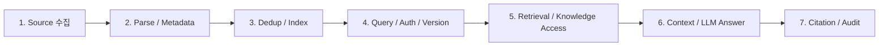
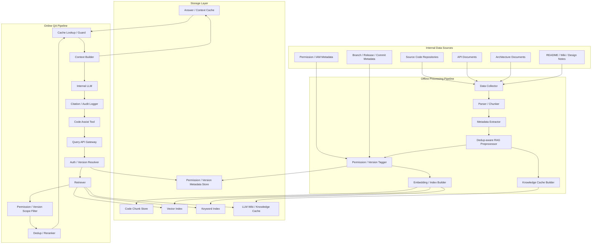

# 01. RAG 기반 코드 어시스트 프레임워크 Architecture 문서

## 1. 과제소개

### 1.1 과제 배경

최근 소프트웨어 개발 환경에서는 코드 어시스트 도구가 개발 생산성을 높이는 핵심 수단으로 자리 잡고 있다. 개발자는 코드 생성, 코드 설명, API 사용 예시, 리팩토링 제안, 오류 원인 분석, 테스트 코드 작성 등 다양한 개발 활동에서 LLM 기반 코드 어시스트의 도움을 받을 수 있다.

그러나 사내 소스코드는 다음과 같은 이유로 외부 LLM 기반 코드 어시스트를 그대로 사용하기 어렵다.

1. **보안 및 지식재산권 보호**
   - 사내 코드는 회사의 핵심 자산이며 외부로 유출되어서는 안 된다.
   - 외부 LLM 서비스에 코드나 설계 정보를 전송할 경우 보안 정책 위반 및 지식재산권 유출 위험이 있다.

2. **사내 코드에 대한 외부 모델의 지식 부족**
   - 외부 LLM은 공개 코드와 일반적인 프로그래밍 지식에는 강하지만, 사내 전용 코드베이스, 내부 API, 사내 프레임워크, 프로젝트별 설계 규칙은 알지 못한다.
   - 따라서 단순히 외부 LLM을 사용하는 것만으로는 사내 개발자가 기대하는 수준의 코드 어시스트 품질을 얻기 어렵다.

3. **전용 모델 개발 및 Fine-tuning의 부담**
   - 사내 코드 어시스트 전용 모델을 새로 개발하는 것은 데이터 구축, 모델 학습, 평가, 배포, 운영 비용이 크다.
   - Fine-tuning 방식은 코드 버전이 바뀔 때마다 모델을 다시 학습해야 할 수 있으며, 이는 유지보수성과 정확도 측면에서 부담이 크다.
   - 코드베이스는 지속적으로 변경되므로, 모델 파라미터에 지식을 고정하는 방식은 최신성 유지에 불리하다.

4. **RAG 기반 접근의 필요성**
   - RAG 방식은 모델 자체를 재학습하지 않고도 최신 사내 문서와 코드 지식을 검색하여 LLM Context로 제공할 수 있다.
   - 사내 범용 LLM 또는 사내 승인 LLM을 활용하면서, 코드베이스 지식은 별도의 검색/지식 계층으로 제공할 수 있다.
   - 따라서 본 과제는 사내 코드 어시스트 툴과 연동 가능한 **RAG 기반 코딩 어시스트 프레임워크**를 설계하는 것을 목표로 한다.

#### 1.1.1 Fine-tuning과 RAG의 비교 관점

본 과제의 핵심 질문은 “신규 모델을 직접 개발하지 않으면서 사내 보안 데이터를 활용해 Coding Assist를 제공할 수 있는가?”이다. 이 관점에서 Fine-tuning과 RAG는 다음처럼 비교된다.

| 구분 | Fine-tuning 중심 접근 | RAG 중심 접근 |
|---|---|---|
| 기본 아이디어 | 사내 데이터로 모델 가중치를 추가 학습 | 사내 코드/문서를 검색해 LLM Context로 제공 |
| 최신성 대응 | 코드/문서 변경 시 재학습 또는 추가 튜닝 필요 가능 | Index, Metadata, Cache 갱신으로 대응 |
| 보안/권한 제어 | 학습된 지식 안에 권한 경계를 분리하기 어려움 | Query-time 권한/버전 제어와 Citation 가능 |
| 비용 구조 | 학습 데이터 준비, Training, Custom Model Storage/Inference 비용 발생 | 인덱싱, 검색, LLM 호출, Cache 운영 비용 중심 |
| 본 과제 적합성 | 모델 개발/운영 과제에 가까움 | Architecture 설계 과제 범위에 적합 |

AWS Bedrock Pricing은 fine-tuning 계열 Custom Model에서 training, model storage, inference/provisioned throughput 비용이 발생할 수 있음을 설명한다. 따라서 본 과제에서는 전용 모델을 새로 만드는 접근보다, 사내 승인 LLM을 유지하고 지식 공급 계층을 설계하는 RAG 중심 접근을 우선한다.

#### 1.1.2 일반 문서용 RAG와 코드 어시스트 RAG의 관심사 차이

일반 문서용 RAG와 코드 어시스트 RAG는 모두 Retrieval과 LLM 답변 생성을 사용하지만, 중요하게 보는 데이터 특성과 실패 비용이 다르다. 일반 문서용 RAG는 보통 문서 의미 검색, 답변 요약, 출처 인용, 최신 문서 반영, 사용자 질문 의도 파악이 주요 관심사다. 반면 코드 어시스트 RAG는 코드가 실행 가능한 산출물이라는 특성 때문에 중복성, 권한 민감성, 최신성/버전, 정확도, 응답 속도, 근거 추적이 더 강한 Architecture Driver가 된다.

| 구분 | 주요 관심 항목 | 중요한 이유 |
|---|---|---|
| 일반 문서용 RAG | 문서 의미 검색 | 사용자의 질문과 의미적으로 가까운 문서 단락을 찾아야 답변 품질이 올라간다. |
| 일반 문서용 RAG | 요약 품질 | 긴 문서를 사용자가 이해하기 쉬운 답변으로 압축하는 것이 중요하다. |
| 일반 문서용 RAG | 출처 인용 | 답변이 어떤 문서에 근거했는지 확인할 수 있어야 한다. |
| 일반 문서용 RAG | 최신 문서 반영 | 정책, 매뉴얼, FAQ가 바뀌었을 때 오래된 문서를 답변에 쓰지 않아야 한다. |
| 일반 문서용 RAG | 질문 의도 파악 | 같은 문서라도 사용자의 의도에 따라 필요한 단락과 답변 범위가 달라진다. |
| 코드 어시스트 RAG | 중복성 | 복사 구현, 샘플 코드, 버전별 유사 파일이 Top-K를 잠식하면 실제 필요한 근거가 누락된다. |
| 코드 어시스트 RAG | 권한 민감성 | Repository, Project, 보안 모듈 단위로 접근 권한이 다르며, 권한 없는 코드가 답변에 섞이면 보안 사고가 된다. |
| 코드 어시스트 RAG | 최신성/버전 | Branch, Release, Commit, 제품 버전에 따라 정답 코드가 달라질 수 있다. |
| 코드 어시스트 RAG | 정확도 | API Signature, 호출 순서, Deprecated 여부가 틀리면 빌드 오류, 런타임 오류, 보안 취약점으로 이어질 수 있다. |
| 코드 어시스트 RAG | 응답 속도 | IDE나 코드 리뷰 흐름 안에서 사용되므로 응답이 느리면 개발 흐름을 방해한다. |
| 코드 어시스트 RAG | 근거 추적 | 답변 근거가 Repository, 파일, Symbol, Segment, Commit, 권한 판단까지 추적되어야 신뢰할 수 있다. |

이 차이 때문에 본 Architecture는 코드 어시스트 RAG의 주요 Driver를 DP1의 중복 제어, DP2의 권한/버전 제어, DP3의 Knowledge Access Strategy, DP4의 RAG Cache Strategy로 나누어 다룬다.

---

### 1.2 과제 개요

#### 1.2.1 도메인 설명

본 과제의 도메인은 **사내 코드베이스 기반 개발자 지원 시스템**이다.

대상 사용자는 사내 개발자이며, 주요 사용 시나리오는 다음과 같다.

- 특정 내부 API 사용법 질의
- 기존 코드 구조 설명
- 유사 구현 예시 검색
- 코드 작성 방향 제안
- 에러 로그 또는 빌드 실패 원인 분석
- 리팩토링 가이드 요청
- 테스트 코드 작성 보조
- 프로젝트별 코딩 규칙 및 제약사항 확인

일반적인 문서 검색 시스템과 달리, 코드 어시스트 도메인은 다음 특성을 가진다.

| 특성 | 설명 |
|---|---|
| 코드 중복성 | 유사한 코드 패턴, 복사된 구현, 버전별 유사 파일이 많다. |
| 권한 민감성 | 프로젝트/부서/역할별로 접근 가능한 코드가 다르다. |
| 최신성 중요 | 코드 변경이 잦으므로 최신 Repository 상태를 반영해야 한다. |
| 정확도 중요 | 잘못된 코드 제안은 빌드 오류, 보안 취약점, 설계 위반으로 이어질 수 있다. |
| 응답 속도 중요 | 개발 도구 내 사용성이므로 긴 대기 시간은 생산성을 저하시킨다. |
| 근거 추적 필요 | 답변이 어떤 코드/문서에 근거했는지 확인 가능해야 한다. |

#### 1.2.2 과제 설명

본 과제는 실제 구현이 아니라, Architecture 설계/디자인 과제이다. 목표는 사내 코드 어시스트 도구에 연동 가능한 RAG 기반 프레임워크의 주요 Architecture를 정의하고, 핵심 설계 결정 지점을 비교·선정하는 것이다.

본 프레임워크는 다음 역할을 수행한다.

1. 사내 코드 및 관련 문서를 수집한다.
2. 코드 Chunk, 문서 Chunk, 메타데이터, 권한 정보를 생성한다.
3. 중복이 많은 코드 데이터에서 검색 품질을 유지할 수 있도록 중복 제어 RAG 구조를 비교·선정한다.
4. 사용자 권한과 코드/문서 버전에 따라 접근 가능한 지식만 검색 또는 답변에 사용한다.
5. QA 속도와 정확도를 높이기 위해 Knowledge Access Strategy를 정의한다.
6. 반복 질의에서 RAG 산출물을 안전하게 재사용하기 위한 Cache Strategy를 정의한다.
7. 사내 코드 어시스트 툴이 사용할 수 있는 질의 API를 제공한다.
8. 답변과 함께 근거 코드/문서 Citation을 제공한다.

#### 1.2.3 과제 구성

```text
1. 과제소개
  1-1. 과제 배경
  1-2. 과제 개요

2. 요구사항
  2-1. Stakeholder
  2-2. Functional Requirements
  2-3. 제약사항
  2-4. Non-functional Requirements / Quality Attributes

3. 과제 설계
  3-1. Overall Architecture
  3-2. DP1: 중복 데이터에 강한 RAG 구조 선정
  3-3. DP2: 권한/버전 기반 Dataset / Retrieval Strategy 선정
  3-4. DP3: Knowledge Access Strategy 선정
  3-5. DP4: RAG Cache Strategy 선정
```

---

## 2. 요구사항

## 2.1 Stakeholder

| Stakeholder | 관심사 |
|---|---|
| 사내 개발자 | 빠르고 정확한 코드 어시스트, 내부 API 사용 예시, 코드 설명, 신뢰 가능한 답변 |
| 프로젝트 개발팀 | 프로젝트 코드베이스의 보안 유지, 개발 생산성 향상, 팀별 코드 규칙 반영 |
| Software Architect / Technical Lead | 설계 원칙 준수, 코드 품질 유지, Architecture Decision 근거 추적 |
| 보안 담당 조직 | 코드 외부 유출 방지, 접근 권한 준수, 로그/감사 가능성 |
| 플랫폼/인프라 운영팀 | 안정적인 서비스 운영, 인덱스 갱신, 장애 대응, 확장성 |
| 사내 LLM 운영 조직 | 사내 범용 LLM 활용, 모델 변경 영향 최소화, Token/Latency 관리 |
| 교육/양성과정 평가자 | 설계 논리의 타당성, DP 비교의 명확성, QA 기반 Trade-off 설명 |

---

## 2.2 Functional Requirements

### FR Ranking 기준

- **P1**: 필수. 시스템 목적 달성을 위해 반드시 필요
- **P2**: 중요. 핵심 품질 향상에 필요
- **P3**: 선택. 확장 또는 운영 효율 개선에 필요

| ID | Rank | Functional Requirement | 설명 |
|---|---:|---|---|
| FR-01 | P1 | 코드/문서 데이터 수집 및 인덱싱 | 사내 Repository, API 문서, 설계 문서, README, Commit/PR 정보 등을 수집하고 검색 가능한 형태로 인덱싱해야 한다. |
| FR-02 | P1 | 코드 어시스트 질의 처리 | 개발자의 자연어 질문 또는 코드 Context를 입력받아 관련 코드/문서를 검색하고 답변을 생성해야 한다. |
| FR-03 | P1 | 권한 기반 검색 및 답변 제어 | 사용자의 프로젝트/부서/역할 권한에 따라 접근 가능한 데이터만 검색 또는 답변에 사용해야 한다. |
| FR-04 | P1 | 중복 데이터 제어 | 유사 코드, 복사된 코드, 버전별 중복 문서가 Top-K 검색 결과를 과도하게 점유하지 않도록 제어해야 한다. |
| FR-05 | P2 | 근거 코드/문서 Citation 제공 | 답변에 사용된 코드 파일, 문서, Chunk, 버전 정보를 사용자가 확인할 수 있어야 한다. |
| FR-06 | P2 | 기존 사내 코드 어시스트 툴 연동 API 제공 | 사내 코드 어시스트 툴이 질의, 응답, Citation, 권한 정보를 연동할 수 있는 API를 제공해야 한다. |
| FR-07 | P3 | Knowledge Cache / Wiki 관리 | 반복 질의나 설계 지식에 대해 Canonical Knowledge를 생성·갱신하고 QA에 활용할 수 있어야 한다. |
| FR-08 | P2 | Source Version 기반 검색/답변 제어 | 사용자가 특정 Branch, Release, Commit, 제품 버전을 기준으로 질문하면 해당 버전 범위의 코드/문서와 Citation을 우선 사용해야 한다. |

### FR / Pipeline 영향도

FR 영향도는 아래의 간략화된 시스템 파이프라인을 기준으로 표시한다. 실제 구현은 Offline Pipeline과 Online QA Pipeline으로 나뉘지만, 발표에서는 요구사항이 어느 처리 단계에 영향을 주는지 빠르게 보기 위해 하나의 순서형 흐름으로 단순화한다.



| FR | 1. Source 수집 | 2. Parse / Metadata | 3. Dedup / Index | 4. Query / Auth / Version | 5. Retrieval / Knowledge Access | 6. Context / LLM Answer | 7. Citation / Audit |
|---|---:|---:|---:|---:|---:|---:|---:|
| FR-01 코드/문서 데이터 수집 및 인덱싱 | O | O | O |  |  |  |  |
| FR-02 코드 어시스트 질의 처리 |  |  |  | O | O | O | O |
| FR-03 권한 기반 검색 및 답변 제어 |  | O | O | O | O | O | O |
| FR-04 중복 데이터 제어 |  | O | O |  | O | O | O |
| FR-05 근거 코드/문서 Citation 제공 | O | O | O | O | O | O | O |
| FR-06 기존 사내 코드 어시스트 툴 연동 API 제공 |  |  |  | O | O | O | O |
| FR-07 Knowledge Cache / Wiki 관리 |  | O | O |  | O | O | O |
| FR-08 Source Version 기반 검색/답변 제어 | O | O | O | O | O | O | O |

| 단계 | 의미 | 주요 연결 |
|---|---|---|
| 1. Source 수집 | Repository, API 문서, 설계 문서, Commit/PR 정보 수집 | FR-01, FR-05, FR-08 |
| 2. Parse / Metadata | 코드/문서 Segment 생성, Repository/File/Symbol/권한/버전 Metadata 추출 | FR-01, FR-03, FR-04, FR-05, FR-07, FR-08 |
| 3. Dedup / Index | 중복 제어 단위 구성, Vector/Keyword Index 생성, Source Mapping 유지 | FR-01, FR-03, FR-04, FR-05, FR-07, FR-08 |
| 4. Query / Auth / Version | 사용자 질의 수신, 권한 확인, 요청 Branch/Release/Commit 해석 | FR-02, FR-03, FR-05, FR-06, FR-08 |
| 5. Retrieval / Knowledge Access | Source Scope 검색, Knowledge Cache 조회, Fallback 판단 | FR-02, FR-03, FR-04, FR-05, FR-06, FR-07, FR-08 |
| 6. Context / LLM Answer | 검색 결과와 Citation 후보를 Context로 구성하고 답변 생성 | FR-02, FR-03, FR-04, FR-05, FR-06, FR-07, FR-08 |
| 7. Citation / Audit | 답변 근거와 권한/버전 판단 로그를 사용자와 감사 체계에 제공 | FR-02, FR-03, FR-04, FR-05, FR-06, FR-07, FR-08 |

---

## 2.3 제약사항

| ID | 제약사항 | 설명 |
|---|---|---|
| CON-01 | 사내 코드 외부 유출 금지 | 사내 소스코드, 설계 문서, 내부 API 정보는 외부 LLM 서비스나 외부 저장소로 전송되어서는 안 된다. |

---

## 2.4 NFR / Quality Attributes

### QA Ranking 기준

- **H**: High. Architecture 결정에 강하게 영향을 주는 핵심 품질속성
- **M**: Medium. 중요하지만 핵심 결정의 보조 기준
- **L**: Low. 초기 설계 범위에서는 낮은 우선순위

| ID | Rank | Quality Attribute | 짧은 시나리오 | KPI 초안 |
|---|---:|---|---|---|
| QA-01 | H | 정확도 | 개발자가 내부 API 사용법을 질문하면, 시스템은 실제 접근 가능한 최신 코드와 문서에 근거해 잘못된 API 사용을 제안하지 않아야 한다. | [External Metric] 평가 Query Set에서 EM/F1 또는 RAGAS Faithfulness가 기준 Baseline RAG 이상이어야 한다. |
| QA-02 | H | 응답 속도 | IDE 또는 사내 코드 어시스트 툴에서 질문한 경우, 개발 흐름을 방해하지 않을 수준의 시간 내에 답변을 제공해야 한다. | [Expected, 측정 필요] 일반 QA P95 응답 시간이 5초 이내, Wiki/Cache Hit 질의는 2초 이내를 목표로 한다. |
| QA-03 | H | 보안성 | 사용자는 본인이 접근 권한이 없는 프로젝트의 코드, 문서, 식별 가능한 세부 정보를 답변에서 볼 수 없어야 한다. | [Required] Unauthorized Context Exposure Rate는 0%여야 한다. |
| QA-04 | H | 권한/버전 정합성 | 같은 질문이라도 사용자 권한이나 요청 Source Version이 다르면 검색 대상과 답변 근거가 범위에 맞게 달라져야 한다. | [Expected, 측정 필요] 권한/버전 Scenario Set에서 Allowed Result Sufficiency@10 90% 이상, Wrong Version Citation 0%를 목표로 한다. |
| QA-05 | H | 중복 데이터 강건성 | 유사 코드가 다수 존재해도 Top-K 결과가 동일한 내용으로만 채워지지 않고 다양한 근거를 포함해야 한다. | [Expected, 측정 필요] 중복성 높은 Dataset에서 Top-K Duplicate Ratio 20% 이하 또는 Context Diversity@10 7개 이상을 목표로 한다. |
| QA-06 | M | 유지보수성 | 코드 Repository와 권한 체계가 변경되어도 인덱스와 Knowledge Layer를 재구성 가능한 구조여야 한다. | [Expected, 측정 필요] 변경 Repository/권한 반영 Batch가 24시간 이내, 긴급 권한 변경은 Query-time Resolver로 즉시 반영되어야 한다. |
| QA-07 | M | 최신성 | 코드 변경, 문서 변경, 권한 변경이 발생하면 일정한 정책에 따라 검색 결과와 답변에 반영되어야 한다. | [Expected, 측정 필요] 최근 변경 코드의 Citation Freshness가 정책 SLA 이내이며 Stale Answer Rate 5% 이하를 목표로 한다. |
| QA-08 | M | 근거 추적성 | 답변에 사용된 코드 파일, 문서, Segment, Repository 버전, 권한 판단 근거를 추적할 수 있어야 한다. | [Expected, 측정 필요] Citation Trace Coverage 95% 이상을 목표로 한다. |
| QA-09 | M | 개발 난이도 | 제한된 과제 기간 내 설계 및 PoC 수준으로 설명 가능한 복잡도를 유지해야 한다. | [Expected] 핵심 Pipeline은 4개 DP와 5개 이하 주요 Runtime 컴포넌트로 설명 가능해야 한다. |
| QA-10 | M | 확장성 | 프로젝트, Repository, 사용자 수, Chunk 수가 증가해도 검색/권한/응답 구조를 확장할 수 있어야 한다. | [Expected, 측정 필요] Repository/Index 증가 시 수평 확장 가능한 Storage/Retrieval 경로를 유지한다. |

---

## 3. 과제 설계

## 3.1 Overall Architecture

### 3.1.1 Architecture 목표

본 Architecture는 다음 목표를 만족해야 한다.

1. 사내 코드가 외부로 유출되지 않도록 내부 LLM 및 내부 저장소를 사용한다.
2. RAG 기반으로 최신 코드/문서 지식을 검색하여 LLM 답변에 제공한다.
3. 중복이 많은 코드 데이터에서도 검색 정확도와 답변 다양성을 유지한다.
4. 프로젝트/부서/역할 기반 권한을 반영하여 접근 가능한 데이터만 사용한다.
5. 개발자 경험을 위해 빠른 응답 속도를 제공한다.
6. 답변 근거를 추적 가능하게 하여 신뢰성과 감사 가능성을 확보한다.
7. 구현이 아닌 설계 과제 범위에서 현실적인 Architecture Decision을 제시한다.

### 3.1.2 Overall Architecture Diagram



### 3.1.3 주요 컴포넌트 설명

| 컴포넌트 | 역할 |
|---|---|
| Data Collector | 사내 코드 Repository, 문서, API Spec, 설계 문서를 수집한다. |
| Parser / Chunker | 코드와 문서를 검색 가능한 단위로 분할한다. 코드의 경우 함수, 클래스, 파일, 모듈 단위 Chunk를 고려한다. |
| Metadata Extractor | Repository, Path, Language, Symbol, Commit, Project, Owner 정보를 추출한다. |
| Dedup-aware RAG Preprocessor | 유사 코드, 반복 문서, 복사된 Segment를 분석하여 중복 제어용 근거 단위와 Source Mapping을 만든다. |
| Permission / Version Tagger | 각 Segment 또는 근거 단위에 프로젝트/부서/역할 기반 접근 권한과 Branch/Release/Commit 등 Source Version 메타데이터를 연결한다. |
| Embedding / Index Builder | Vector Index와 Keyword Index를 생성한다. |
| Knowledge Cache Builder | 반복적으로 사용될 설계 지식, 정책, API 요약을 LLM Wiki 형태로 생성한다. |
| Answer / Context Cache | 반복 질의에서 재사용 가능한 최종 답변 또는 검증된 Context Pack을 저장한다. |
| Query API Gateway | 사내 코드 어시스트 툴의 질의를 수신하고 인증/권한/검색 파이프라인을 호출한다. |
| Auth / Permission Resolver | 사용자의 접근 권한을 확인하고 검색 또는 필터링에 필요한 권한 정보를 생성한다. |
| Retriever | Vector, Keyword, Wiki, 또는 Graph 기반 Retrieval을 수행한다. |
| Permission / Version Filter | 검색 결과 중 사용자가 접근 가능하고 요청 버전 범위에 맞는 근거만 남긴다. |
| Dedup / Reranker | 중복 결과를 제거하고 질문 관련도, 다양성, 최신성 기준으로 재정렬한다. |
| Cache Lookup / Guard | Cache 후보의 embedding similarity, Symbol overlap, 권한/버전/최신성 metadata를 검증한다. |
| Context Builder | 최종 Chunk와 Citation 정보를 LLM Prompt에 포함할 Context로 구성한다. |
| Internal LLM | 사내에서 승인된 범용 LLM을 사용하여 답변을 생성한다. |
| Citation / Audit Logger | 답변 근거, 사용된 Chunk, 사용자, 권한 판단, 요청 로그를 기록한다. |

### 3.1.4 주요 Design Points

| DP | 제목 | 핵심 질문 |
|---|---|---|
| DP1 | 중복 데이터에 강한 RAG 구조 선정 | 중복이 많은 코드 데이터에서 Top-K 편향과 Hallucination을 줄이기 위해 어떤 RAG 구조를 사용할 것인가? |
| DP2 | 권한/버전 기반 Dataset / Retrieval Strategy 선정 | 사용자의 권한과 요청 Source Version 범위 내에서만 검색·답변하기 위해 Dataset을 어떻게 구성하고 필터링할 것인가? |
| DP3 | Knowledge Access Strategy 선정 | 중복 제어 RAG 위에서 반복 질의, 답변 일관성, Knowledge 운영성을 개선하기 위해 어떤 지식 접근 방식을 추가할 것인가? |
| DP4 | RAG Cache Strategy 선정 | 반복 질의에서 최종 답변을 재사용할 것인가, 검증된 Evidence Context를 재사용할 것인가? |

### 3.1.5 요구사항 / 품질속성 / Design Point 관계

| Driver ID | Driver 유형 | 주요 내용 | 관련 QA | 관련 DP | 설계 연결 |
|---|---|---|---|---|---|
| FR-01 | Functional Requirement | 코드/문서 데이터 수집 및 인덱싱 | QA-06, QA-07, QA-10 | DP1, DP2 | Segment, Metadata, Permission, Source Version 정보를 함께 생성해야 Dedup 및 권한/버전 기반 Retrieval이 가능하다. |
| FR-02 | Functional Requirement | 코드 어시스트 질의 처리 | QA-01, QA-02, QA-08 | DP1, DP2, DP3, DP4 | 질의 처리 경로는 중복 제어 Retrieval, Permission/Version Filtering, Knowledge Access, RAG Cache를 순차적으로 활용한다. |
| FR-03 | Functional Requirement | 권한 기반 검색 및 답변 제어 | QA-03, QA-04, QA-08 | DP2 | 사용자의 권한 범위 안에서만 검색 후보와 답변 Context를 구성해야 한다. |
| FR-04 | Functional Requirement | 중복 데이터 제어 | QA-01, QA-02, QA-05 | DP1, DP3 | Offline Dedup과 Canonical Knowledge를 통해 Top-K 중복 편향과 Context 낭비를 줄인다. |
| FR-05 | Functional Requirement | 근거 코드/문서 Citation 제공 | QA-01, QA-08 | DP1, DP2, DP3, DP4 | 검색 근거, 원본 Segment, 권한/버전 판단, Wiki Page와 Context Cache의 Source Mapping을 추적 가능하게 유지한다. |
| FR-06 | Functional Requirement | 기존 사내 코드 어시스트 툴 연동 API 제공 | QA-02, QA-06, QA-10 | DP2, DP3, DP4 | API Gateway가 사용자 권한, 검색 결과, Citation, Cache/Fallback 결과를 일관된 응답으로 제공한다. |
| FR-07 | Functional Requirement | Knowledge Cache / Wiki 관리 | QA-02, QA-06, QA-07, QA-08 | DP3 | 반복 질의와 설계 지식을 Wiki 형태로 관리하되, 최신성 검증과 기존 RAG Fallback을 유지한다. |
| FR-08 | Functional Requirement | Source Version 기반 검색/답변 제어 | QA-04, QA-07, QA-08 | DP2, DP3, DP4 | Branch/Release/Commit 기준으로 검색 범위를 제한하고 Citation 및 Cache validity에 버전 정보를 포함한다. |
| CON-01 | Constraint | 사내 코드 외부 유출 금지 | QA-03, QA-04, QA-08 | DP2 | 권한/버전 기반 Routing 또는 Filtering과 Audit Logging이 필수 설계 요소가 된다. |

### 3.1.6 Design Point별 KPI 후보

아래 KPI는 내부 측정값이 아직 없는 설계 단계 기준이므로 모두 `[Expected]`로 표시한다. 실제 PoC 이후에는 측정값으로 대체해야 한다.

| DP | KPI | 의미 | 목표 방향 |
|---|---|---|---|
| DP1 | Top-K Duplicate Ratio | Top-K 결과 중 동일/유사 Cluster가 차지하는 비율 | [Expected] 낮을수록 좋음 |
| DP1 | Context Diversity@K | Top-K 안에 포함된 서로 다른 근거 Cluster 수 | [Expected] 높을수록 좋음 |
| DP1 | Citation Trace Coverage | 답변 근거가 원본 Segment와 중복 제어 근거 단위까지 추적 가능한 비율 | [Expected] 높을수록 좋음 |
| DP2 | Unauthorized Context Exposure Rate | 권한 없는 Chunk가 검색/Context/답변에 포함되는 비율 | [Expected] 0% 목표 |
| DP2 | Wrong Version Citation Rate | 요청 Source Version과 다른 근거가 Citation에 포함되는 비율 | [Expected] 0% 목표 |
| DP2 | Allowed Result Sufficiency@K | 권한 필터 후 답변 가능한 결과가 충분히 남는 비율 | [Expected] 높을수록 좋음 |
| DP2 | Permission Filter Latency Overhead | 권한 처리 때문에 추가되는 지연 시간 | [Expected] 낮을수록 좋음 |
| DP3 | Wiki Cache Hit Rate | Wiki/Cache에서 우선 답변 가능한 질의 비율 | [Expected] 높을수록 좋음 |
| DP3 | P95 QA Latency | 95% 질의의 End-to-end 응답 시간 | [Expected] 낮을수록 좋음 |
| DP3 | Stale Answer Rate | 최신 원문과 불일치하는 Cache/Wiki 답변 비율 | [Expected] 낮을수록 좋음 |
| DP4 | Cache Hit Rate | Answer Cache 또는 Context Cache에서 재사용 가능한 질의 비율 | [Expected] 높을수록 좋음 |
| DP4 | Wrong Answer Reuse Rate | 잘못된 최종 답변을 재사용한 비율 | [Expected] 낮을수록 좋음 |
| DP4 | RAG Call Count Reduction | EU-only RAG 대비 검색/filtering/rerank/context build 생략 비율 | [Expected] 높을수록 좋음 |
| DP4 | Invalid Cache Rejection Rate | 권한/버전/최신성 불일치 Cache를 거부한 비율 | [Expected] 높을수록 좋음 |

### 3.1.7 Architecture 핵심 방향

1. **신규 모델 직접 개발보다 RAG 중심**
   - 사내 코드를 모델 파라미터에 고정하기보다, 최신 사내 코드 지식을 검색 계층으로 제공하는 방향을 우선 검토한다.

2. **중복 제어 전략을 DP1에서 선정**
   - 중복 코드가 많은 환경을 고려해 Offline/Online 중복 제어 방식과 근거 단위를 비교한다.

3. **권한과 버전은 검색 정확도만큼 중요한 Architecture Concern**
   - 검색 결과가 정확하더라도 권한이 맞지 않으면 사용할 수 없다.
   - 사용자가 요청한 Branch, Release, Commit 범위와 맞지 않는 근거도 잘못된 답변으로 이어질 수 있다.
   - 따라서 권한 Metadata와 Source Version Metadata는 인덱싱 및 검색 단계에서 일급 데이터로 다룬다.

4. **Knowledge Cache를 통한 속도와 일관성 개선**
   - 반복 질의와 설계 지식은 LLM Wiki 형태로 Canonical Knowledge를 구성한다.
   - 단, 원문 검증이 필요한 경우 기존 RAG Fallback을 유지한다.

5. **Citation과 Audit을 기본 기능으로 포함**
   - 코드 어시스트 답변은 근거 코드와 문서가 확인 가능해야 신뢰할 수 있다.

---

## 4. References / Evidence

| ID | 문서명 | 출처 | 본 과제에서의 활용 |
|---|---|---|---|
| REF-01 | Retrieval-Augmented Generation for Knowledge-Intensive NLP Tasks | Lewis et al., NeurIPS 2020 / arXiv, https://arxiv.org/abs/2005.11401 | RAG를 모델 재학습 없이 외부 지식 검색과 결합하는 기본 접근 근거로 활용 |
| REF-02 | RAGAS: Automated Evaluation of Retrieval Augmented Generation | Es et al., arXiv, https://arxiv.org/abs/2309.15217 | Context Precision, Context Recall, Faithfulness 등 RAG 평가 KPI 후보 근거로 활용 |
| REF-03 | OpenSearch Filtering data for vector search | OpenSearch Documentation, https://docs.opensearch.org/latest/vector-search/filter-search-knn/index/ | Vector Search에서 filtering 방식과 post-filtering의 결과 부족 위험을 설명하는 근거로 활용 |
| REF-04 | Pinecone Filter by metadata | Pinecone Documentation, https://docs.pinecone.io/guides/search/filter-by-metadata | 통합 Index에서 Metadata Filter로 검색 범위를 제한할 수 있다는 구현 가능성 근거로 활용 |
| REF-05 | Customize a model with fine-tuning in Amazon Bedrock | AWS Documentation, https://docs.aws.amazon.com/bedrock/latest/userguide/custom-model-fine-tuning.html | Fine-tuning은 특정 작업 성능 개선을 위해 Foundation Model을 추가 학습하는 방식이라는 설명 근거 |
| REF-06 | Amazon Bedrock Pricing | AWS Pricing, https://aws.amazon.com/bedrock/pricing/ | Fine-tuning에는 training, custom model storage, custom model inference/provisioned throughput 비용이 발생한다는 근거 |
| REF-07 | Foundation models and hyperparameters for fine-tuning | Amazon SageMaker AI Documentation, https://docs.aws.amazon.com/sagemaker/latest/dg/jumpstart-foundation-models-fine-tuning.html | Fine-tuning은 모델 가중치를 변경하는 추가 학습이며, 도메인 특화 성능 개선에 사용될 수 있다는 근거 |

---

## 5. PPT 필수 포함 포인트

| 우선순위 | PPT에 반드시 들어갈 메시지 | 이유 |
|---|---|---|
| Must | 본 과제는 구현이 아니라 사내 코드 어시스트용 RAG Architecture 설계 과제이다. | 평가자가 Scope를 혼동하지 않도록 첫 장에서 경계를 잡아야 한다. |
| Must | 핵심 Driver는 보안/권한, 중복 데이터 강건성, 응답 속도, 근거 추적성이다. | 세 개 DP가 왜 필요한지 설명하는 상위 기준이다. |
| Must | 전체 설계 흐름은 DP1 중복 데이터 제어, DP2 권한/버전 기반 Retrieval, DP3 Knowledge Access, DP4 RAG Cache Strategy로 이어진다. | 발표의 메인 스토리라인이며, 문서 간 싱크의 중심이다. |
