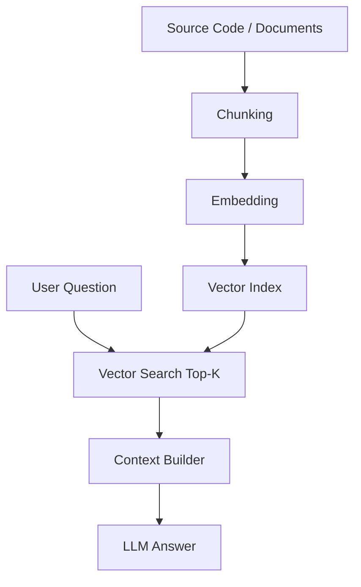
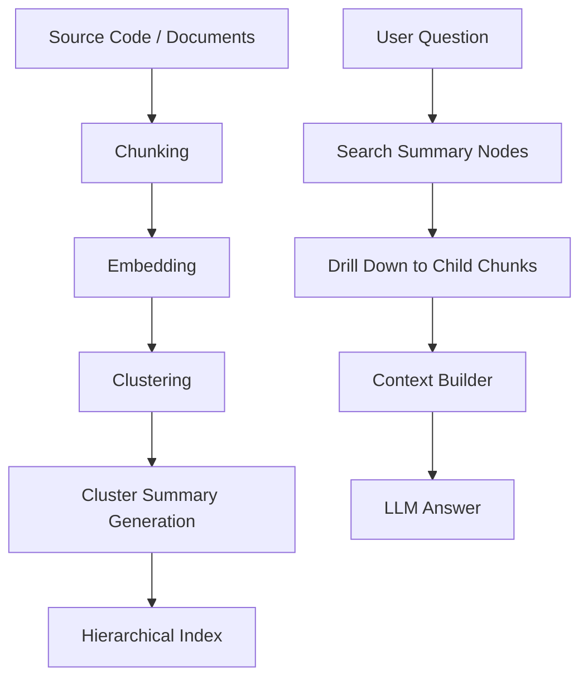
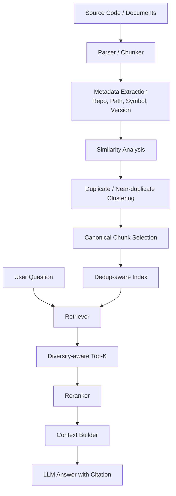
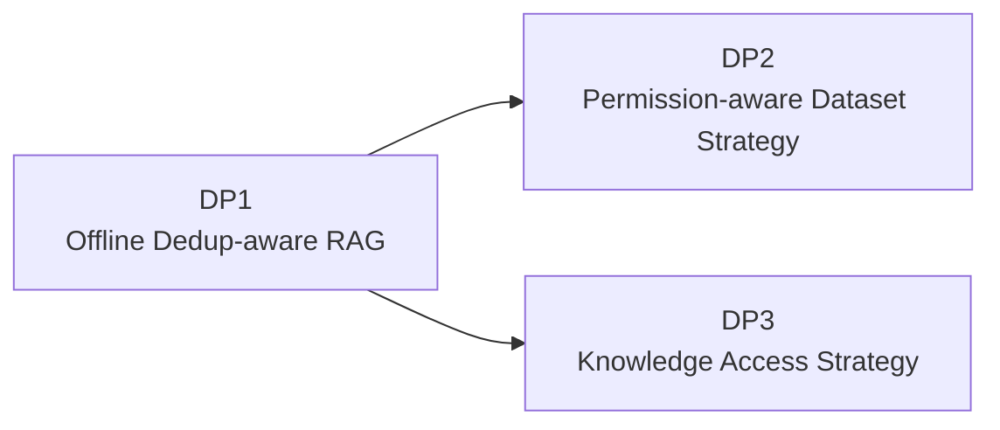

# 02. DP1 - 중복 데이터에 강한 RAG 구조 선정

## 1. Decision Point 개요

### 1.1 결정 주제

본 DP는 사내 코드 어시스트를 위한 RAG 기반 프레임워크에서 **중복이 많은 코드/문서 데이터 환경에서도 정확한 검색 결과와 안정적인 답변을 제공하기 위한 RAG 구조**를 선정한다.

### 1.2 배경

사내 코드베이스에는 중복 또는 유사 데이터가 매우 많다.

- 프로젝트 간 복사된 유사 코드
- 버전별로 거의 동일한 파일
- Template 기반으로 생성된 반복 코드
- 여러 Repository에 존재하는 동일 API 사용 예시
- Legacy 코드와 신규 코드가 함께 존재하는 경우
- 유사한 README, 설계 문서, API 설명 문서

일반적인 Naive RAG를 적용하면 Top-K 검색 결과가 동일하거나 매우 유사한 Chunk로 채워질 수 있다.

```text
Top-5 결과:
1. LoginManager.cpp의 validateToken()
2. LoginManager_v2.cpp의 validateToken()
3. LegacyLoginManager.cpp의 validateToken()
4. sample/LoginManager.cpp의 validateToken()
5. copied/LoginManager.cpp의 validateToken()
```

이 경우 LLM은 충분히 다양한 근거를 받지 못하고, 같은 정보를 여러 번 받은 것처럼 Context를 구성하게 된다. 이는 답변 정확도 저하, Hallucination 증가, 오래된 코드의 최신 구현 오인, Context Token 낭비로 이어질 수 있다.

---

## 2. 관련 Quality Attributes

| QA | 영향 |
|---|---|
| 정확도 | 중복 Chunk가 검색 결과를 잠식하면 실제 답변에 필요한 근거가 누락될 수 있다. |
| 속도 | 중복 결과를 많이 처리하면 검색, Rerank, LLM Context 비용이 증가한다. |
| 중복 데이터 강건성 | 코드 어시스트 도메인의 핵심 품질속성이다. |
| 유지보수성 | 코드 변경과 Repository 증가에도 Dedup 전략을 유지해야 한다. |
| 근거 추적성 | Canonical Chunk와 원본 Chunk의 관계를 추적할 수 있어야 한다. |
| 개발 난이도 | 과제 범위에서 설명 가능하고 구현 가능한 복잡도를 유지해야 한다. |

---

## 3. 후보안

| 후보 | 설명 |
|---|---|
| Option A. Naive RAG | 일반적인 Chunking + Embedding + Top-K 검색 구조 |
| Option B. RAPTOR-style Hierarchical RAG | 문서를 계층적으로 요약/클러스터링하여 상위 Summary와 하위 Chunk를 함께 활용 |
| Option C. Offline Dedup-aware RAG | Offline 단계에서 유사 Chunk/문서 Cluster를 구성하고 Canonical Chunk 및 Diversity-aware Retrieval을 수행 |

---

## 4. Option A. Naive RAG

### 4.1 개념

Naive RAG는 가장 기본적인 RAG 구조이다.

```text
문서 수집 → Chunking → Embedding → Vector Search → Top-K → LLM
```

### 4.2 다이어그램



### 4.3 장점

- 구현이 단순하다.
- 빠르게 PoC를 만들 수 있다.
- 일반적인 문서 검색에는 일정 수준의 성능을 낼 수 있다.
- 구성 요소가 적어 운영 복잡도가 낮다.

### 4.4 단점

- 중복 코드가 많은 환경에 취약하다.
- Top-K가 유사 Chunk로만 채워질 수 있다.
- Deprecated 코드와 최신 코드를 구분하기 어렵다.
- Context Token 낭비가 크다.
- 검색 결과 다양성을 보장하기 어렵다.
- 코드 어시스트처럼 정확도가 중요한 도메인에는 부족하다.

---

## 5. Option B. RAPTOR-style Hierarchical RAG

### 5.1 개념

RAPTOR-style 접근은 문서를 단순 Chunk 단위로만 검색하지 않고, 유사 Chunk를 클러스터링하고 상위 요약 노드를 만들어 계층적으로 검색하는 방식이다.

```text
Raw Chunk → Cluster → Summary Node → Higher-level Summary → Query 시 상위/하위 노드 검색
```

### 5.2 다이어그램



### 5.3 장점

- 문서 집합의 상위 구조를 활용할 수 있다.
- 장문 문서나 대규모 문서 집합에서 요약 기반 검색이 가능하다.
- 중복 Chunk가 많은 경우 Cluster Summary를 통해 일부 압축 효과를 얻을 수 있다.
- 큰 주제에서 세부 근거로 내려가는 검색 구조를 설계할 수 있다.

### 5.4 단점

- Summary 품질이 낮으면 하위 Chunk 검색도 잘못될 수 있다.
- 코드처럼 세부 Symbol, API 이름, 구현 차이가 중요한 데이터에서는 요약 과정에서 중요한 정보가 손실될 수 있다.
- 중복 제어 자체가 주 목적은 아니므로 유사 코드가 Cluster 내부에서 어떻게 정규화되는지 별도 설계가 필요하다.
- 인덱스 구축과 갱신 비용이 증가한다.
- 코드 변경이 잦은 환경에서 Summary 재생성 비용이 부담될 수 있다.

---

## 6. Option C. Offline Dedup-aware RAG

### 6.1 개념

Offline Dedup-aware RAG는 코드/문서 데이터의 중복성을 RAG 검색 단계에서 매번 처리하는 것이 아니라, **Offline Processing 단계에서 사전에 분석하고 Canonical Knowledge를 구성하는 방식**이다.

핵심 아이디어는 다음과 같다.

1. Chunk 단위 유사도 분석
2. 코드 Symbol, 파일 경로, Repository, Version Metadata 기반 중복 탐지
3. 유사 Chunk Cluster 생성
4. Canonical Chunk 또는 Representative Chunk 선정
5. Query 시 Cluster Diversity와 Canonical Priority를 반영
6. 답변 시 원본 Chunk와 Canonical Chunk의 관계를 Citation으로 제공

### 6.2 다이어그램



### 6.3 장점

- 중복 코드가 많은 환경에 직접 대응한다.
- Top-K가 동일 내용으로 채워지는 문제를 줄일 수 있다.
- Context Token 낭비를 줄일 수 있다.
- 최신 버전, 권장 구현, Canonical 구현을 우선 제공할 수 있다.
- 원본 Chunk와 Canonical Chunk의 관계를 유지하면 근거 추적이 가능하다.
- 이후 LLM Wiki, 권한 필터링, Reranking 전략과 결합하기 좋다.

### 6.4 단점

- Offline Processing Pipeline이 복잡해진다.
- Canonical Chunk 선정 기준을 잘못 잡으면 중요한 변형 구현이 누락될 수 있다.
- 코드 변경 시 Dedup Cluster를 갱신해야 한다.
- 초기 설계와 평가 기준이 필요하다.
- 완전한 중복 제거가 아니라, 유사성과 다양성의 균형을 설계해야 한다.

---

## 7. Trade-off 평가

평가 기준: ★★★ 매우 우수, ★★☆ 보통 이상, ★☆☆ 제한적

| QA 속성 | Naive RAG | RAPTOR-style RAG | Offline Dedup-aware RAG |
|---|---:|---:|---:|
| 중복 데이터 강건성 | ★☆☆ | ★★☆ | ★★★ |
| 정확도 | ★★☆ | ★★☆ | ★★★ |
| 속도 | ★★★ | ★★☆ | ★★☆ |
| 유지보수성 | ★★★ | ★★☆ | ★★☆ |
| 개발 난이도 | ★★★ | ★★☆ | ★★☆ |
| 근거 추적성 | ★★☆ | ★★☆ | ★★★ |
| 코드 도메인 적합성 | ★★☆ | ★★☆ | ★★★ |

---

## 8. Decision

본 DP에서는 **Option C. Offline Dedup-aware RAG**를 선택한다.

### 8.1 선택 이유

1. **문제에 직접 대응한다.**  
   본 과제의 코드 데이터는 중복성이 높으며, 단순 Top-K 검색은 동일한 내용의 Chunk로 결과가 편향될 수 있다.

2. **Hallucination과 부정확한 답변을 줄일 수 있다.**  
   LLM에 동일하거나 유사한 Chunk만 반복 제공하는 대신, 다양하고 대표성 있는 근거를 제공할 수 있다.

3. **Context Token을 효율적으로 사용할 수 있다.**  
   중복 Chunk를 줄이고 Canonical Chunk를 우선 제공하면 LLM Context를 더 의미 있는 정보로 채울 수 있다.

4. **추후 DP와 결합하기 좋다.**  
   권한 기반 필터링, LLM Wiki Knowledge Cache, Hybrid Retrieval 등의 후속 설계가 Canonical Chunk와 Dedup Cluster를 기반으로 동작할 수 있다.

5. **코드 도메인에 적합하다.**  
   코드에서는 동일한 의미의 구현이 여러 파일/버전/프로젝트에 존재할 수 있으므로, Metadata 기반 Dedup과 Diversity-aware Retrieval이 중요하다.

---

## 9. Consequences

### 9.1 긍정적 결과

- 중복 데이터 환경에서 Top-K 품질 개선
- LLM Context 효율 향상
- 답변 정확도 및 일관성 향상
- Deprecated 코드와 권장 구현 구분 가능
- Citation과 근거 추적 구조 강화
- 후속 Knowledge Access Strategy의 기반 제공

### 9.2 부정적 결과 및 대응

| 리스크 | 설명 | 대응 |
|---|---|---|
| Offline 처리 비용 증가 | Chunk 유사도 분석과 Cluster 생성 비용이 발생 | 증분 처리, 변경 파일 우선 처리, Batch Pipeline 적용 |
| Canonical 선정 오류 | 대표 Chunk가 부적절하면 중요한 정보가 누락 | 최신성, 권장 API, 사용 빈도, Owner Metadata를 기준으로 선정 |
| 변형 구현 손실 | 유사하지만 의미가 다른 코드가 하나로 묶일 수 있음 | Similarity Threshold와 Symbol/Path Metadata를 함께 사용 |
| Pipeline 복잡도 증가 | 단순 RAG보다 설계와 운영이 어려움 | Dedup Cluster, Canonical Chunk, Source Mapping을 명확히 모델링 |

---

## 10. 후속 DP와의 연결

Offline Dedup-aware RAG는 본 과제의 Baseline Retrieval 구조가 된다.

- DP2에서는 Dedup된 Chunk와 권한 Metadata를 어떻게 결합할지 결정한다.
- DP3에서는 Dedup 결과를 기반으로 LLM Wiki Knowledge Cache를 생성할지 결정한다.



---

## 11. 최종 결론

본 과제의 코드 어시스트 도메인은 중복 코드와 유사 문서가 많은 환경이다. 따라서 단순 RAG 또는 일반적인 계층형 요약 RAG만으로는 Top-K 편향과 Context 낭비 문제를 충분히 해결하기 어렵다.

본 DP는 **Offline Dedup-aware RAG**를 선택하여, 중복이 많은 사내 코드 데이터에서도 다양하고 대표성 있는 근거를 제공하는 검색 기반을 마련한다.
