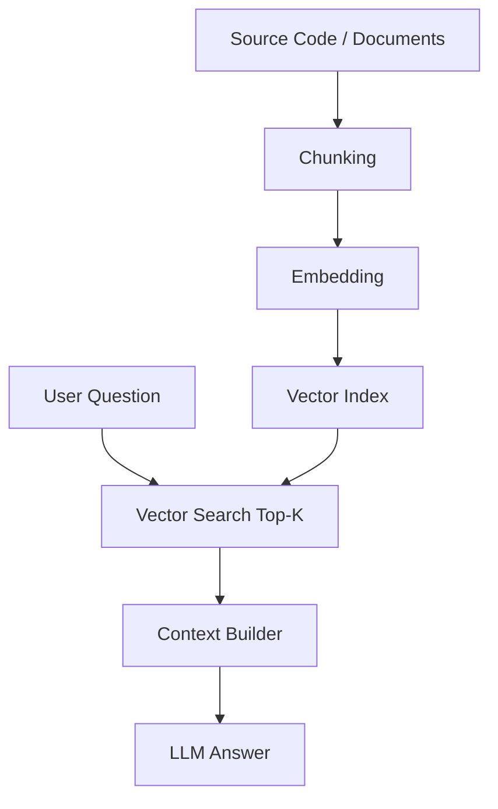
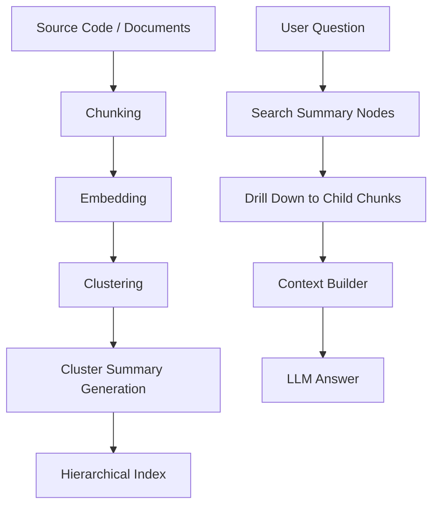
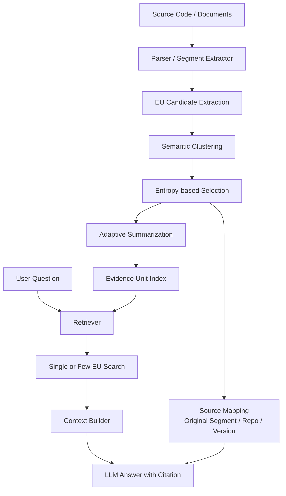
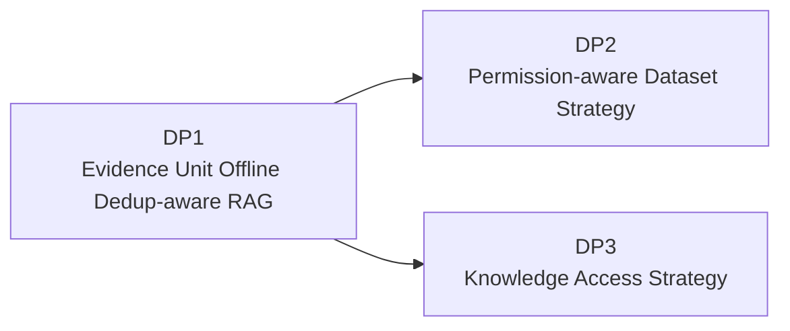

# 02. DP1 - 중복 데이터에 강한 RAG 구조 선정

## 1. Decision Point 개요

### 1.1 결정 주제

본 DP는 사내 코드 어시스트를 위한 RAG 기반 프레임워크에서 **중복이 많은 코드/문서 데이터 환경에서도 정확한 검색 결과와 안정적인 답변을 제공하기 위한 RAG 구조**를 선정한다.

### 1.2 배경

사내 코드베이스에는 중복 또는 유사 데이터가 매우 많다.

- 프로젝트 간 복사된 유사 코드
- 버전별로 거의 동일한 파일
- Template 기반으로 생성된 반복 코드
- 여러 Repository에 존재하는 동일 API 사용 예시
- Legacy 코드와 신규 코드가 함께 존재하는 경우
- 유사한 README, 설계 문서, API 설명 문서

일반적인 Naive RAG를 적용하면 Top-K 검색 결과가 동일하거나 매우 유사한 Chunk로 채워질 수 있다.

```text
Top-5 결과:
1. LoginManager.cpp의 validateToken()
2. LoginManager_v2.cpp의 validateToken()
3. LegacyLoginManager.cpp의 validateToken()
4. sample/LoginManager.cpp의 validateToken()
5. copied/LoginManager.cpp의 validateToken()
```

이 경우 LLM은 충분히 다양한 근거를 받지 못하고, 같은 정보를 여러 번 받은 것처럼 Context를 구성하게 된다. 이는 답변 정확도 저하, Hallucination 증가, 오래된 코드의 최신 구현 오인, Context Token 낭비로 이어질 수 있다.

---

## 2. 관련 Quality Attributes

| QA | 영향 |
|---|---|
| 정확도 | 중복 Chunk가 검색 결과를 잠식하면 실제 답변에 필요한 근거가 누락될 수 있다. |
| 속도 | 중복 결과를 많이 처리하면 검색, Rerank, LLM Context 비용이 증가한다. |
| 중복 데이터 강건성 | 코드 어시스트 도메인의 핵심 품질속성이다. |
| 유지보수성 | 코드 변경과 Repository 증가에도 Dedup 전략을 유지해야 한다. |
| 근거 추적성 | Evidence Unit과 원본 Segment의 관계를 추적할 수 있어야 한다. |
| 개발 난이도 | 과제 범위에서 설명 가능하고 구현 가능한 복잡도를 유지해야 한다. |

---

## 3. 후보안

| 후보 | 설명 |
|---|---|
| Option A. Naive RAG | 일반적인 Chunking + Embedding + Top-K 검색 구조 |
| Option B. RAPTOR-style Hierarchical RAG | 문서를 계층적으로 요약/클러스터링하여 상위 Summary와 하위 Chunk를 함께 활용 |
| Option C. SPRAG 기반 Evidence Unit Offline Dedup-aware RAG | Offline 단계에서 유사 Text Segment를 Evidence Unit으로 클러스터링/압축하고, Query-time에는 단일 또는 소수 EU 검색으로 답변 생성 |

---

## 4. Option A. Naive RAG

### 4.1 개념

Naive RAG는 가장 기본적인 RAG 구조이다.

```text
문서 수집 → Chunking → Embedding → Vector Search → Top-K → LLM
```

### 4.2 다이어그램



### 4.3 장점

- 구현이 단순하다.
- 빠르게 PoC를 만들 수 있다.
- 일반적인 문서 검색에는 일정 수준의 성능을 낼 수 있다.
- 구성 요소가 적어 운영 복잡도가 낮다.

### 4.4 단점

- 중복 코드가 많은 환경에 취약하다.
- Top-K가 유사 Chunk로만 채워질 수 있다.
- Deprecated 코드와 최신 코드를 구분하기 어렵다.
- Context Token 낭비가 크다.
- 검색 결과 다양성을 보장하기 어렵다.
- 코드 어시스트처럼 정확도가 중요한 도메인에는 부족하다.

---

## 5. Option B. RAPTOR-style Hierarchical RAG

### 5.1 개념

RAPTOR-style 접근은 문서를 단순 Chunk 단위로만 검색하지 않고, 유사 Chunk를 클러스터링하고 상위 요약 노드를 만들어 계층적으로 검색하는 방식이다.

```text
Raw Chunk → Cluster → Summary Node → Higher-level Summary → Query 시 상위/하위 노드 검색
```

### 5.2 다이어그램



### 5.3 장점

- 문서 집합의 상위 구조를 활용할 수 있다.
- 장문 문서나 대규모 문서 집합에서 요약 기반 검색이 가능하다.
- 중복 Chunk가 많은 경우 Cluster Summary를 통해 일부 압축 효과를 얻을 수 있다.
- 큰 주제에서 세부 근거로 내려가는 검색 구조를 설계할 수 있다.

### 5.4 단점

- Summary 품질이 낮으면 하위 Chunk 검색도 잘못될 수 있다.
- 코드처럼 세부 Symbol, API 이름, 구현 차이가 중요한 데이터에서는 요약 과정에서 중요한 정보가 손실될 수 있다.
- 중복 제어 자체가 주 목적은 아니므로 유사 코드가 Cluster 내부에서 어떻게 정규화되는지 별도 설계가 필요하다.
- 인덱스 구축과 갱신 비용이 증가한다.
- 코드 변경이 잦은 환경에서 Summary 재생성 비용이 부담될 수 있다.

---

## 6. Option C. SPRAG 기반 Evidence Unit Offline Dedup-aware RAG

### 6.1 개념

SPRAG 기반 Evidence Unit Offline Dedup-aware RAG는 코드/문서 데이터의 중복성을 RAG 검색 단계에서 매번 처리하는 것이 아니라, **Index-time / Offline Processing 단계에서 사전에 분석하고 압축된 Evidence Unit을 구성하는 방식**이다.

본 문서에서 Evidence Unit(EU)은 단일 문장이나 단일 Passage가 아니라, 의미적으로 유사한 Text Segment의 집합이다. 즉, 서로 유사하거나 중복성이 높은 Segment, Group, Passage를 Offline 단계에서 클러스터링한 뒤, 적응형 요약을 거쳐 압축된 증거 단위로 변환한 것이다.

EU 생성 과정에서는 엔트로피 기반 선택을 적용한다. 정보량이 낮거나 중복성이 높은 Segment는 줄이고, 답변에 필요한 핵심 정보와 다양한 근거는 유지한다. 이를 통해 Online 단계에서는 여러 Chunk를 반복 검색하고 조합하는 대신, 사용자 Query에 대해 단일 EU 또는 소수 EU를 검색하여 답변 Context를 단순화할 수 있다.

핵심 아이디어는 다음과 같다.

1. Corpus에서 EU 후보가 될 Text Segment를 추출한다.
2. Segment 간 의미 유사도와 중복성을 기준으로 Cluster를 구성한다.
3. 엔트로피 기반 선택으로 중복성이 높은 정보를 제거하고 핵심 정보를 압축한다.
4. 적응형 요약을 통해 문맥 길이와 복잡도에 맞는 압축 EU를 생성한다.
5. EU와 원본 Segment 간 Source Mapping을 유지한 채 EU Index에 저장한다.
6. Query 시 단일 EU 또는 소수 EU를 검색하고, EU 내부의 요약된 정보를 활용해 답변을 생성한다.

### 6.2 다이어그램



### 6.3 장점

- 중복 코드가 많은 환경에 직접 대응한다.
- Top-K가 동일 내용으로 채워지는 문제를 줄일 수 있다.
- Context Token 낭비를 줄일 수 있다.
- 중복 처리를 Query-time에서 Index-time으로 이동시켜 Online 검색 흐름을 단순화할 수 있다.
- EU 내 압축 요약 정보를 활용하므로 Prompt 길이와 생성 지연 시간을 줄일 수 있다.
- Adaptive Summarization으로 중복 제거 후에도 원본 정보의 핵심을 보존할 수 있다.
- 원본 Segment와 EU의 관계를 유지하면 근거 추적이 가능하다.
- 이후 LLM Wiki, 권한 필터링, Reranking 전략과 결합하기 좋다.

### 6.4 단점

- Offline Processing Pipeline이 복잡해진다.
- EU 생성 기준을 잘못 잡으면 중요한 변형 구현이나 세부 근거가 압축 과정에서 약해질 수 있다.
- 코드 변경 시 EU Cluster와 요약 결과를 갱신해야 한다.
- 초기 설계와 평가 기준이 필요하다.
- 실시간 업데이트가 중요한 동적 Corpus에서는 Offline 최적화만으로 부족할 수 있다.
- 복잡한 다단계 추론 QA에서는 단일 EU 검색만으로 충분하지 않을 수 있다.

### 6.5 중복성 / 집계 수준 기반 Regime

SPRAG 방식의 성능은 Dataset의 중복성 강도와 EU의 구조적 집계 수준에 따라 달라질 수 있다.

| 축 | 지표 | 구분 | 의미 |
|---|---|---|---|
| 중복성 강도 | RE | HIGH: RE >= 0.01 | Dataset 내부의 중복 콘텐츠 밀도가 높음 |
| 중복성 강도 | RE | MID: 0.003 <= RE < 0.01 | Dataset 내부의 중복 콘텐츠 밀도가 중간 수준 |
| 중복성 강도 | RE | LOW: RE < 0.003 | Dataset 내부의 중복 콘텐츠 밀도가 낮음 |
| 구조적 집계 수준 | AVG SEG/EU | HIGH Aggregation: AVG SEG/EU >= 3 | 하나의 EU가 평균 3개 이상 Segment를 통합 |
| 구조적 집계 수준 | AVG SEG/EU | LOW Aggregation: AVG SEG/EU < 3 | 하나의 EU가 평균 3개 미만 Segment를 통합 |

| Regime | 의미 | 예시 Dataset | 설계적 해석 |
|---|---|---|---|
| HIGH-HIGH | 높은 중복성 + 높은 집계 | NarrativeQA, QMSUM | EU 압축 효과가 가장 크게 기대되는 영역 |
| MID-HIGH | 중간 중복성 + 높은 집계 | QuALITY, HotpotQA | Prompt 길이와 생성 지연 시간 절감 효과가 기대되는 영역 |
| LOW-LOW | 낮은 중복성 + 낮은 집계 | Natural Questions, QASPER | EU 압축 이득이 제한적일 수 있는 영역 |
 
### 6.6 성능 기대 효과

아래 수치는 사용자가 제공한 SPRAG 요약 기반이며, 현재 본 과제 Corpus에서 직접 측정한 값은 아니다.

| Regime | Prompt 길이 감소 | 처리 시간 단축 | 답변 품질 |
|---|---:|---:|---|
| HIGH-HIGH | [Provided Summary] 63~82% 감소 | [Provided Summary] 17~81% 단축 | EM / F1 기준 기존 RAG 대비 동등 또는 우수 |
| MID-HIGH | [Provided Summary] 30~50% 감소 | [Provided Summary] 10~40% 단축 | EM / F1 기준 기존 RAG 대비 동등 또는 우수 |
| LOW-LOW | [Expected] 제한적 | [Expected] 제한적 | Dataset 특성에 따라 기존 RAG와 유사 |

---

## 7. Trade-off 평가

평가 기준: ★★★ 매우 우수, ★★☆ 보통 이상, ★☆☆ 제한적

| QA 속성 | Naive RAG | RAPTOR-style RAG | SPRAG 기반 Evidence Unit RAG |
|---|---:|---:|---:|
| 중복 데이터 강건성 | ★☆☆ | ★★☆ | ★★★ |
| 정확도 | ★★☆ | ★★☆ | ★★★ |
| 속도 | ★★★ | ★★☆ | ★★☆ |
| 유지보수성 | ★★★ | ★★☆ | ★★☆ |
| 개발 난이도 | ★★★ | ★★☆ | ★★☆ |
| 근거 추적성 | ★★☆ | ★★☆ | ★★★ |
| 코드 도메인 적합성 | ★★☆ | ★★☆ | ★★★ |

### 7.1 KPI 기반 Trade-off 평가

아래 값은 현재 내부 PoC 측정값이 아니라 설계 비교를 위한 `[Expected]` 기준이다. 실제 구현 후에는 동일한 평가 Dataset과 질의 Set으로 재측정해야 한다.

| KPI | 측정 의미 | Option A. Naive RAG | Option B. RAPTOR-style RAG | Option C. SPRAG 기반 Evidence Unit RAG |
|---|---|---:|---:|---:|
| Top-K Duplicate Ratio | Top-K 결과 중 동일/유사 Cluster가 차지하는 비율 | [Expected] 35~60% | [Expected] 20~40% | [Expected] 10~20% |
| Context Diversity@10 | Top-10 결과에 포함된 서로 다른 근거 Cluster 수 | [Expected] 4~6 | [Expected] 5~7 | [Expected] 7~9 |
| Deprecated Code Hit Rate | Deprecated/Legacy Chunk가 최종 Context에 포함되는 비율 | [Expected] 중간~높음 | [Expected] 중간 | [Expected] 낮음 |
| Citation Trace Coverage | 답변 근거가 원본 Segment와 Evidence Unit까지 연결되는 비율 | [Expected] 70~85% | [Expected] 75~90% | [Expected] 90~98% |
| Index Build Complexity | Offline Pipeline 복잡도 | [Expected] 낮음 | [Expected] 높음 | [Expected] 중간~높음 |
| P95 Retrieval Latency | 검색 및 Rerank 단계 P95 지연 | [Expected] 낮음 | [Expected] 중간~높음 | [Expected] 중간 |
| Context Token Usage | 답변 생성에 투입되는 평균 Context Token | [Expected] 높음 | [Expected] 중간 | [Expected] 낮음~중간 |
| Prompt Length Reduction | 기존 RAG 대비 Prompt 길이 감소율 | [Expected] 기준값 | [Expected] 일부 감소 | [Provided Summary] HIGH-HIGH 63~82%, MID-HIGH 30~50% |
| Generation Latency Reduction | 기존 RAG 대비 생성 지연 시간 감소율 | [Expected] 기준값 | [Expected] 일부 감소 | [Provided Summary] HIGH-HIGH 17~81%, MID-HIGH 10~40% |
| Single Retrieval Rate | Query당 단일 EU 검색으로 답변 가능한 비율 | [Expected] 낮음 | [Expected] 낮음~중간 | [Expected] 중간~높음 |

### 7.2 KPI 평가 해석

- Naive RAG는 구현과 검색 지연 측면에서는 유리하지만, 중복 코드가 많은 환경에서 Top-K Duplicate Ratio가 높아질 가능성이 크다.
- RAPTOR-style RAG는 장문 문서의 계층적 이해에는 강점이 있으나, 코드 Symbol 단위의 미세한 차이와 중복 제거를 직접 해결하는 구조는 아니다.
- SPRAG 기반 Evidence Unit RAG는 Offline 처리 비용을 감수하는 대신, Query-time 검색 흐름을 단순화하고 Prompt 길이, 생성 지연 시간, Context Token 효율을 개선하는 방향이다.

---

## 8. Decision

본 DP에서는 **Option C. SPRAG 기반 Evidence Unit Offline Dedup-aware RAG**를 선택한다.

### 8.1 선택 이유

1. **문제에 직접 대응한다.**  
   본 과제의 코드 데이터는 중복성이 높으며, 단순 Top-K 검색은 동일한 내용의 Chunk로 결과가 편향될 수 있다.

2. **Hallucination과 부정확한 답변을 줄일 수 있다.**  
   LLM에 동일하거나 유사한 Chunk만 반복 제공하는 대신, 다양하고 대표성 있는 근거를 제공할 수 있다.

3. **Context Token과 생성 지연 시간을 효율화할 수 있다.**  
   중복 Segment를 EU로 압축하고 단일 또는 소수 EU를 우선 제공하면 LLM Prompt를 더 짧고 의미 있는 정보로 구성할 수 있다.

4. **추후 DP와 결합하기 좋다.**  
   권한 기반 필터링, LLM Wiki Knowledge Cache, Hybrid Retrieval 등의 후속 설계가 Evidence Unit과 Source Mapping을 기반으로 동작할 수 있다.

5. **코드 도메인에 적합하다.**  
   코드에서는 동일한 의미의 구현이 여러 파일/버전/프로젝트에 존재할 수 있으므로, 엔트로피 기반 선택과 EU 압축으로 중복성과 다양성의 균형을 관리하는 것이 중요하다.

---

## 9. Consequences

### 9.1 긍정적 결과

- 중복 데이터 환경에서 Evidence Unit 기반 검색 품질 개선
- LLM Context 효율 향상
- Prompt 길이 및 생성 지연 시간 감소 기대
- 답변 정확도 및 일관성 향상
- Deprecated 코드와 권장 구현 구분 가능
- Citation과 근거 추적 구조 강화
- 후속 Knowledge Access Strategy의 기반 제공

### 9.2 부정적 결과 및 대응

| 리스크 | 설명 | 대응 |
|---|---|---|
| Offline 처리 비용 증가 | EU 후보 추출, 클러스터링, 엔트로피 계산, 적응형 요약 비용이 발생 | 증분 처리, 변경 파일 우선 처리, Batch Pipeline 적용 |
| EU 압축 오류 | 요약 또는 엔트로피 선택이 부적절하면 중요한 정보가 누락 | Source Mapping 유지, 샘플 기반 Human Review, EM/F1 회귀 평가 |
| 변형 구현 손실 | 유사하지만 의미가 다른 코드가 하나의 EU에 과도하게 묶일 수 있음 | Similarity Threshold와 Symbol/Path/Version Metadata를 함께 사용 |
| 동적 Corpus 대응 어려움 | 실시간 변경이 많은 Repository에서는 Offline EU가 오래될 수 있음 | Offline EU + Online Fresh Retrieval을 병행하는 Hybrid 전략 적용 |
| 다단계 추론 한계 | 단일 EU 검색만으로 복잡한 Multi-hop QA를 처리하기 어려울 수 있음 | 필요 시 기존 RAG 또는 Graph Retrieval Fallback 사용 |

---

## 10. 후속 DP와의 연결

SPRAG 기반 Evidence Unit Offline Dedup-aware RAG는 본 과제의 Baseline Retrieval 구조가 된다.

- DP2에서는 EU와 원본 Segment의 권한 Metadata를 어떻게 결합할지 결정한다.
- DP3에서는 EU와 Source Mapping 결과를 기반으로 LLM Wiki Knowledge Cache를 생성할지 결정한다.



---

## 11. 최종 결론

본 과제의 코드 어시스트 도메인은 중복 코드와 유사 문서가 많은 환경이다. 따라서 단순 RAG 또는 일반적인 계층형 요약 RAG만으로는 Top-K 편향과 Context 낭비 문제를 충분히 해결하기 어렵다.

본 DP는 **SPRAG 기반 Evidence Unit Offline Dedup-aware RAG**를 선택하여, 중복이 많은 사내 코드 데이터에서도 다양하고 대표성 있는 근거를 압축된 EU 형태로 제공하는 검색 기반을 마련한다.

---

## 12. References / Evidence

| ID | 문서명 | 출처 | 본 DP에서의 활용 |
|---|---|---|---|
| REF-DP1-01 | Retrieval-Augmented Generation for Knowledge-Intensive NLP Tasks | Lewis et al., NeurIPS 2020 / arXiv, https://arxiv.org/abs/2005.11401 | Naive RAG의 기본 구조와 Retrieval 기반 지식 주입 접근의 근거 |
| REF-DP1-02 | RAPTOR: Recursive Abstractive Processing for Tree-Organized Retrieval | Sarthi et al., ICLR 2024 / arXiv, https://arxiv.org/abs/2401.18059 | Hierarchical RAG 후보의 근거 |
| REF-DP1-03 | On the Resemblance and Containment of Documents | Broder, 1997, https://doi.org/10.1109/SEQUEN.1997.666900 | Near-duplicate detection과 문서 유사도 기반 Dedup 접근의 이론적 배경 |
| REF-DP1-04 | Near-duplicates and shingling | Stanford IR Book, https://nlp.stanford.edu/IR-book/html/htmledition/near-duplicates-and-shingling-1.html | Shingling 기반 Near-duplicate detection 설명 근거 |
| REF-DP1-05 | Maximal Marginal Relevance | Carbonell and Goldstein, 1998, https://dl.acm.org/doi/10.1145/290941.291025 | 검색 결과 관련도와 다양성의 균형을 잡는 Diversity-aware Retrieval 근거 |
| REF-DP1-06 | SPRAG | Provided Summary, 상세 출처 TBD | Evidence Unit, RE/AVG SEG/EU Regime, Prompt 길이 및 생성 지연 시간 개선 수치의 근거. 공식 논문명과 링크 확인 필요 |

---

## 13. PPT 필수 포함 포인트

| 우선순위 | PPT에 반드시 들어갈 메시지 | 이유 |
|---|---|---|
| Must | Naive RAG는 중복 코드 환경에서 Top-K가 유사 Chunk로 채워지는 문제가 있다. | DP1 문제 정의를 가장 직관적으로 보여준다. |
| Must | 선택안은 SPRAG 기반 Evidence Unit RAG이며, 중복 처리를 Query-time이 아니라 Index-time으로 이동한다. | 선택안의 차별점과 Architecture 의미가 한 문장으로 드러난다. |
| Must | Evidence Unit은 유사 Segment를 클러스터링하고 엔트로피 기반 선택/적응형 요약으로 압축한 증거 단위이다. | SPRAG를 단순 Dedup이 아니라 설계 결정으로 설명하는 핵심이다. |
| Must | 제공 요약 기준 HIGH-HIGH Regime에서 Prompt 길이 63~82%, 처리 시간 17~81% 감소가 기대된다. | KPI 기반 설득 포인트다. 단, `Provided Summary` 출처 표시가 필요하다. |
