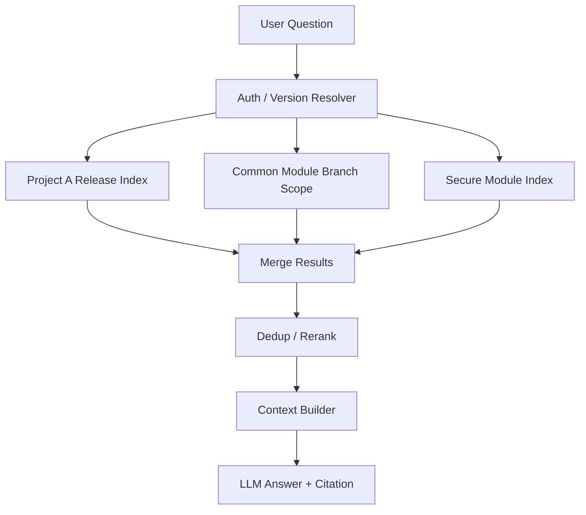
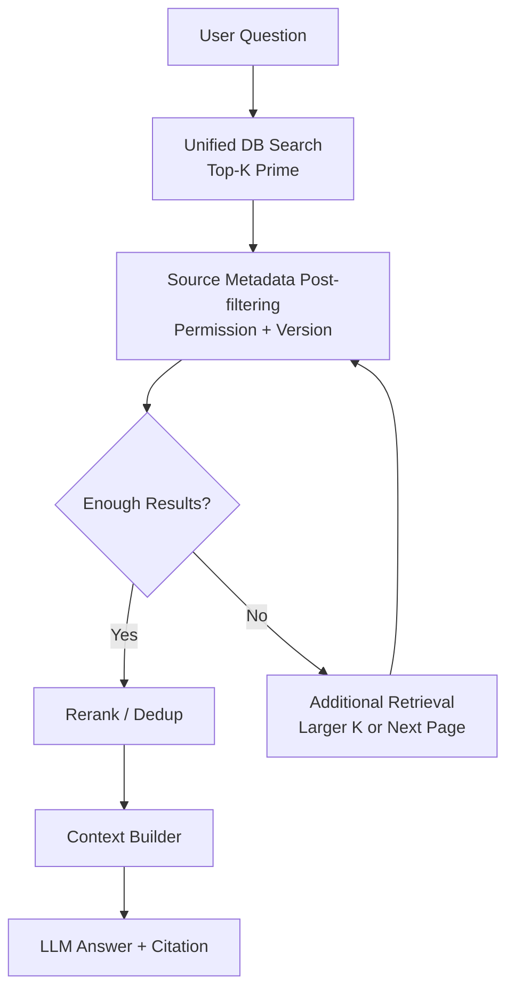
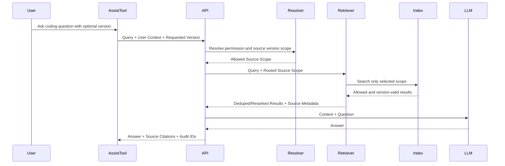

# 03. DP2 - 권한/버전 기반 Dataset / Retrieval Strategy 선정

## 1. Decision Point 개요

### 1.1 결정 주제

본 DP는 사내 코드 어시스트 프레임워크에서 사용자의 프로젝트/부서/역할 권한과 요청한 Source Version 범위에 따라, 접근 가능한 코드와 문서만 검색 및 답변에 사용하기 위한 Dataset 및 Retrieval Strategy를 선정한다.

### 1.2 배경

사내 코드는 외부 유출뿐 아니라, 사내에서도 권한과 버전에 따라 접근 가능한 범위가 달라진다.

- A 프로젝트 개발자는 A Repository에는 접근 가능하지만 B 프로젝트 Repository에는 접근 불가
- 플랫폼 공통 모듈은 여러 프로젝트에서 접근 가능
- 특정 보안 모듈은 제한된 조직만 접근 가능
- 부서 이동, 프로젝트 참여 변경에 따라 권한이 동적으로 바뀜
- 같은 API 이름이 여러 프로젝트와 버전에 존재하지만, 사용자 권한과 요청 버전에 따라 보여줄 수 있는 구현이 다름
- 사용자가 특정 Branch, Release, Commit, 제품 버전을 기준으로 질문할 수 있음

따라서 RAG 기반 코드 어시스트는 검색 정확도뿐 아니라 **권한 정합성**과 **버전 정합성**을 반드시 보장해야 한다.

### 1.3 발표용 배경 태그

| 구분 | 관련 항목 |
|---|---|
| Stakeholder | 사내 개발자, 프로젝트 개발팀, 보안 담당 조직, 플랫폼/인프라 운영팀 |
| FR | FR-03 권한 기반 검색 및 답변 제어, FR-05 Citation 제공, FR-06 Tool API 연동, FR-08 Source Version 기반 검색/답변 제어 |
| QA | QA-03 보안성, QA-04 권한/버전 정합성, QA-08 근거 추적성, QA-10 확장성 |
| 핵심 문제 | 권한 없는 Source 노출, 잘못된 버전 Citation, Source Metadata 품질, Audit 가능성 |

### 1.4 배경 상황 설명

DP2가 필요한 이유는 검색 품질이 높아도 **사용자가 볼 수 없는 코드나 요청 버전과 다른 코드가 답변에 섞이면 시스템을 사용할 수 없기 때문**이다.

코드 어시스트 질의는 단순히 “가장 유사한 코드”를 찾는 문제가 아니다. 사용자가 접근 가능한 Repository인지, 현재 작업 중인 Branch 또는 Release와 맞는지, 답변 Citation이 실제로 허용된 Source를 가리키는지까지 함께 확인해야 한다. 특히 같은 API 이름이 여러 프로젝트와 버전에 존재하면, 의미적으로는 맞아 보이지만 권한/버전 관점에서는 틀린 결과가 검색될 수 있다.

이 문제는 일반적인 문서 검색보다 더 민감하다. 문서 RAG에서 잘못된 문서를 인용하면 답변 품질 문제가 되지만, 코드 어시스트에서 권한 없는 Source가 답변이나 로그에 남으면 보안 사고가 된다. 또한 요청한 Release와 다른 구현을 제안하면 개발자가 현재 제품 버전에서 동작하지 않는 API를 사용하게 될 수 있다. 따라서 DP2는 검색 결과의 유사도뿐 아니라 “이 사용자가 이 버전의 이 Source를 답변 근거로 볼 수 있는가?”를 Architecture 수준에서 보장해야 한다.

또 하나 중요한 점은 Citation이다. 답변에 파일 경로와 Commit이 표시되더라도 그 Source가 권한/버전 조건을 만족하지 않으면 Citation은 신뢰 근거가 아니라 위험 근거가 된다. 그래서 DP2에서는 권한 판단, 버전 판단, Citation이 모두 같은 Source Metadata를 공유해야 한다.

따라서 DP2의 배경 페이지에서는 후보 구조보다 다음 실패 상황을 강조한다.

```text
사용자 질의
 → 유사한 Source 검색
 → 권한 없는 Repository 또는 다른 Release Source 포함
 → 답변 / Citation / Debug Log에 잘못된 Source 노출
 → 보안 사고 또는 잘못된 개발 가이드
```

### 1.5 예상 발표 스크립트

DP2는 검색 정확도만으로는 코드 어시스트를 운영할 수 없다는 문제에서 출발합니다. 사내 코드는 프로젝트, 부서, 역할에 따라 볼 수 있는 범위가 다르고, 같은 API라도 Branch나 Release에 따라 실제 구현이 달라질 수 있습니다. 그래서 의미적으로 가장 유사한 코드가 검색되더라도, 그 코드가 사용자 권한 밖에 있거나 요청한 버전과 다르면 답변 근거로 사용할 수 없습니다. 더 위험한 점은 이런 Source가 최종 답변뿐 아니라 중간 검색 결과, Debug Log, Citation에 남을 수 있다는 것입니다. 따라서 DP2에서는 검색 전에 Source Scope를 나눌지, 검색 후 Source Metadata로 검증할지 같은 전략을 비교해야 합니다. 핵심은 “이 사용자가 이 버전의 이 Source를 답변 근거로 볼 수 있는가”를 Architecture가 보장하는 것입니다.

---

## 2. 관련 Quality Attributes

| QA | 영향 |
|---|---|
| 보안성 | 권한 없는 코드/문서가 답변, Context, 로그에 포함되면 보안 사고가 된다. |
| 권한/버전 정합성 | 사용자별 접근 범위와 요청 Source Version 범위가 정확히 반영되어야 한다. |
| 정확도 | 권한/버전 필터링 이후에도 충분한 검색 결과가 남아야 정확한 답변이 가능하다. |
| 속도 | 권한/버전 확인과 필터링이 질의 지연을 크게 증가시키면 사용성이 떨어진다. |
| 유지보수성 | 프로젝트, 권한, Branch/Release 변경에 따라 Index와 Metadata를 관리하기 쉬워야 한다. |
| 확장성 | Repository, 프로젝트, 사용자, 버전 수 증가에도 구조가 확장 가능해야 한다. |
| 근거 추적성 | 어떤 Source, Version, 권한 판단으로 어떤 결과가 제공되었는지 추적 가능해야 한다. |

---

## 3. 후보안

본 DP에서는 사용자가 기대한 두 가지 후보만 비교한다.

| 후보 | 설명 |
|---|---|
| Option A. 권한/버전 기반 Source Routing / 분리 Index | 사용자 권한과 요청 버전을 먼저 해석한 뒤, 접근 가능한 Repository/Project/Branch/Release별 Index 또는 Source Scope로 라우팅한다. |
| Option B. 통합 DB + Source Metadata Post-filtering | 하나의 통합 DB에서 넉넉히 검색한 뒤, 반환된 결과의 출처 Metadata를 보고 권한/버전 범위에 맞지 않는 결과를 제거한다. |

최종 발표 비교 범위는 Option A와 Option B로 제한한다.

---

## 4. Source Metadata의 의미

Option B는 검색 결과의 **출처(Source Metadata)**를 보고 후필터링한다. 여기서 출처는 단순 파일 경로가 아니라, 권한 판단과 Citation에 필요한 메타데이터 묶음이다.

```text
SourceMetadata {
  repository_id
  project_id
  department_id
  owner_team
  file_path
  symbol_name
  branch
  release
  commit_sha
  product_version
  confidentiality_level
  allowed_roles
  source_timestamp
}
```

이 Metadata는 FR-05 `근거 코드/문서 Citation 제공`, FR-08 `Source Version 기반 검색/답변 제어`, QA-08 `근거 추적성`과 직접 연결된다. 즉, Citation을 제공하려면 답변 근거가 어떤 파일과 버전에서 왔는지 알아야 하고, 권한/버전 필터링도 같은 Metadata를 사용한다.

---

## 5. Option A. 권한/버전 기반 Source Routing / 분리 Index

### 5.1 개념

사용자가 질문하면 Auth/Version Resolver가 사용자의 권한과 요청 Source Version을 해석한다. 이후 해당 사용자가 접근 가능한 Repository, Project, Branch, Release, Commit 범위의 DB/Index/Source Scope만 선택하여 검색한다.

```text
Question
 → Resolve User Permission + Requested Version
 → Route to Allowed Source Scope / Index
 → Search
 → Merge / Rerank
 → LLM Answer + Citation
```

### 5.2 다이어그램



### 5.3 장점

- 권한과 버전 경계가 검색 전에 결정되므로 보안 경계가 명확하다.
- 권한 없는 Repository나 잘못된 버전의 Source가 검색 후보에 들어올 가능성이 낮다.
- 고보안 프로젝트나 Release별 고정 문서처럼 분리 운영이 필요한 데이터에 적합하다.
- 특정 Branch/Release 단위로 인덱스 갱신과 롤백 전략을 세우기 쉽다.
- 감사 시 “어떤 Scope를 검색했는가”를 설명하기 쉽다.

### 5.4 단점

- Repository, 프로젝트, 권한 그룹, Branch, Release 조합이 늘어나면 Index/Scope 관리가 복잡해진다.
- 사용자가 여러 권한과 여러 버전 범위를 동시에 가진 경우 결과 병합과 Score 정규화가 필요하다.
- 공통 모듈과 프로젝트별 모듈의 중복 관리가 어려울 수 있다.
- 권한/버전 변경 시 어떤 Index 또는 Scope에 반영해야 하는지 운영 절차가 필요하다.
- 작은 Scope로 나누면 일부 질문에서 답변 가능한 결과가 부족할 수 있다.

---

## 6. Option B. 통합 DB + Source Metadata Post-filtering

### 6.1 개념

모든 코드와 문서를 하나의 통합 DB/Index에 넣고, 질의 시 우선 넉넉한 Top-K를 검색한다. 이후 반환된 결과의 Source Metadata를 확인하여 사용자 권한과 요청 Source Version 범위에 맞지 않는 결과를 제거한다.

```text
Question
 → Global Search Top-K Prime
 → Source Metadata Post-filtering
 → Permission / Version Valid Results
 → Dedup / Rerank
 → LLM Answer + Citation
```

### 6.2 다이어그램



### 6.3 장점

- DB/Index 운영이 단순하다.
- 전체 코드베이스를 대상으로 전역 유사도 검색이 가능하다.
- 권한이나 버전 변경을 Source Metadata 중심으로 반영할 수 있다.
- Citation에 필요한 Source Metadata를 필터링과 공통으로 사용할 수 있다.
- 공통 모듈과 프로젝트별 모듈의 중복을 하나의 Index에서 관리하기 쉽다.

### 6.4 단점

- 검색 단계에서는 권한 없는 데이터나 요청 버전과 다른 데이터도 후보로 검색될 수 있다.
- Top-K 결과가 제거 대상 데이터로 많이 채워지면 필터링 후 결과가 부족할 수 있다.
- 결과 부족 시 추가 검색이 필요하여 지연 시간이 증가할 수 있다.
- Intermediate Result, Debug Log, Trace에 권한 없는 Source가 남지 않도록 별도 통제가 필요하다.
- 후필터링 로직이 누락되거나 Metadata 품질이 낮으면 보안/버전 정합성 문제가 발생한다.

---

## 7. Trade-off 평가

### 7.0 발표용 비교 기준

DP2 비교 페이지에서는 각 후보를 다음 QA 4개로 비교한다.

| QA | ★☆☆ 기준 | ★★☆ 기준 | ★★★ 기준 | 근거 / 측정 방식 |
|---|---|---|---|---|
| QA-03 보안성 | 중간 결과 또는 로그 노출 통제가 어려움 | 최종 답변 노출은 막지만 중간 후보 관리 필요 | 검색 Scope 자체가 권한 범위로 제한됨 | Unauthorized Context Exposure Rate |
| QA-04 권한/버전 정합성 | 필터 후 결과 부족 또는 버전 혼선 큼 | Metadata 품질에 따라 정합성 확보 | 권한/버전 Scope가 Query 초기에 결정됨 | Wrong Version Citation Rate, Routing Accuracy |
| QA-08 근거 추적성 | Citation 검증 정보가 부족 | Source Metadata로 사후 추적 가능 | Query Scope와 Source Metadata를 함께 Audit | Citation Trace Coverage |
| QA-10 확장성/운영성 | Index/Scope 조합 폭발 또는 재검색 비용 큼 | 운영 단순성과 보안성 중 하나에 치우침 | 보안 Scope와 운영 Scope를 Hybrid로 관리 가능 | Index Operation Count, P95 Overhead |

평가 기준: ★★★ 매우 우수, ★★☆ 보통 이상, ★☆☆ 제한적

| QA 속성 | Option A. Source Routing / 분리 Index | Option B. 통합 DB + Post-filtering |
|---|---:|---:|
| 보안성 | ★★★ | ★★☆ |
| 권한 정합성 | ★★★ | ★★☆ |
| 버전 정합성 | ★★★ | ★★☆ |
| 검색 정확도 | ★★☆ | ★★☆ |
| 응답 속도 | ★★☆ | ★☆☆ |
| 유지보수성 | ★☆☆ | ★★★ |
| 확장성 | ★★☆ | ★★☆ |
| 운영 복잡도 낮음 | ★☆☆ | ★★★ |
| 결과 부족 위험 낮음 | ★★☆ | ★☆☆ |
| 근거 추적성 | ★★☆ | ★★★ |

### 7.1 KPI 기반 Trade-off 평가

아래 값은 현재 내부 PoC 측정값이 아니라 설계 비교를 위한 `[Expected]` 기준이다. 실제 구현 후에는 권한 Scenario, Source Version Scenario, Repository Scope, Query Set을 고정하고 재측정해야 한다.

| KPI | 측정 의미 | Option A. Source Routing / 분리 Index | Option B. 통합 DB + Post-filtering |
|---|---|---:|---:|
| Unauthorized Context Exposure Rate | 권한 없는 Chunk가 검색 결과, Context, 답변, 로그에 포함되는 비율 | [Required] 0% 목표 | [Required] 0% 목표이나 중간 결과 통제 필요 |
| Wrong Version Citation Rate | 요청 버전과 다른 Source가 Citation으로 제공되는 비율 | [Required] 0% 목표 | [Required] 0% 목표이나 Metadata 품질 의존 |
| Allowed Result Sufficiency@10 | 권한/버전 적용 후 Top-10에 답변 가능한 결과가 충분히 남는 비율 | [Expected] 80~95% | [Expected] 50~80% |
| Routing Accuracy | Resolver가 올바른 Source Scope를 선택한 비율 | [Expected] 95% 이상 | 해당 없음 |
| Post-filter Drop Rate | 검색 결과 중 권한/버전 조건으로 제거되는 비율 | 해당 없음 | [Expected] 낮을수록 좋음, 30% 이하 목표 |
| P95 Permission/Version Overhead | 권한/버전 처리로 추가되는 P95 지연 | [Expected] 낮음~중간 | [Expected] 중간~높음 |
| Index Operation Count | 운영해야 하는 Index/Scope 개수 | [Expected] 권한/버전 Scope 수에 비례 | [Expected] 1개 중심 |
| Citation Trace Coverage | 답변 근거의 Repository/File/Version/권한 판단 추적 가능 비율 | [Expected] 90% 이상 | [Expected] 95% 이상 |

### 7.2 KPI 평가 해석

- Option A는 권한/버전 경계가 명확하지만, Source Scope가 늘어날수록 운영 복잡도와 결과 병합 복잡도가 증가한다.
- Option B는 운영이 단순하고 Citation Metadata와 자연스럽게 연결되지만, 검색 후 제거되는 결과가 많으면 지연 시간과 결과 부족 문제가 커진다.
- 보안과 버전 정합성을 최우선으로 보는 본 과제에서는 Option A가 기본 방향에 더 적합하다. 다만 운영 단순성과 Citation Metadata 재사용이 중요한 구간에서는 Option B를 보조 전략으로 사용할 수 있다.

---

## 8. Decision

본 DP에서는 **Option A. 권한/버전 기반 Source Routing / 분리 Index**를 우선 선택한다.

다만 모든 데이터를 물리적으로 분리한다는 의미는 아니다. 기본 원칙은 사용자 권한과 요청 버전에 따라 검색 가능한 Source Scope를 먼저 라우팅하는 것이며, 공통 모듈이나 저위험 데이터에서는 논리 Scope 또는 통합 Index 내 Source Scope를 사용할 수 있다. Option B는 운영 단순성이 중요한 보조/대안 전략으로 남긴다.

### 8.1 선택 이유

1. **보안성과 버전 정합성이 가장 명확하다.**  
   권한 없는 Source와 요청 버전 밖 Source를 검색 전에 배제하므로, 답변 Context와 Citation에 잘못된 근거가 섞일 위험을 줄인다.

2. **요구사항과 직접 연결된다.**  
   FR-03 권한 기반 제어, FR-05 Citation 제공, FR-08 Source Version 기반 제어를 하나의 Source Scope 판단으로 묶을 수 있다.

3. **감사와 설명이 쉽다.**  
   Query마다 사용된 User Permission, Requested Version, Routed Source Scope를 로그로 남기면 권한/버전 판단 근거를 설명할 수 있다.

4. **고보안 데이터 대응이 쉽다.**  
   민감도가 높은 Repository나 보안 모듈은 별도 Secure Index로 두고, 공통/일반 데이터는 논리 Scope로 관리하는 Hybrid 구성이 가능하다.

5. **DP1/DP3와 연결 가능하다.**  
   Evidence Unit, Source Mapping, Wiki Page에도 동일한 Source Metadata를 유지하면 중복 제어와 Knowledge Cache가 권한/버전 범위를 침범하지 않는다.

---

## 9. 보완 설계

### 9.1 Hybrid Source Scope Strategy

| 데이터 유형 | 전략 |
|---|---|
| 일반 프로젝트 코드 | 권한/버전 Scope 기반 라우팅 |
| 공통 플랫폼 코드 | 공통 접근 권한과 지원 버전을 Metadata로 명시 |
| 보안 민감 코드 | 별도 Secure Index 또는 별도 보안 영역 적용 |
| Deprecated / Archived 코드 | 요청이 명시된 경우에만 낮은 우선순위로 검색 |
| 교육/샘플 코드 | 별도 Scope로 분리하거나 Citation에 Sample 표시 |

### 9.2 권한/버전 Metadata 모델 예시

```text
KnowledgeItem {
  knowledge_item_id
  eu_id
  segment_id
  repository_id
  project_id
  department_id
  owner_team
  file_path
  symbol_name
  access_scope
  allowed_roles
  confidentiality_level
  branch
  release
  commit_sha
  product_version
  source_timestamp
}
```

### 9.3 Query 시 권한/버전 처리 흐름



---

## 10. Consequences

### 10.1 긍정적 결과

- 권한 없는 데이터와 잘못된 버전 데이터가 검색 후보에 포함될 위험 감소
- Query마다 어떤 Source Scope를 사용했는지 Audit 가능
- FR-05 Citation과 FR-08 Source Version 제어를 같은 Metadata 체계로 연결
- 고보안 Repository를 분리 Index로 운영하기 쉬움
- DP1 Evidence Unit과 DP3 Wiki Page에 Source Metadata를 유지하기 쉬움

### 10.2 부정적 결과 및 대응

| 리스크 | 설명 | 대응 |
|---|---|---|
| Scope 조합 증가 | 권한, Repository, Branch, Release 조합이 많아질 수 있음 | Source Scope Token 사전 계산, 공통 Scope 재사용 |
| 결과 병합 복잡도 | 여러 Index/Scope 결과의 Score 정규화가 필요 | Reranker 기준 통일, Scope별 Top-K 제한 |
| Metadata 오류 | 잘못된 Source Metadata가 누락 또는 과노출을 유발 | 수집 Pipeline 검증, 권한/버전 동기화 테스트 |
| 버전 Staleness | 오래된 Index가 최신 Source로 오인될 수 있음 | Commit SHA, Release Tag, Index Build Timestamp를 Citation에 포함 |
| 운영 복잡도 | 분리 Index가 늘면 갱신/모니터링 비용 증가 | 민감도와 사용 빈도 기준으로 분리 대상 제한 |

---

## 11. 최종 결론

본 DP는 **권한/버전 기반 Source Routing / 분리 Index**를 기본 전략으로 선택한다.

핵심은 “사용자에게 보여줄 수 없는 Source는 검색하지 않는다”이다. Option B의 Post-filtering은 통합 운영이 필요한 영역에서 사용할 수 있지만, 반드시 Source Metadata 기반 후필터링, 중간 결과 로그 통제, Citation 검증을 함께 적용해야 한다.

```text
기본 전략:
Permission + Version-aware Source Routing

보조 전략:
Unified DB + Source Metadata Post-filtering
```

---

## 12. References / Evidence

| ID | 문서명 | 출처 | 본 DP에서의 활용 |
|---|---|---|---|
| REF-DP2-01 | Filtering data for vector search | OpenSearch Documentation, https://docs.opensearch.org/latest/vector-search/filter-search-knn/index/ | Vector Search에서 filtering during search와 post-filtering 차이를 설명하는 근거 |
| REF-DP2-02 | Filter by metadata | Pinecone Documentation, https://docs.pinecone.io/guides/search/filter-by-metadata | Metadata Filter로 검색 결과를 제한하거나 검증하는 통합 Index 설계 근거 |
| REF-DP2-03 | Filtering | Qdrant Documentation, https://qdrant.tech/documentation/concepts/filtering/ | Payload 기반 조건 필터를 검색과 결합할 수 있다는 근거 |
| REF-DP2-04 | RAGAS: Automated Evaluation of Retrieval Augmented Generation | arXiv, https://arxiv.org/abs/2309.15217 | Faithfulness, context precision/recall 등 RAG 평가 지표 참고 |

---

## 13. PPT 필수 포함 포인트

| 우선순위 | PPT에 반드시 들어갈 메시지 | 이유 |
|---|---|---|
| Must | 권한과 버전은 검색 정확도만큼 중요한 Architecture Concern이다. | 정확해 보여도 권한/버전이 틀리면 사용할 수 없다. |
| Must | DP2 후보는 A. Source Routing / 분리 Index와 B. Source Metadata Post-filtering 두 가지다. | 사용자 기대 범위와 발표 비교 구조를 맞춘다. |
| Must | Source Metadata는 Citation, 권한 판단, 버전 판단이 공유하는 핵심 데이터다. | FR-05와 FR-08의 연결을 한 장에서 설명할 수 있다. |
| Must | 선택안은 권한/버전 기반 Source Routing이며, Post-filtering은 보조 전략이다. | 보안과 최신성 요구가 강한 코드 어시스트 도메인에 맞는 결론이다. |
