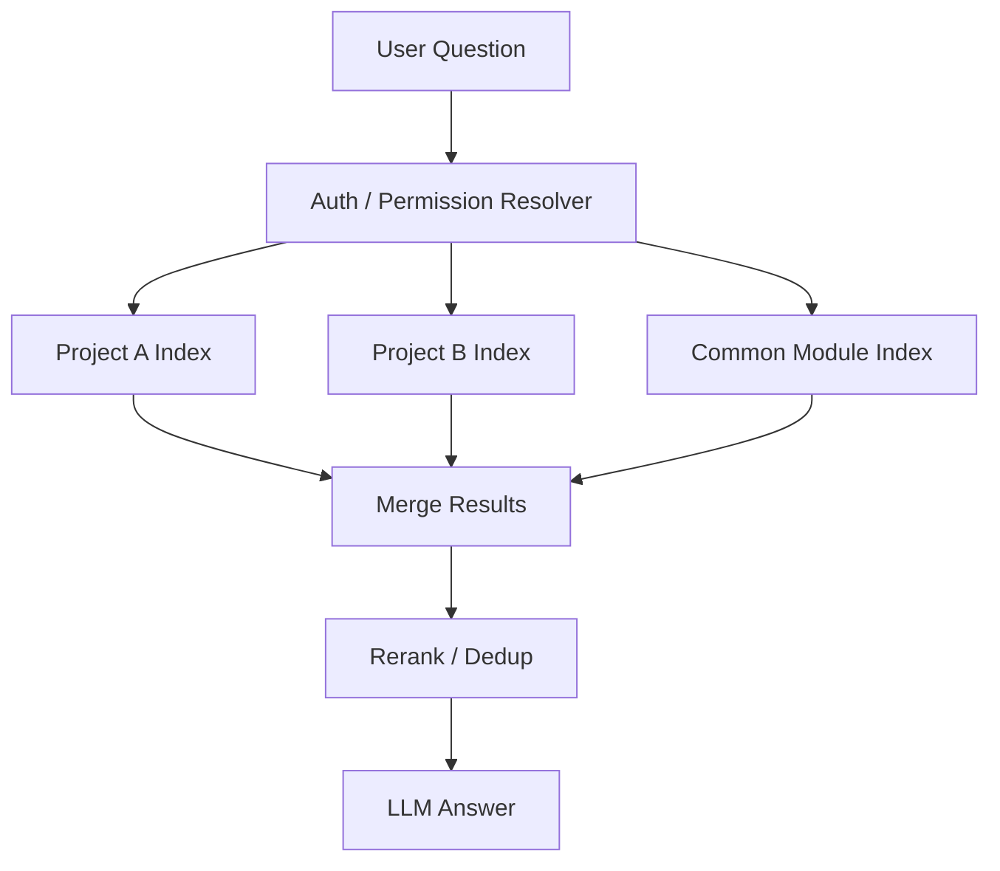
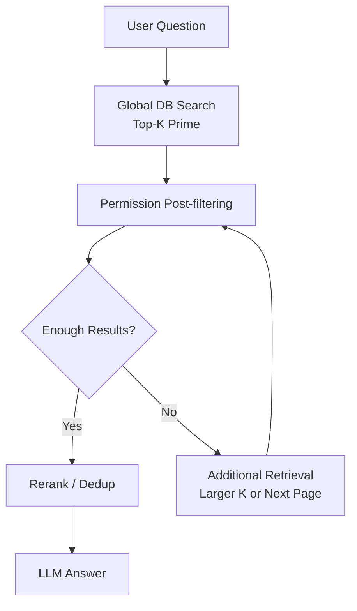
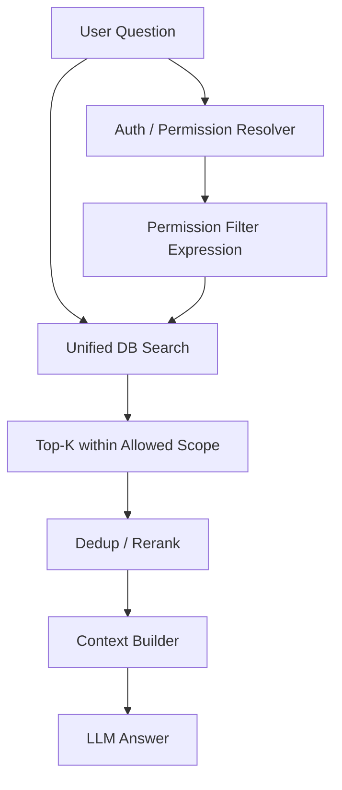
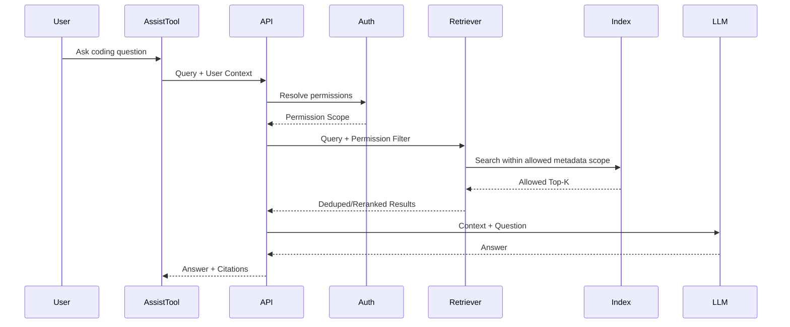

# 03. DP2 - 권한 기반 Dataset / Retrieval Strategy 선정

## 1. Decision Point 개요

### 1.1 결정 주제

본 DP는 사내 코드 어시스트 프레임워크에서, 사용자의 프로젝트/부서/역할 권한에 따라 접근 가능한 코드와 문서만 검색 및 답변에 사용하기 위한 Dataset 및 Retrieval Strategy를 선정한다.

### 1.2 배경

사내 코드는 외부 유출뿐 아니라, 사내에서도 권한에 따라 접근 범위가 달라진다.

예를 들어 다음과 같은 상황이 가능하다.

- A 프로젝트 개발자는 A Repository에는 접근 가능하지만 B 프로젝트 Repository에는 접근 불가
- 플랫폼 공통 모듈은 여러 프로젝트에서 접근 가능
- 특정 보안 모듈은 제한된 조직만 접근 가능
- 부서 이동, 프로젝트 참여 변경에 따라 권한이 동적으로 바뀜
- 같은 API 이름이 여러 프로젝트에 존재하지만 사용자 권한에 따라 보여줄 수 있는 구현이 다름

따라서 RAG 기반 코드 어시스트는 검색 정확도뿐 아니라 **권한 정합성**을 반드시 보장해야 한다.

---

## 2. 관련 Quality Attributes

| QA | 영향 |
|---|---|
| 보안성 | 권한 없는 코드/문서가 답변에 포함되면 보안 사고가 된다. |
| 권한 정합성 | 사용자별로 접근 가능한 데이터 범위가 정확히 반영되어야 한다. |
| 정확도 | 권한 필터링 이후에도 충분한 검색 결과가 남아야 정확한 답변이 가능하다. |
| 속도 | 권한 확인과 필터링이 질의 지연을 크게 증가시키면 사용성이 떨어진다. |
| 유지보수성 | 프로젝트/부서/권한 변경에 따라 DB나 Index를 관리하기 쉬워야 한다. |
| 확장성 | Repository, 프로젝트, 사용자 수 증가에도 구조가 확장 가능해야 한다. |
| 감사 가능성 | 어떤 권한 판단으로 어떤 결과가 제공되었는지 로그로 추적 가능해야 한다. |

---

## 3. 후보안

본 DP에서는 다음 후보를 비교한다.

| 후보 | 설명 |
|---|---|
| Option A. 권한별 분리 DB / Index | 프로젝트, 부서, 권한 그룹별로 별도 DB 또는 Index를 구성하고, 질의 시 사용자 권한에 맞는 DB를 선택 |
| Option B. 통합 DB + Post-filtering | 하나의 통합 DB에서 넉넉한 Top-K를 검색한 뒤 사용자 권한에 따라 결과를 필터링 |
| Option C. 통합 DB + Permission-aware Pre-filtering | 하나의 통합 DB를 사용하되, 검색 전에 권한 Metadata Filter를 적용하여 검색 후보군 자체를 제한 |

사용자가 언급한 두 가지 옵션은 A와 B에 해당한다. 본 문서에서는 Architecture 관점에서 C를 추가한다. C는 실제 실무 설계에서 보안성과 검색 효율을 동시에 고려할 때 중요한 후보가 될 수 있다.

> Note: Option C는 사용자 최초 후보에는 없던 Architecture-derived Candidate이다. Option A의 물리적/논리적 보안 경계와 Option B의 통합 DB 운영성을 절충하기 위해 추가한 후보이며, 최종 발표에서 후보를 2개로 제한해야 한다면 Appendix 또는 보완 설계로 이동할 수 있다.

---

## 4. Option A. 권한별 분리 DB / Index

### 4.1 개념

권한 그룹 또는 프로젝트 단위로 별도의 Vector DB / Keyword Index / Chunk Store를 구성한다. 사용자가 질문하면 Auth Resolver가 사용자의 권한을 확인하고, 해당 권한에 맞는 DB 또는 Index만 검색한다.

### 4.2 다이어그램



### 4.3 장점

- 물리적 또는 논리적으로 데이터가 분리되어 보안 경계가 명확하다.
- 권한 없는 DB를 검색하지 않으므로 정보 노출 가능성이 낮다.
- 프로젝트 단위 인덱스 갱신이 가능하다.
- 작은 Index를 검색하므로 특정 상황에서는 검색 속도가 빠를 수 있다.

### 4.4 단점

- DB/Index 관리 수가 증가한다.
- 사용자가 여러 권한을 가진 경우 여러 DB를 검색하고 결과를 병합해야 한다.
- 프로젝트/부서/권한 조합이 많아지면 Index 조합 폭발이 발생할 수 있다.
- 공통 모듈과 프로젝트별 모듈의 중복 관리가 복잡하다.
- 권한 변경 시 어떤 DB/Index에 반영해야 하는지 관리가 어려울 수 있다.
- 여러 DB에서 온 결과의 Score 정규화와 Reranking이 필요하다.

---

## 5. Option B. 통합 DB + Post-filtering

### 5.1 개념

모든 코드와 문서를 하나의 통합 DB/Index에 넣고, 질의 시 우선 넉넉한 Top-K를 검색한다. 그 후 검색 결과에서 사용자 권한에 맞지 않는 Chunk를 제거한다.

```text
Question → Global Search Top-K' → Permission Filtering → Final Top-K → LLM
```

### 5.2 다이어그램



### 5.3 장점

- DB/Index 관리가 단순하다.
- 전체 코드베이스를 대상으로 전역 유사도 검색이 가능하다.
- 권한 변경 시 Metadata만 갱신하면 되는 구조를 만들 수 있다.
- 공통 모듈과 프로젝트별 모듈의 중복을 하나의 Index에서 관리할 수 있다.
- Architecture가 직관적이며 확장성이 좋다.

### 5.4 단점

- 검색 단계에서는 권한 없는 데이터도 후보로 검색될 수 있다.
- Top-K 결과가 권한 없는 데이터로 많이 채워지면 필터링 후 결과가 부족할 수 있다.
- 결과 부족 시 추가 검색이 필요하여 속도가 느려질 수 있다.
- 충분한 결과를 확보하기 위해 K를 크게 잡아야 하며, 이는 검색 및 Rerank 비용을 증가시킨다.
- 구현이 잘못되면 권한 없는 데이터가 로그, Debug 정보, Intermediate Context에 노출될 위험이 있다.

---

## 6. Option C. 통합 DB + Permission-aware Pre-filtering

### 6.1 개념

하나의 통합 DB/Index를 사용하되, 검색 요청 시 사용자의 권한 Metadata를 검색 Filter로 함께 전달한다. 즉, 검색 후보군 자체를 사용자가 접근 가능한 Chunk로 제한한다.

```text
Question → Resolve User Permission → Search with Metadata Filter → Top-K from Allowed Scope → Dedup/Rerank → LLM
```

### 6.2 다이어그램



### 6.3 장점

- 통합 DB의 운영 단순성을 유지하면서 권한 없는 데이터를 검색 후보에서 제외할 수 있다.
- Post-filtering보다 결과 부족 문제가 줄어든다.
- 권한 없는 Chunk가 Intermediate Result에 들어올 가능성을 낮춘다.
- 프로젝트/부서/역할 Metadata를 활용하여 유연한 검색 범위를 구성할 수 있다.
- 공통 모듈과 프로젝트별 모듈을 하나의 Index에서 함께 관리할 수 있다.
- 권한 변경은 Metadata 또는 Permission Resolver 중심으로 반영 가능하다.

### 6.4 단점

- Vector DB/Search Engine이 Metadata Filter를 효율적으로 지원해야 한다.
- 복잡한 권한 조건을 Query Filter로 변환하는 로직이 필요하다.
- 권한 Filter가 너무 복잡하면 검색 성능이 저하될 수 있다.
- 권한 Metadata 품질이 낮으면 검색 누락 또는 과노출이 발생할 수 있다.
- DB 내부 필터의 보안 보장 수준을 검증해야 한다.

---

## 7. Trade-off 평가

평가 기준: ★★★ 매우 우수, ★★☆ 보통 이상, ★☆☆ 제한적

| QA 속성 | 권한별 분리 DB | 통합 DB + Post-filtering | 통합 DB + Pre-filtering |
|---|---:|---:|---:|
| 보안성 | ★★★ | ★★☆ | ★★★ |
| 권한 정합성 | ★★★ | ★★☆ | ★★★ |
| 검색 정확도 | ★★☆ | ★★☆ | ★★★ |
| 응답 속도 | ★★☆ | ★☆☆ | ★★☆ |
| 유지보수성 | ★☆☆ | ★★★ | ★★☆ |
| 확장성 | ★☆☆ | ★★☆ | ★★☆ |
| 개발 난이도 | ★★☆ | ★★☆ | ★★☆ |
| 운영 복잡도 낮음 | ★☆☆ | ★★★ | ★★☆ |
| 결과 부족 위험 낮음 | ★★☆ | ★☆☆ | ★★★ |
| 감사 가능성 | ★★☆ | ★★☆ | ★★★ |

### 7.1 KPI 기반 Trade-off 평가

아래 값은 현재 내부 PoC 측정값이 아니라 설계 비교를 위한 `[Expected]` 기준이다. 실제 구현 후에는 권한 Scenario, Repository Scope, Query Set을 고정하고 재측정해야 한다.

| KPI | 측정 의미 | Option A. 권한별 분리 DB / Index | Option B. 통합 DB + Post-filtering | Option C. 통합 DB + Permission-aware Pre-filtering |
|---|---|---:|---:|---:|
| Unauthorized Context Exposure Rate | 권한 없는 Chunk가 검색 결과, Context, 답변에 포함되는 비율 | [Expected] 0% 목표 | [Expected] 0% 목표이나 구현 오류 위험 중간 | [Expected] 0% 목표 |
| Allowed Result Sufficiency@10 | 권한 적용 후 Top-10에 답변 가능한 결과가 충분히 남는 비율 | [Expected] 80~95% | [Expected] 50~80% | [Expected] 85~95% |
| Permission Filter Latency Overhead | 권한 처리로 추가되는 P95 지연 | [Expected] 낮음~중간 | [Expected] 중간~높음 | [Expected] 중간 |
| Index Operation Count | 운영해야 하는 Index/DB 개수 | [Expected] 권한 그룹 수에 비례 | [Expected] 1개 중심 | [Expected] 1개 중심 + 예외 분리 |
| Permission Change Propagation Cost | 권한 변경 시 반영 비용 | [Expected] 높음 | [Expected] 낮음~중간 | [Expected] 중간 |
| Score Normalization Complexity | 여러 Index 결과를 병합할 때 점수 정규화 복잡도 | [Expected] 높음 | [Expected] 낮음 | [Expected] 낮음 |
| Audit Explainability | 질의 시 어떤 권한 조건으로 결과가 나왔는지 설명 가능성 | [Expected] 중간 | [Expected] 중간 | [Expected] 높음 |
| Sensitive Dataset Isolation | 고보안 데이터셋을 일반 데이터와 분리하는 용이성 | [Expected] 높음 | [Expected] 낮음 | [Expected] 중간~높음 |

### 7.2 KPI 평가 해석

- Option A는 권한 경계가 명확하지만, 권한 그룹과 프로젝트가 늘어날수록 Index 운영 수와 병합 복잡도가 커진다.
- Option B는 운영은 단순하지만, 권한 없는 결과를 검색한 뒤 제거하므로 필터링 후 결과 부족과 중간 결과 노출 위험을 관리해야 한다.
- Option C는 통합 Index 운영성을 유지하면서 검색 후보군을 권한 Metadata로 먼저 제한한다. 단, Vector/Search DB의 Metadata Filtering 성능과 권한 Metadata 품질이 전제 조건이다.

---

## 8. Decision

본 DP에서는 **Option C. 통합 DB + Permission-aware Pre-filtering**을 우선 선택한다.

다만, 보안 중요도가 높은 특정 프로젝트나 데이터셋에 대해서는 Option A의 분리 Index를 보조적으로 적용할 수 있도록 확장 여지를 둔다.

### 8.1 선택 이유

1. **보안성과 검색 품질의 균형이 좋다.**  
   검색 후보군 자체를 사용자의 권한 범위로 제한하므로, Post-filtering보다 권한 없는 데이터가 Intermediate Result에 들어올 위험이 낮다.

2. **통합 DB의 운영 장점을 유지한다.**  
   권한별 DB를 다수 운영하는 방식보다 Index 관리, 중복제어, 갱신 Pipeline이 단순하다.

3. **결과 부족 문제가 줄어든다.**  
   Post-filtering은 Top-K를 가져온 후 권한 없는 결과를 제거하므로 결과가 부족해질 수 있다. Pre-filtering은 처음부터 허용 범위 내에서 Top-K를 구성하므로 이 문제가 완화된다.

4. **기존 SPRAG 기반 Evidence Unit RAG와 결합하기 쉽다.**  
   Evidence Unit과 원본 Segment에 Permission Metadata를 연결하여, 권한 범위 내에서만 EU와 Source Mapping을 사용할 수 있다.

5. **감사와 추적이 가능하다.**  
   Query 시 사용된 Permission Filter Expression과 반환된 EU/Segment를 로그로 남기면, 권한 판단 근거를 추적할 수 있다.

---

## 9. 보완 설계

### 9.1 Hybrid Permission Strategy

| 데이터 유형 | 전략 |
|---|---|
| 일반 프로젝트 코드 | 통합 DB + Permission-aware Pre-filtering |
| 공통 플랫폼 코드 | 통합 DB에 포함하되 공통 접근 권한 Metadata 부여 |
| 보안 민감 코드 | 별도 분리 Index 또는 별도 보안 영역 적용 |
| Deprecated / Archived 코드 | 검색 가능 여부를 Metadata로 제어 |
| 교육/샘플 코드 | 별도 Scope로 분리하거나 낮은 우선순위 부여 |

### 9.2 권한 Metadata 모델 예시

```text
KnowledgeItem {
  knowledge_item_id
  eu_id
  segment_id
  repository_id
  project_id
  department_id
  owner_team
  access_scope
  allowed_roles
  confidentiality_level
  source_version
}
```

### 9.3 Query 시 권한 처리 흐름



---

## 10. Consequences

### 10.1 긍정적 결과

- 통합 Index 운영으로 관리 복잡도 감소
- 권한 없는 데이터가 검색 후보에 포함될 위험 감소
- 권한 범위 내 Top-K 품질 개선
- SPRAG 기반 Evidence Unit RAG와 자연스럽게 결합
- 권한 판단과 검색 결과의 Audit 가능
- 프로젝트/부서/역할 변경에 대한 대응성 향상

### 10.2 부정적 결과 및 대응

| 리스크 | 설명 | 대응 |
|---|---|---|
| Metadata Filter 성능 저하 | 복잡한 권한 Filter가 검색 속도를 낮출 수 있음 | 권한 Scope 단순화, Permission Token 사전 계산 |
| 권한 Metadata 오류 | 잘못된 Metadata가 과노출 또는 누락을 유발 | 수집 Pipeline 검증, 권한 동기화 테스트 |
| DB 기능 종속성 | 사용하는 Vector/Search DB의 Filter 기능에 의존 | DB 선택 시 Metadata Filtering 성능을 평가 |
| 보안 민감 데이터 우려 | 통합 DB 자체가 부담될 수 있음 | 민감 데이터는 별도 Index로 분리하는 Hybrid 전략 |
| 권한 변경 반영 지연 | 사용자 권한 변경 후 Index Metadata 반영 지연 | Query-time Permission Resolver를 우선 사용 |

---

## 11. 최종 결론

본 DP는 **통합 DB + Permission-aware Pre-filtering**을 선택한다.

이는 권한별 DB 분리 방식보다 운영성이 좋고, 단순 Post-filtering 방식보다 보안성과 검색 품질이 우수하다.

다만, 모든 데이터를 무조건 하나의 DB에 넣는다는 의미는 아니다. 일반 데이터는 통합 DB에서 Metadata Filter 기반으로 처리하고, 보안 민감도가 높은 데이터는 별도 Index로 분리할 수 있는 Hybrid 전략을 유지한다.

```text
기본 전략:
Unified Index + Permission-aware Pre-filtering

예외 전략:
High-confidentiality Data → Separated Secure Index
```

---

## 12. References / Evidence

| ID | 문서명 | 출처 | 본 DP에서의 활용 |
|---|---|---|---|
| REF-DP2-01 | Filtering data for vector search | OpenSearch Documentation, https://docs.opensearch.org/latest/vector-search/filter-search-knn/index/ | Vector Search에서 filtering during search와 post-filtering 차이를 설명하는 근거 |
| REF-DP2-02 | k-NN query | OpenSearch Documentation, https://docs.opensearch.org/2.19/query-dsl/specialized/k-nn/ | k-NN 검색에서 filter 필드를 적용할 수 있다는 구현 가능성 근거 |
| REF-DP2-03 | Filter by metadata | Pinecone Documentation, https://docs.pinecone.io/guides/search/filter-by-metadata | Metadata Filter로 검색 결과를 제한하는 통합 Index 설계 근거 |
| REF-DP2-04 | Filtering | Qdrant Documentation, https://qdrant.tech/documentation/search/filtering/ | Payload 기반 조건 필터를 Vector Search와 결합할 수 있다는 근거 |

---

## 13. PPT 필수 포함 포인트

| 우선순위 | PPT에 반드시 들어갈 메시지 | 이유 |
|---|---|---|
| Must | 권한은 검색 정확도만큼 중요한 Architecture Concern이며, 권한 없는 코드가 답변에 섞이면 보안 사고가 된다. | DP2의 필요성을 강하게 설명한다. |
| Must | Candidate C는 사용자 최초 후보가 아니라 A/B의 Trade-off를 보완한 Architecture-derived Candidate이다. | 후보가 늘어난 이유를 발표자가 먼저 설명할 수 있어야 한다. |
| Must | 선택안은 통합 DB + Permission-aware Pre-filtering이며, 검색 전부터 권한 범위 내 후보만 검색한다. | Post-filtering과의 차이를 분명히 보여준다. |
| Must | 고보안 데이터는 예외적으로 분리 Index를 사용하는 Hybrid 전략을 유지한다. | “통합 DB가 보안상 위험하지 않은가?” 질문에 대한 방어 포인트다. |
