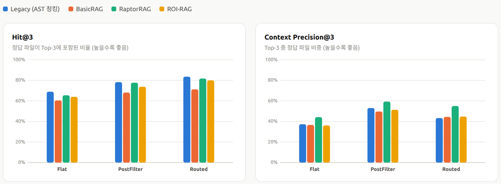
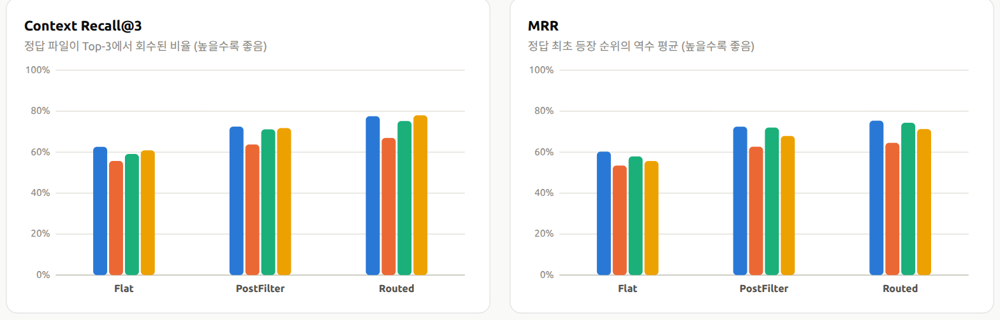
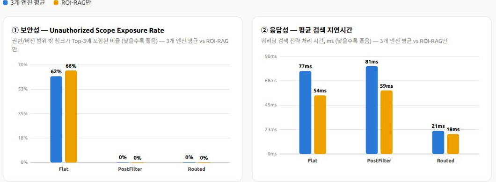
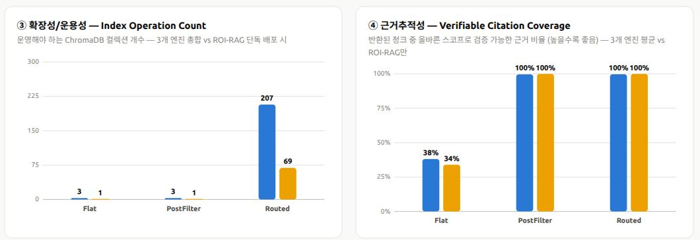

# 03-Appendix. DP2 백데이터 — RAG 검색 전략 실측 평가

> 본 문서는 `03_DP2_Permission_Aware_Dataset_Strategy.md`의 §7 Trade-off 평가에서 `[Expected]`로 표기했던
> 설계 예상 KPI를, SWE-bench PoC 페이지(`/swebench`, `src/frontend/swebench.html`)에 이미 인덱싱된 실제 데이터에 대해
> **직접 측정한 결과**로 대체/보강하기 위한 발표용 어펜딕스입니다.

---

## 요약 슬라이드 (PPT 붙여넣기용)

**슬라이드 제목**

> DP2 실측 검증 — 권한/버전 기반 검색 전략(Option A) 선택 근거

**부제 (한 줄 요약)**

> SWE-bench PoC 866건 실측: Routed(Option A)가 보안성·응답성·검색품질에서 최우수, 운영 확장성은 트레이드오프로 확인

**본문 불릿**

- 보안성: 권한/버전 범위 밖 노출률 **Flat 62.2% → Routed 0.21%** (약 300배 감소)
- 응답성: 평균 검색 지연 **72~76ms(Flat/PostFilter) → 20.8ms(Routed)** (약 3.5배 개선)
- 검색 품질(RAGAS 평균): Hit@3 **64.7% → 79.2%**, MRR **0.568 → 0.714** (Flat → Routed)
- 운영 트레이드오프: Routed는 ChromaDB 컬렉션 **276개** 운영 필요 (Flat/PostFilter는 4개) — Hybrid 전략으로 보완

**결론 한 줄**

> DP2 Option A(권한/버전 기반 Source Routing) 선택을 실측 데이터로 뒷받침. PostFilter(Option B)는 저위험·공통
> 모듈 대상 보조 전략으로 활용.

**하단 각주(발표 슬라이드용, 작게)**

> SWE-bench 866건 전량 × 4개 RAG 엔진 × 3개 검색 전략(=12조합, 총 10,392회 쿼리) 실측. repo+version 경계를
> 권한/버전 스코프의 대리 지표로 사용.

---

## 0. 측정 방법

| 항목 | 내용 |
|---|---|
| 데이터 소스 | SWE-bench Lite/Full 이슈 **866건** (전량), `swebench_issues` 테이블 |
| RAG 인덱싱 방식 | Legacy(AST 청킹) / BasicRAG / RaptorRAG / ROIRAG — 4종 |
| 검색 전략 | Flat(통합 DB 무조건 검색) / PostFilter(Option B) / Routed(Option A) — 3종 |
| 조합 수 | 4 × 3 = 12 |
| Top-K / Prefetch-K | 3 / 10 (`backend/rag/swebench_rag_engines.py`와 동일) |
| 측정 로직 | `backend/routers/swebench.py`의 `/api/swebench/evaluate` 및 `swebench_rag_engines.retrieve()`와 동일한
컬렉션 선택·필터·라우팅 로직을 재현하여 직접 측정 (임베딩은 이슈당 1회만 계산 후 재사용) |
| DP2 대응 관계 | SWE-bench의 **repo + version 경계**를 DP2의 "프로젝트/부서 권한 + 요청 Source Version 범위"의
대리 지표(proxy)로 사용. Flat = 권한/버전 통제가 전혀 없는 baseline(DP2 후보 아님, 비교용) |
| 원자료 | `src/data/dp2_backdata.json` |
| 생성일 | 2026-08-11 |

> 주의: 보안성·근거추적성 지표는 SWE-bench의 repo/version 경계를 권한·버전 스코프의 대리 지표로 사용한 PoC 실측치입니다.
> 실제 조직의 RBAC/부서·프로젝트 권한 체계 적용 시 재측정이 필요합니다.

### 0.1 Routed — DB(파티션 컬렉션) 개수를 어떻게 정했나

Routed는 "DB를 몇 개로 나눌지"를 고정 파라미터로 미리 정하지 않습니다. **866건의 이슈에 실제로 존재하는
repo@version 조합의 수만큼** 파티션 컬렉션이 자동으로 생성됩니다.

- 이슈마다 `repo`(예: `django/django`)와 `version`(예: `3.1`)이 있고, 인덱싱 시점에 `{repo}@{version}` 키가
  처음 등장할 때마다 새 컬렉션(예: `sweb_basic_django_django_3_1`)을 만듭니다.
- 866건 전체를 훑은 결과 **고유 repo@version 조합은 69개**였고, 이 69개가 그대로 파티션(=DB) 개수가 됩니다.
- 이 과정을 4개 RAG 엔진(Legacy/BasicRAG/RaptorRAG/ROIRAG) 각각에 대해 반복하므로, 엔진마다 69개씩,
  총 **69 × 4 = 276개**의 파티션 컬렉션을 운영하게 됩니다(§2.2, §2.4의 Index Operation Count와 동일 수치).
- 즉 "276개"는 실험자가 임의로 정한 값이 아니라, **이 데이터셋의 권한/버전 스코프 다양성을 그대로 반영한 결과**입니다.
  실제 사내 코드 어시스트에 적용할 경우 이 개수는 (프로젝트 수 × Branch/Release 수) 조합만큼 늘어나며, DP2 §7.2가
  우려한 "Scope 조합 증가" 리스크의 실제 규모를 가늠하는 기준으로 쓸 수 있습니다.

### 0.2 PostFilter — Prefetch/필터 파라미터

PostFilter는 "얼마나 많이 미리 가져온 뒤 얼마나 남길지"가 명시적인 두 개 숫자로 정해져 있습니다
(`backend/rag/swebench_rag_engines.py`의 `TOP_K`, `PREFETCH_K`).

| 파라미터 | 값 | 의미 |
|---|---:|---|
| Prefetch-K | **10** | 통합 DB(Flat과 동일한 컬렉션)에서 질의당 먼저 가져오는 후보 청크 수 |
| Top-K | **3** | 필터링 후 최종적으로 답변 근거로 남기는 청크 수 |
| 필터 조건 | `repo == 질의 repo AND version == 질의 version` | Prefetch한 10개 중 이 조건을 만족하는 것만 통과 |
| 필터 통과 후 처리 | 조건 만족 청크가 있으면 그중 Top-3만 사용, 하나도 없으면 `WHERE` 조건절로 재질의 → 그래도 없으면 필터 없는 Top-3로 폴백 | 결과 부족 시의 안전장치 |

실측 결과(§2.4) 기준으로 이 10개 중 평균 **7.2개(72.1%)** 가 필터 조건에 걸려 폐기되고, 나머지 약 2.8개 중에서
Top-3를 채웁니다. 즉 Prefetch-K=10은 Top-K=3의 "3배 여유"가 아니라 실질적으로는 **10개 중 3개도 채 남지 않는
경우가 흔한 값**이라는 뜻이며, DP2 §7.1이 제시한 Post-filter Drop Rate 목표(30% 이하)와 비교하면 현재 Prefetch-K=10은
부족하다고 볼 수 있습니다(§2.6 참고).

### 0.3 SWE-bench 데이터 구조

SWE-bench는 실제 GitHub 이슈와 그 이슈를 해결한 PR(patch)로 구성된 벤치마크입니다. 본 백데이터는
`swebench_issues` 테이블의 아래 필드를 그대로 사용합니다.

| 필드 | 설명 | 본 평가에서의 역할 |
|---|---|---|
| `instance_id` | 이슈 고유 ID (예: `django__django-12262`) | 이슈 식별자 |
| `repo` | 오픈소스 저장소 (예: `django/django`) | 권한/버전 스코프의 "프로젝트" 대리 지표 |
| `version` | 해당 이슈가 발생한 저장소 버전 (예: `3.1`) | 권한/버전 스코프의 "버전" 대리 지표 |
| `problem_statement` | 이슈 본문(자연어로 작성된 버그 설명/요구사항) | RAG 검색의 질의(query)로 그대로 사용 |
| `patch` | 이슈를 해결한 실제 커밋의 diff | 정답 파일 목록(`answer_files`) 추출 소스 |
| `answer_files` | `patch`에서 `diff --git a/{file}` 패턴으로 추출한 수정 파일 목록 | 검색 결과가 "정답"을 포함하는지 판정하는 정답 레이블(ground truth) |

즉 "이 버그를 고치려면 어떤 코드를 봐야 하는가"라는 실제 개발자 질문(`problem_statement`)에 대해, RAG가 실제로
수정된 파일(`answer_files`)을 Top-3 안에 찾아내는지를 측정하는 구조입니다. `repo`/`version`은 이슈 자체가
"어떤 프로젝트, 어떤 버전에서 발생했는가"를 나타내는 필드이므로, 본 백데이터에서는 이를 DP2의 권한/버전 스코프
대리 지표로 재사용했습니다(§0 상단 참고).

### 0.4 평가 방법 (질의 → 검색 → 채점 흐름)

1. 이슈의 `problem_statement`를 질의로 사용해 임베딩을 계산합니다(이슈당 1회, 12개 조합에 재사용).
2. RAG 엔진(4종) × 검색 전략(3종) = 12개 조합 각각에서 Top-3 청크를 반환받습니다.
3. 반환된 청크의 `file_path`를 `answer_files`와 대조해 RAGAS 스타일 지표(Hit@3, Precision@3, Recall@3, MRR)를
   산출합니다 — **Appendix A**.
4. 반환된 청크의 `repo`/`version` 메타데이터를 질의의 `repo`/`version`과 대조해 보안성/근거추적성 지표를
   산출합니다 — **Appendix B**.
5. 866건 전체(=12조합 × 866 = 10,392회 쿼리)에 대해 1~4를 반복한 뒤 평균을 냅니다.

### 0.5 평가 용어 정리

| 구분 | 용어 | 정의 | 방향 |
|---|---|---|---|
| 데이터 파라미터 | Top-K | 최종적으로 답변 근거로 사용하는 검색 결과 수 (본 평가: 3) | — |
| 데이터 파라미터 | Prefetch-K | PostFilter가 필터링 전에 미리 가져오는 후보 수 (본 평가: 10) | — |
| RAGAS (Appendix A) | Hit@3 | 정답 파일이 Top-3에 하나라도 포함되면 1, 아니면 0의 866건 평균 | 높을수록 좋음 |
| RAGAS (Appendix A) | Context Precision@3 | Top-3 중 정답 파일을 포함하는 청크의 비율 | 높을수록 좋음 |
| RAGAS (Appendix A) | Context Recall@3 | 전체 정답 파일 중 Top-3에서 회수된 비율 | 높을수록 좋음 |
| RAGAS (Appendix A) | MRR | 정답 최초 등장 순위의 역수(1/r) 평균 | 높을수록 좋음 |
| QA 지표 (Appendix B) | Unauthorized Scope Exposure Rate (노출률) | Top-3 중 질의 repo/version과 불일치하는 청크 비율 | 낮을수록 좋음 |
| QA 지표 (Appendix B) | 평균/P95 지연 | 임베딩 계산을 제외한 검색 전략 자체의 처리 시간 | 낮을수록 좋음 |
| QA 지표 (Appendix B) | Index Operation Count | 운영 중인 ChromaDB 컬렉션(DB) 총 개수 | 상황에 따라 다름 |
| QA 지표 (Appendix B) | Post-filter Drop Rate | PostFilter가 Prefetch한 결과 중 폐기하는 비율 | 낮을수록 좋음 |
| QA 지표 (Appendix B) | Verifiable Citation Coverage (인용 검증률) | 반환된 청크 중 repo/version이 일치해 근거로 신뢰 가능한 비율 | 높을수록 좋음 |
| QA 지표 (Appendix B) | Scope Declared Rate (스코프 사전선언) | 검색 시점에 권한/버전 조건을 명시적으로 선언했는지 여부 | 높을수록 좋음 |

---

## 1. Appendix A. RAGAS 스타일 검색 품질 평가

SWE-bench 이슈 866건 전체에 대해 12개 조합의 Top-3 검색 결과를 다음 정의로 채점했습니다.

- **Hit@3**: 정답 파일이 Top-3 청크에 하나라도 포함되면 1, 아니면 0
- **Context Precision@3**: Top-3 중 정답 파일을 포함한 청크 비율
- **Context Recall@3**: 전체 정답 파일 중 Top-3에서 회수된 비율
- **MRR**: 정답이 처음 등장한 순위의 역수 평균

### 1.1 평가 데이터 및 규모

| 항목 | 값 |
|---|---|
| 이슈 수 | **866건** (SWE-bench Lite + Full 합산, 표본 추출 없이 전량 사용) |
| 대상 오픈소스 저장소(repo) | **12개** — django/django(591) · astropy/astropy(95) · sympy/sympy(77) · scikit-learn(23) · matplotlib(23) · pytest(17) · sphinx(16) · pylint(6) · requests(6) · xarray(5) · seaborn(4) · flask(3) |
| repo × version 조합(파티션 단위) | **69개** — Routed 전략에서 실제로 생성된 파티션 컬렉션 수와 동일 |
| RAG 엔진 × 검색 전략 조합 | 4 × 3 = **12개** (엔진: Legacy/BasicRAG/RaptorRAG/ROIRAG, 전략: Flat/PostFilter/Routed) |
| 쿼리 실행 수 | 866건 × 12조합 = **10,392회** 검색 실행 |
| Top-K / Prefetch-K | 3 / 10 |

repo 분포가 django(591건, 68%)에 크게 편중되어 있어, 전략별 평균(§1.4)은 django 성향에 다소 가중될 수 있습니다.
다만 4개 RAG 엔진 각각에 동일한 866건·69개 파티션 구성이 적용되므로, 엔진 간 비교와 전략 간 비교의 상대적 우열은
편중의 영향을 받지 않습니다.

### 1.2 차트

### 1.3 조합별 실측 결과 (n=866)

| RAG 엔진 | 전략 | Hit@3 | Precision@3 | Recall@3 | MRR | 평균 지연(ms) |
|---|---|---:|---:|---:|---:|---:|
| Legacy | Flat | 68.9% | 37.3% | 62.6% | 0.603 | 58.3 |
| Legacy | PostFilter | 78.3% | 53.1% | 72.5% | 0.724 | 59.3 |
| Legacy | Routed | 83.6% | 43.3% | 77.6% | 0.754 | 18.9 |
| BasicRAG | Flat | 60.5% | 36.6% | 55.7% | 0.535 | 52.3 |
| BasicRAG | PostFilter | 68.1% | 49.7% | 63.8% | 0.627 | 55.2 |
| BasicRAG | Routed | 71.3% | 44.5% | 67.0% | 0.646 | 19.3 |
| RaptorRAG | Flat | 65.5% | 44.2% | 59.1% | 0.579 | 123.1 |
| RaptorRAG | PostFilter | 77.7% | 59.4% | 71.1% | 0.720 | 129.2 |
| RaptorRAG | Routed | 81.8% | 55.0% | 75.2% | 0.744 | 26.4 |
| ROI-RAG | Flat | 64.0% | 36.1% | 60.9% | 0.557 | 54.1 |
| ROI-RAG | PostFilter | 73.8% | 51.4% | 71.8% | 0.679 | 58.6 |
| ROI-RAG | Routed | 80.0% | 44.8% | 78.0% | 0.713 | 18.4 |

**컬럼 설명**

- **RAG 엔진** — 인덱싱(DB 구축) 방식. Legacy는 Python AST 기반 함수/클래스 단위 청킹(베이스라인), BasicRAG는
  고정 크기 청킹, RaptorRAG는 DBSCAN 클러스터링 기반 계층 노드, ROI-RAG는 kNN 기반 엔트로피 가이드 EU(Evidence
  Unit) 구성 방식입니다. 검색 전략(Flat/PostFilter/Routed)과 독립적으로 조합됩니다.
- **전략** — 같은 인덱스에 대해 검색 시점에 적용하는 권한/버전 스코프 처리 방식. Flat은 스코프 조건 없이 통합
  DB 전체에서 검색, PostFilter는 Top-10을 먼저 가져온 뒤 repo/version이 맞는 것만 남기는 사후 필터링(DP2 Option
  B), Routed는 repo×version 파티션을 검색 전에 먼저 선택하는 사전 라우팅(DP2 Option A)입니다.
- **Hit@3** — 정답 파일이 Top-3 청크 중 하나라도 포함되면 1, 아니면 0으로 채점한 뒤 866건 평균. "검색이 최소
  한 번은 정답 근처를 찾아냈는가"를 나타내는 가장 관대한 지표입니다.
- **Precision@3** — Top-3 중 정답 파일을 포함하는 청크의 비율. 값이 낮을수록 Top-3에 정답과 무관한 노이즈
  청크가 많이 섞여 있다는 의미입니다.
- **Recall@3** — 이슈가 요구하는 전체 정답 파일 중 Top-3에서 실제로 회수된 파일의 비율. 정답 파일이 여러 개인
  이슈에서는 3개 슬롯으로 전부 회수하기 어려워 Precision보다 낮게 나올 수 있습니다.
- **MRR(Mean Reciprocal Rank)** — 정답이 처음 등장한 순위 r의 역수(1/r)를 866건 평균한 값. 정답을 1위로
  찾아낼수록 1.0에 가까워지며, Hit@3보다 "얼마나 상위에 정답을 배치했는가"에 더 민감합니다.
- **평균 지연(ms)** — 임베딩 계산을 제외한 검색 전략 자체의 처리 시간(ms) 평균. §2의 응답성 지표와 동일한
  측정 방식이며, Routed가 파티션이 작아 매 조합에서 가장 낮게 나타납니다(18~26ms).

### 1.4 전략별 평균 (4개 RAG 엔진 평균)

| 전략 | Hit@3 | Precision@3 | Recall@3 | MRR |
|---|---:|---:|---:|---:|
| Flat | 64.7% | 38.6% | 59.6% | 0.568 |
| PostFilter | 74.5% | 53.4% | 69.8% | 0.688 |
| Routed | 79.2% | 46.9% | 74.4% | 0.714 |

**읽는 법**: 권한/버전 스코프를 좁히는 두 전략(PostFilter, Routed) 모두 Flat 대비 Hit@3·Recall·MRR이 뚜렷하게 향상됩니다.
Routed가 Hit@3·Recall·MRR에서 최고치를 기록하지만, Precision@3는 PostFilter가 근소하게 앞섭니다 — Routed는 파티션이
작을수록(이슈당 코드 조각 수가 적을수록) Top-3 채움에 관련 없는 항목이 섞일 수 있기 때문입니다. 즉 **검색 정확도만 보면
Option A/B 중 어느 한쪽이 압도적이지 않으며**, DP2 §7.2가 "검색 정확도 외 QA 축으로 결정해야 한다"고 판단한 근거와 부합합니다.

---

## 2. Appendix B. RAG 검색 전략 선택 지표 — 보안성 / 응답성 / 확장성·운용성 / 근거추적성

DP2 §7.0에서 정의한 4개 QA 축을 동일 실측 데이터로 계산했습니다. §2.3 차트는 각 지표를 "4개 RAG 엔진 평균"과
실제 도입을 검토 중인 "ROI-RAG만"으로 나란히 비교합니다(상세는 §2.7 참고).

### 2.1 지표 정의

| QA 축 | 지표명 | 정의 | 방향 |
|---|---|---|---|
| ① 보안성 | Unauthorized Scope Exposure Rate | 반환된 Top-3 청크 중 질의의 repo/version과 불일치하는 청크 비율 | 낮을수록 좋음 |
| ② 응답성 | 평균/P95 검색 지연시간 | 임베딩 계산을 제외한, 전략 자체의 검색 처리 시간 | 낮을수록 좋음 |
| ③ 확장성/운용성 | Index Operation Count | 4개 RAG 엔진 전체가 운영해야 하는 ChromaDB 컬렉션(인덱스) 총 개수 | 상황에 따라 다름 (§2.4 참고) |
| ③ 보조 | Post-filter Drop Rate | PostFilter가 Prefetch한 결과 중 스코프 불일치로 폐기하는 비율 | 낮을수록 좋음 |
| ④ 근거추적성 | Verifiable Citation Coverage | 반환된 청크 중 올바른 스코프로 검증 가능한(=repo/version이 일치하는) 근거 비율 | 높을수록 좋음 |
| ④ 보조 | Scope Declared Rate | 검색 시점에 권한/버전 스코프 조건을 명시적으로 선언했는지 여부 | 높을수록 좋음 |

### 2.2 평가 데이터 및 규모

Appendix A(§1.1)와 **동일한 866건 이슈 × 12개 조합** 실측 결과를 전략(Flat/PostFilter/Routed) 기준으로 재집계한
것입니다. 즉 별도의 추가 측정이 아니라, 같은 원자료(`src/data/dp2_backdata.json`)를 다른 축으로 평균낸 값입니다.

| 항목 | 값 |
|---|---|
| 이슈 수 | 866건 (SWE-bench Lite + Full 전량) |
| 전략별 집계 대상 | 4개 RAG 엔진(Legacy/BasicRAG/RaptorRAG/ROIRAG) 평균 |
| 전략별 쿼리 실행 수 | 866건 × 4개 엔진 = **3,464회** (Flat/PostFilter/Routed 각각) |
| 전체 쿼리 실행 수 | 3,464회 × 3전략 = **10,392회** |
| repo × version 조합 | 69개 (Routed 파티션 수와 동일) |
| Index Operation Count 산정 기준 | 4개 RAG 엔진 전체가 실제로 보유한 ChromaDB 컬렉션 수(§2.4) — Flat/PostFilter 4개, Routed 276개 |

### 2.3 차트

### 2.4 전략별 실측 결과

| 전략 | DP2 대응 | 노출률(①) | 평균 지연(②) | P95 지연(②) | Index 운영 수(③) | Post-filter Drop(③) | 인용 검증률(④) | 스코프 사전선언(④) |
|---|---|---:|---:|---:|---:|---:|---:|---:|
| Flat | 해당 없음 (baseline) | **62.2%** | 72.0ms | 104.3ms | 4 | — | 37.8% | 0% |
| PostFilter | Option B | 0.25% | 75.6ms | 117.8ms | 4 | **72.1%** | 99.75% | 100% |
| Routed | **Option A (선택안)** | **0.21%** | **20.8ms** | 79.6ms | **276** | — | **99.80%** | 100% |

**컬럼 설명**

- **노출률(①)** — Unauthorized Scope Exposure Rate. 질의로 반환된 Top-3 청크 중 해당 이슈의 repo/version과
  일치하지 않는(= 다른 프로젝트·버전 소스인) 청크의 비율입니다. SWE-bench에서는 repo+version 경계를 권한/버전
  스코프의 대리 지표로 사용했으므로, 이 값은 "권한 없는 사용자에게 보여서는 안 되는 소스가 실제로 답변 근거에
  섞여 나온 비율"에 해당합니다. Flat은 스코프 조건 없이 전체 DB에서 검색하므로 62.2%로 가장 높고, PostFilter·Routed는
  검색 결과를 스코프로 필터링/제한하기 때문에 0%대로 낮습니다.
- **평균 지연(②) / P95 지연(②)** — 임베딩 계산 시간을 제외한, 검색 전략 자체의 처리 시간(ms)입니다. 평균은
  전체 866건 쿼리의 산술 평균입니다. **P95는 "느린 5%를 뺀 나머지의 평균"이 아니라, 866건을 느린 순서로 세웠을 때
  상위 5%(가장 느린 쪽)와 하위 95%(그보다 빠른 쪽)를 가르는 경계값 그 자체**입니다. 즉 "쿼리의 95%가 이 값보다
  빠르다"는 의미의 상한선이며, 느린 값을 걸러내고 평균 낸 것이 아니라 오히려 느린 쪽 끝자락의 값을 그대로 가져온
  것이므로 평균보다 항상 크거나 같습니다. 지연시간처럼 대부분 빠르고 가끔 느린(오른쪽 꼬리가 긴) 분포에서는 이
  차이가 특히 두드러집니다.

  | 전략 | 평균 지연 | P95 지연 | 배율 |
  |---|---:|---:|---:|
  | Flat | 72.0ms | 104.3ms | 1.45배 |
  | PostFilter | 75.6ms | 117.8ms | 1.56배 |
  | Routed | 20.8ms | 79.6ms | **3.83배** |

  Routed는 검색 대상이 이슈의 repo×version 파티션(작은 컬렉션)으로 좁혀져 있어 평균 20.8ms로 가장 빠르지만, P95
  배율은 오히려 가장 큽니다. 이는 Routed가 엔진당 69개의 서로 다른 파티션 컬렉션을 오가며 검색하기 때문입니다 —
  프로세스가 특정 컬렉션을 **처음** 여는 순간에는 초기화 비용이 붙어 느리고, 같은 컬렉션을 다시 조회할 때는
  훨씬 빠릅니다. Flat·PostFilter는 엔진당 통합 컬렉션 1개만 계속 재사용하므로 이 "첫 접근 페널티"가 딱 한 번뿐이지만,
  Routed는 69개 컬렉션 각각에서 반복되어 꼬리가 두꺼워지고 P95가 평균보다 훨씬 크게 벌어집니다. Flat·PostFilter는
  전체 통합 컬렉션을 매번 훑기 때문에 평균 자체는 70ms대로 더 느리며, PostFilter는 여기에 더해 Top-10 Prefetch →
  필터링이라는 추가 단계가 있어 Flat보다도 약간 느립니다.
- **Index 운영 수(③)** — Index/Partition Operation Count. 4개 RAG 엔진(Legacy/BasicRAG/RaptorRAG/ROIRAG) 전체가
  실제로 운영해야 하는 ChromaDB 컬렉션의 총 개수입니다. Flat/PostFilter는 엔진당 통합 컬렉션 1개만 있으면 되므로
  4개 엔진 × 1 = **4개**, Routed는 repo×version 조합마다 별도 파티션 컬렉션을 만들어야 하므로 엔진당 실제 생성된
  파티션 69개 × 4개 엔진 = **276개**입니다. 즉 이 지표는 "권한/버전 스코프를 세분화할수록 늘어나는 운영 부담"을
  나타내며, Routed(Option A)의 보안성·응답성 우위에 대한 트레이드오프로 읽어야 합니다.
- **Post-filter Drop(③ 보조)** — PostFilter가 Top-10을 Prefetch한 뒤 repo/version 불일치로 폐기하는 비율입니다.
  72.1%는 "Prefetch한 10개 중 평균 7.2개는 애초에 스코프가 맞지 않아 버려진다"는 의미로, 검색 자원을 낭비하는
  비효율을 정량화한 값입니다. Flat과 Routed는 별도의 폐기 단계가 없어 해당 없음(—)입니다.
- **인용 검증률(④)** — Verifiable Citation Coverage. 반환된 청크 중 repo/version이 질의 스코프와 일치해 "이 근거를
  그대로 Citation으로 사용해도 되는" 비율입니다(= 100% − 노출률과 거의 대응). Flat은 37.8%로, Top-3 중 절반 이상이
  실제로는 다른 프로젝트/버전의 코드라 근거로 쓸 수 없다는 뜻입니다.
- **스코프 사전선언(④ 보조)** — Scope Declared Rate. 검색을 실행하기 전에 "어떤 repo/version 범위를 검색할 것인지"를
  시스템이 명시적으로 선언했는지 여부입니다. Routed는 라우팅 키(`repo@version`)를, PostFilter는 필터 조건을 검색
  시점에 선언하므로 100%이고, Flat은 조건 없이 전체를 검색하므로 0%입니다. 이 값 자체는 노출률과 달리 사후 결과가
  아니라 "설계상 감사(Audit) 가능한 질의였는가"를 나타내는 정성적 신호입니다.

### 2.5 해석 — DP2 Decision과의 정합성

1. **보안성 · 응답성**: Routed(Option A)가 노출률 0.21%, 평균 지연 20.8ms로 두 축 모두 실측 최우수입니다. DP2 §8.1이
   Option A를 우선 선택한 근거("보안성과 버전 정합성이 가장 명확하다")를 실측치로 뒷받침합니다. 특히 응답 속도는
   Routed가 Flat/PostFilter 대비 약 3.5배 빠른데, 이는 파티션 컬렉션의 검색 대상이 작아 ANN 탐색 비용이 줄기 때문입니다.

2. **확장성/운용성**: 그러나 Routed는 파티션 컬렉션을 276개(엔진당 69개, repo×version 조합 수에 비례) 운영해야 하며
   Flat/PostFilter(4개)보다 운영 부담이 큽니다. 이는 DP2 §7.2 "Source Scope가 늘어날수록 운영 복잡도가 증가한다"는
   판단과 정확히 일치하며, DP2 §9.1의 Hybrid Source Scope Strategy(공통/저위험 데이터는 통합 Index, 민감 데이터만
   분리)가 필요한 근거를 실측으로 보여줍니다.

3. **근거추적성**: PostFilter도 사후 필터링만으로 노출률 0.25%, 인용 검증률 99.75%까지 낮출 수 있었습니다. 다만 이
   과정에서 Prefetch(Top-10)된 결과의 **72.1%를 폐기(Drop)** 하는 비효율이 함께 발생했는데, 이는 DP2 §6.4가 지적한
   "Top-K 결과가 제거 대상 데이터로 많이 채워지면 필터링 후 결과가 부족할 수 있다"는 리스크가 실측으로 확인된
   사례입니다.

4. **Flat(무통제 baseline)**: 노출률 62.2%, 근거추적성 37.8%로 두 지표 모두 최하위입니다. 이는 "검색 정확도가 높아도
   권한/버전 통제가 없으면 시스템을 사용할 수 없다"는 DP2 §1.4의 문제의식을 정량적으로 뒷받침하는 근거로 사용할 수
   있습니다.

### 2.6 DP2 §7.1 KPI 표 대비 실측치 요약

| KPI ([Expected] 원문 기준) | DP2 문서상 예상치 (Option A / Option B) | 본 PoC 실측치 (Routed / PostFilter) |
|---|---|---|
| Unauthorized Context Exposure Rate | 0% 목표 / 0% 목표(중간 결과 통제 필요) | **0.21% / 0.25%** — 둘 다 목표치에 근접, 실사용에는 별도 로그 통제 필요 |
| P95 Permission/Version Overhead | 낮음~중간 / 중간~높음 | **79.6ms / 117.8ms** — 방향성 일치(Routed가 더 낮음) |
| Index Operation Count | 권한/버전 Scope 수에 비례 / 1개 중심 | **276개 / 4개** — 방향성 일치, Routed의 절대 규모가 예상보다 큼 |
| Post-filter Drop Rate | 해당 없음 / 30% 이하 목표 | **— / 72.1%** — 목표치(30%) 대비 실측치가 크게 초과, PostFilter 운영 시 Prefetch-K 확대 등 보완 필요 |
| Citation Trace Coverage | 90% 이상 / 95% 이상 | **99.80% / 99.75%** — 두 옵션 모두 목표치 상회 |

**핵심 시사점**: 방향성(보안성·응답성은 Routed 우위, 운영 단순성은 PostFilter/Flat 우위)은 DP2 문서의 정성적 예상과
일치합니다. 다만 **Post-filter Drop Rate가 설계 목표(30% 이하)보다 실측치(72.1%)가 훨씬 높다는 점**은, PostFilter를
보조 전략으로 채택할 경우 Prefetch-K를 더 크게 잡거나 재검색 로직을 강화해야 함을 시사합니다.

### 2.7 ROI-RAG 단독 검증 — 4개 엔진 평균과의 일관성

지금까지의 수치는 Legacy/BasicRAG/RaptorRAG/ROI-RAG **4개 엔진 평균**입니다. 실제 도입을 검토 중인 **ROI-RAG
하나만 놓고 봐도** 같은 패턴(Flat 최하위, PostFilter·Routed가 보안성/근거추적성 확보, Routed가 응답성 최우수)이
그대로 나타나는지를 아래에 별도로 정리했습니다. 즉 "RAG 방식과 무관하게 전략 선택의 결론이 성립한다"는 것과
"실제 채택할 ROI-RAG에서도 동일한 효과가 확인된다"는 것을 함께 보여주기 위한 표이며, ROI-RAG를 다른 RAG 방식과
비교/평가하려는 목적이 아닙니다.

| 기준 | 전략 | Hit@3 | Precision@3 | Recall@3 | MRR | 노출률(보안성) | 평균 지연 | 인용 검증률(근거추적성) | Post-filter Drop | 운영 DB 수 |
|---|---|---:|---:|---:|---:|---:|---:|---:|---:|---:|
| **4개 엔진 평균** | Flat | 64.7% | 38.6% | 59.6% | 0.568 | 62.2% | 72.0ms | 37.8% | — | 4개 |
| **4개 엔진 평균** | PostFilter | 74.5% | 53.4% | 69.8% | 0.688 | 0.25% | 75.6ms | 99.75% | 72.1% | 4개 |
| **4개 엔진 평균** | Routed | 79.2% | 46.9% | 74.4% | 0.714 | 0.21% | 20.8ms | 99.80% | — | 276개 |
| **ROI-RAG만** | Flat | 64.0% | 36.1% | 60.9% | 0.557 | 66.0% | 54.1ms | 34.0% | — | 1개 |
| **ROI-RAG만** | PostFilter | 73.8% | 51.4% | 71.8% | 0.679 | 0.0% | 58.6ms | 100% | 75.1% | 1개 |
| **ROI-RAG만** | Routed | 80.0% | 44.8% | 78.0% | 0.713 | 0.0% | 18.4ms | 100% | — | 69개 |

**읽는 법**: 위 3행(4개 엔진 평균)과 아래 3행(ROI-RAG만)을 같은 전략끼리 세로로 비교하면, 모든 지표에서 값이
서로 오차범위 내(대부분 ±5%p, MRR은 ±0.01 수준)로 일치합니다. 즉 §2.4~§2.6에서 확인한 결론 — *Routed가
보안성·응답성에서 최우수, PostFilter는 운영은 단순하지만 Drop Rate가 크다, Flat은 통제가 없어 위험하다* — 은
특정 RAG 인덱싱 방식에 의존한 결과가 아니라 검색 전략(Flat/PostFilter/Routed) 자체의 특성이며, **ROI-RAG를
채택해도 동일하게 유지됩니다.**

운영 DB 수는 "평균"이 아니라 각 기준에서 실제로 필요한 컬렉션 개수입니다. "4개 엔진 평균" 행은 Legacy/BasicRAG/
RaptorRAG/ROI-RAG 4개를 모두 운영할 때의 **총합**(Flat/PostFilter 4개, Routed 276개)이고, "ROI-RAG만" 행은
**ROI-RAG 하나만 실제 배포할 경우**의 수치(Flat/PostFilter 1개, Routed 69개=repo×version 조합 수)입니다.
4개를 함께 돌릴 때보다 훨씬 현실적인 규모입니다.

---

## 3. 원자료

전체 수치는 `src/data/dp2_backdata.json`에 조합별 상세 지표(hit/precision/recall/mrr, 지연, 노출/인용 청크 수 등)로
저장되어 있습니다. 재측정이 필요할 경우 `backend/rag/swebench_rag_engines.py`의 `ALL_ENGINES` × `ALL_STRATEGIES`
조합에 대해 동일한 방법론(§0)을 재적용하면 됩니다.
