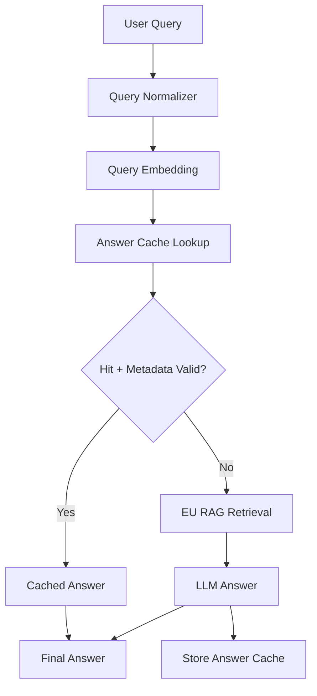
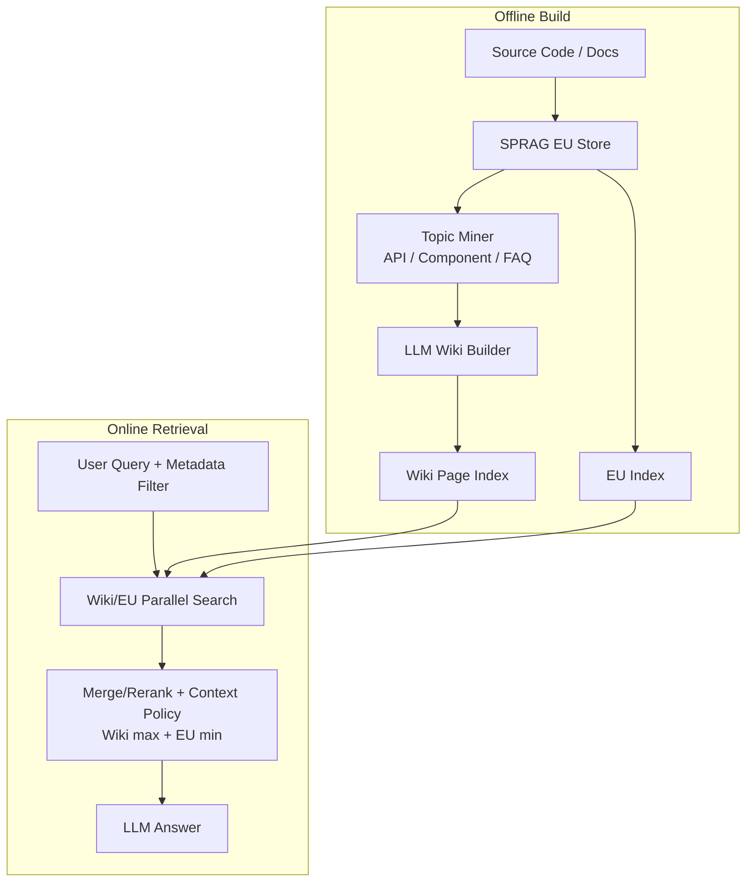

# 04. DP3 - Semantic Answer Cache vs LLM Wiki Knowledge Cache Trade-off

## 1. DP3 주제

DP3의 주제는 **중복 제어 RAG 이후에도 반복적으로 발생하는 API/설계/정책 질문에 대해, 매번 여러 Evidence Unit을 새로 조합하지 않고 빠르고 일관된 답변을 제공하기 위한 Knowledge Access Strategy를 선정하는 것**이다.

DP1의 SPRAG 기반 Evidence Unit RAG는 중복 Segment를 줄이고, 원본 Source Mapping을 유지하는 Retrieval 근거 계층을 만든다. 그러나 반복적인 사용법 질문이나 설계 규칙 질문은 여전히 매번 여러 EU를 검색하고 조합해야 한다.

따라서 DP3의 핵심 질문은 다음이다.

> 반복 질문에 대해 기존 답변을 재사용할 것인가, 아니면 EU 기반으로 미리 정리한 Topic-level Knowledge를 검색 근거로 추가할 것인가?

이 문서에서는 두 후보를 비교한다.

| 후보 | 핵심 아이디어 |
|---|---|
| Option A. Semantic Answer Cache | 과거에 들어온 유사 질문과 답변을 embedding similarity로 찾아 최종 답변을 재사용한다. |
| Option B. LLM Wiki Knowledge Cache | DP1 EU를 기반으로 offline에서 Wiki Page를 자동 생성하고, online에서는 Wiki Index와 EU Index를 함께 검색해 답변 근거로 사용한다. |

---

## 2. 배경

### 2.1 EU-only RAG의 남는 문제

Evidence Unit은 원본 Source에 가까운 근거 단위다. 중복은 줄였지만, 하나의 질문에 답하려면 여러 EU를 조합해야 할 수 있다.

예를 들어 `AuthClient` 사용법 질문에 답하려면 다음 근거들이 필요할 수 있다.

```text
EU-1: AuthClient init() signature
EU-2: AuthClient token validation behavior
EU-3: Deprecated AuthClientV1 replacement
EU-4: release/2.x migration note
EU-5: sample usage
```

EU-only RAG에서는 질문이 반복될 때마다 관련 EU를 검색하고, Top-K 안에서 이들을 다시 조합한다. 이 과정에서 다음 문제가 생긴다.

| 문제 | 설명 |
|---|---|
| 반복 질의 비용 | 같은 주제 질문마다 EU 검색, rerank, context 구성, LLM 생성을 반복한다. |
| Top-K 슬롯 비효율 | 여러 EU가 같은 Topic의 하위 정보로 소비되어, 다른 보완 근거를 넣을 여유가 줄어든다. |
| 답변 일관성 부족 | 매번 선택되는 EU 조합이 달라지면 답변의 권장 방향과 표현이 흔들릴 수 있다. |
| 표준 지식 부재 | “이 API는 언제 써야 하는가?” 같은 표준 사용 지식을 Topic 단위로 관리하기 어렵다. |

### 2.2 DP3가 해결해야 하는 것

DP3는 “검색을 더 잘하자”보다 한 단계 위의 문제를 다룬다.

```text
DP1 = 정확한 근거 조각을 만든다.
DP3 = 반복 질문에 필요한 대표 지식 단위를 어떻게 재사용할지 결정한다.
```

따라서 DP3는 DP1의 대체안이 아니라, DP1 산출물인 Evidence Unit을 소비하는 상위 Knowledge Access Layer의 선택이다. SPRAG가 없으면 LLM Wiki의 source grounding이 약해지고, LLM Wiki가 없으면 SPRAG EU-only RAG는 반복 질문마다 여러 EU를 다시 조합해야 한다. 두 결정은 의존 관계에 있지만 같은 설계 결정은 아니다.

| 구분 | DP1 SPRAG | DP3 LLM Wiki Knowledge Cache |
|---|---|---|
| 설계 질문 | 원본 코드/문서를 어떤 근거 단위로 쪼개고 중복을 줄일 것인가? | 반복 질문에 필요한 대표 지식 계층을 둘 것인가? |
| 산출물 | Evidence Unit | Topic-level Wiki Page |
| 최적화 대상 | Retrieval corpus 품질, 중복 강건성, Source Mapping | 반복 질의 비용, 답변 일관성, Top-K 슬롯 효율 |
| Online 역할 | EU Index의 검색 대상 제공 | Wiki Index를 EU Index와 함께 검색하고 Context Policy에 반영 |
| 실패 위험 | 중복 제거 실패, 잘못된 EU 구성, source mapping 손상 | stale wiki, 요약 손실, Wiki가 EU를 과도하게 대체 |
| 평가 지표 | Top-K Duplicate Ratio, Context Diversity, Citation Mapping | First Query Success, Repeated Answer Consistency, Topic Coverage@K, Context Token Count |

DP3의 좋은 후보는 다음 조건을 만족해야 한다.

- 반복 질문에서 응답 비용을 줄인다.
- 같은 Topic에 대해 답변 방향을 안정화한다.
- 코드 어시스트에 필요한 Citation과 Source Mapping을 유지한다.
- 권한/버전/최신성 문제가 생기면 원본 EU 근거로 검증하거나 보강할 수 있다.
- PoC에서 측정 가능한 trade-off를 제공한다.

---

## 3. Option A. Semantic Answer Cache

### 3.1 상세 설명

Semantic Answer Cache는 과거에 처리한 질문과 답변을 저장해두고, 새 질문이 들어오면 embedding similarity로 유사 질문을 찾아 기존 답변을 재사용하는 방식이다.

이 방식은 GPTCache 같은 semantic cache 계열 아이디어와 유사하다. 구조가 단순하고, 반복 질문이 충분히 쌓인 뒤에는 매우 빠르다.

핵심은 다음이다.

```text
"전에 비슷한 질문에 뭐라고 답했지?"
```

즉 Semantic Answer Cache는 **answer reuse** 전략이다.

### 3.2 동작 원리

1. 사용자 질문을 정규화한다.
2. 질문 embedding 또는 intent representation을 생성한다.
3. Cache에서 유사한 과거 질문을 검색한다.
4. 유사도 threshold를 넘으면 cache hit로 판단한다.
5. Cache entry의 권한 Scope, Source Version, TTL, source timestamp를 검증한다.
6. 유효하면 cached answer와 citation metadata를 반환한다.
7. Miss 또는 invalid이면 EU RAG를 수행한다.
8. 새 답변이 cacheable하면 Answer Cache에 저장한다.

### 3.3 설계 다이어그램



### 3.4 장점

| 장점 | 설명 |
|---|---|
| 구현이 쉽다 | Query embedding, vector search, threshold, TTL 정도로 최소 PoC를 만들 수 있다. |
| Cache hit 이후 매우 빠르다 | Retrieval과 LLM 생성을 생략하거나 크게 줄일 수 있다. |
| 반복 질문에 직접 대응한다 | 같은 질문 또는 매우 유사한 질문이 반복되면 효과가 크다. |
| 지표가 명확하다 | Cache Hit Rate, latency, wrong hit rate를 쉽게 측정할 수 있다. |

### 3.5 단점

| 단점 | 설명 |
|---|---|
| Cold-start에 약하다 | 과거 질문/답변이 없으면 cache 효과가 없다. |
| 잘못된 재사용 위험 | 비슷해 보이지만 다른 질문에 기존 답변을 재사용할 수 있다. |
| 최종 답변에 묶인다 | 과거 답변을 재사용하므로 새 질문의 뉘앙스에 맞춰 유연하게 재구성하기 어렵다. |
| 표준 지식 관리가 약하다 | Cache entry는 운영 지식 문서가 아니라 과거 실행 결과에 가깝다. |
| Citation 유지가 별도 과제다 | 과거 답변에 어떤 EU/source가 쓰였는지 보존하지 않으면 신뢰성이 낮아진다. |

### 3.6 Coding Assist에서의 위험 예

다음 두 질문은 semantic similarity가 높지만 답변 방향은 달라야 한다.

```text
Q1. AuthClient는 언제 써야 해?
Q2. AuthClient를 쓰면 안 되는 경우는?
```

Semantic Answer Cache가 Q1의 답변을 Q2에 재사용하면 잘못된 권장사항을 줄 수 있다. 코드 어시스트에서는 이런 wrong cache hit가 실제 구현 오류나 보안 취약점으로 이어질 수 있다.

---

## 4. Option B. LLM Wiki Knowledge Cache

### 4.1 상세 설명

LLM Wiki Knowledge Cache는 DP1의 Evidence Unit과 Source Mapping을 기반으로, offline에서 Topic-level Wiki Page를 자동 생성하고, online에서는 Wiki Index와 EU Index를 함께 검색하는 구조다.

중요한 점은 LLM Wiki가 RAG를 우회하는 별도 답변 시스템이 아니라는 것이다.

```text
LLM Wiki는 RAG를 대체하지 않는다.
LLM Wiki는 RAG의 검색 대상과 Context 후보를 확장한다.
```

즉 LLM Wiki는 다음 역할을 한다.

```text
EU 여러 개의 핵심 내용을 하나의 Topic-level Wiki Page로 압축한다.
반복 질문에서 Wiki Page가 대표 근거 역할을 한다.
EU는 세부 구현, 최신성, Citation 보강을 위해 계속 유지한다.
```

핵심은 다음이다.

```text
"이 Topic에 대해 미리 정리된 표준 지식이 있나?"
```

즉 LLM Wiki는 **knowledge reuse** 전략이다.

### 4.2 EU와 Wiki의 관계

| 구분 | Evidence Unit | LLM Wiki Page |
|---|---|---|
| 성격 | 원본 Source에 가까운 근거 조각 | 여러 EU를 기반으로 만든 Topic-level 요약 지식 |
| 정보 손실 | 낮음 | 있음 |
| 강점 | 세부 구현, 정확한 Citation, 버전 검증 | 개론적 설명, 사용법, 설계 의도, 답변 일관성 |
| 약점 | 여러 EU를 매번 조합해야 함 | 세부 구현 손실, stale 위험 |
| Online 역할 | 상세 근거와 보강 근거 | 대표 맥락과 표준 답변 방향 |

예시는 다음과 같다.

```text
EU-1: AuthClient init() signature
EU-2: AuthClient token validation behavior
EU-3: Deprecated AuthClientV1 replacement
EU-4: release/2.x migration note
EU-5: sample usage

Wiki-1: AuthClient Usage Guide
  - 언제 사용하는가
  - 권장 초기화 순서
  - Deprecated 방식
  - release별 주의사항 요약
  - source_eu_ids = [EU-1, EU-2, EU-3, EU-4, EU-5]
```

### 4.3 동작 원리

#### Offline Build

1. Source Code / Docs를 수집한다.
2. DP1 SPRAG가 Segment를 중복 제어하고 Evidence Unit을 만든다.
3. Topic Miner가 EU들을 API, Component, Decision, FAQ, Design Rule 단위로 묶는다.
4. LLM Wiki Builder가 각 Topic에 대한 Wiki Page 초안을 생성한다.
5. Wiki Page에 `source_eu_ids`, `source_segment_ids`, `release_range`, `allowed_scope`, `last_verified_commit`을 연결한다.
6. Wiki Page를 embedding하여 Wiki Index에 저장한다.
7. EU Index는 그대로 유지한다.

#### Online Retrieval

1. 사용자 질문이 들어온다.
2. 권한/버전 metadata filter를 만든다.
3. Wiki Index와 EU Index를 함께 검색한다.
4. Wiki result와 EU result를 merge/rerank한다.
5. Context 구성 시 Wiki result 수를 제한하고 EU 최소 포함량을 둔다.
6. LLM은 Wiki의 개론/표준 지식과 EU의 세부 근거를 함께 사용해 답변한다.

### 4.4 설계 다이어그램



### 4.5 Top-K 슬롯 효율 관점

EU-only RAG에서는 반복 질문 하나에 답하기 위해 여러 EU가 필요할 수 있다.

```text
Top-K = EU-1, EU-2, EU-3, EU-4, EU-5
```

LLM Wiki + EU RAG에서는 Wiki Page 하나가 여러 EU의 핵심을 압축한 대표 근거가 된다.

```text
Top-K = Wiki-AuthClient-Usage, EU-1, EU-4
```

이 경우 Wiki는 개론적 설명과 표준 답변 방향을 제공하고, EU는 최신 구현이나 정확한 Citation을 보강한다. 따라서 같은 Top-K 안에서 더 넓은 topic coverage를 얻을 수 있다.

### 4.6 장점

| 장점 | 설명 |
|---|---|
| Cold-start에 강하다 | 과거 질문이 없어도 offline에서 생성한 Wiki Page를 첫 질문부터 사용할 수 있다. |
| Top-K 슬롯 효율이 좋다 | 하나의 Wiki Page가 여러 EU의 핵심을 압축해 대표 근거 역할을 한다. |
| 답변 일관성이 높다 | 반복 질문이 같은 Wiki Topic을 중심으로 답변되어 권장 방향이 안정된다. |
| 질문별 답변 생성이 가능하다 | 과거 답변을 그대로 재사용하지 않고 Wiki 근거로 새 질문에 맞게 답변한다. |
| 사람이 직접 작성하지 않아도 된다 | Wiki Page는 LLM이 EU 기반으로 offline 자동 생성한다. |
| Source Mapping을 유지할 수 있다 | Wiki Page에 source_eu_ids와 source_segment_ids를 연결할 수 있다. |

### 4.7 단점

| 단점 | 설명 |
|---|---|
| 손실 압축이다 | Wiki 생성 과정에서 세부 구현이나 예외 조건이 빠질 수 있다. |
| Staleness 위험이 있다 | 원문 Source가 바뀌었는데 Wiki가 갱신되지 않으면 오래된 설명을 제공할 수 있다. |
| 생성 오류 위험이 있다 | LLM이 Wiki Page를 잘못 요약하면 반복적으로 사용될 수 있다. |
| 검색 비용이 완전히 사라지지는 않는다 | Wiki Index와 EU Index를 함께 검색하므로 Retrieval 자체를 제거하는 구조는 아니다. |
| Context 정책이 필요하다 | Top-K가 Wiki로만 채워지지 않도록 Wiki max, EU min 같은 정책이 필요하다. |

### 4.8 Context 구성 정책

LLM Wiki를 사용할 때 Top-K가 Wiki Page로만 채워지는 것은 위험하다. Wiki는 손실 요약이므로 세부 근거와 Citation 보강을 위해 EU가 함께 필요하다.

PoC에서는 다음처럼 단순한 정책을 둘 수 있다.

```text
Final Context Policy:
- Wiki result max: 1
- EU result min: 3
- usage / guideline 질문: best Wiki + top EU evidence
- implementation / exact code 질문: EU 중심, Wiki optional
```

이 정책은 복잡한 router가 아니라 context 구성 규칙이다. 설명과 구현이 비교적 쉽다.

---

## 5. Semantic Answer Cache vs LLM Wiki 비교

### 5.1 핵심 차이

| 구분 | Semantic Answer Cache | LLM Wiki Knowledge Cache |
|---|---|---|
| 재사용 대상 | 과거 질문의 최종 답변 | EU 기반 Topic-level 지식 근거 |
| 핵심 전략 | Answer reuse | Knowledge reuse |
| Cold-start | 약함 | 강함 |
| 반복 질문 속도 | Cache hit 이후 매우 빠름 | Wiki hit 시 context 효율 개선 |
| 질문 변형 대응 | 유사도 threshold에 의존 | 같은 Wiki Topic을 근거로 질문별 답변 생성 |
| Wrong reuse 위험 | 높음 | 상대적으로 낮음 |
| Citation | 과거 답변에 citation을 별도 저장해야 함 | Wiki metadata에 source_eu_ids를 연결 |
| 사람이 직접 생성 필요 | 없음 | 없음. LLM이 offline 생성 |
| 주된 위험 | 잘못된 답변 재사용 | stale wiki, 요약 오류 |
| Architecture 성격 | Application-level cache | Knowledge layer + retrieval corpus 확장 |

### 5.2 기술적 비교

| 비교 기준 | Semantic Answer Cache | LLM Wiki Knowledge Cache | 판단 |
|---|---|---|---|
| 구현 난이도 | 낮음 | 중간 | Answer Cache가 PoC는 쉽다. |
| 첫 질문 대응 | 약함 | 강함 | Wiki는 offline 생성되어 첫 질문부터 사용 가능하다. |
| Top-K 효율 | 개선 제한적 | 개선 가능 | Wiki Page 하나가 여러 EU의 대표 근거가 될 수 있다. |
| 답변 일관성 | 과거 답변 품질에 의존 | Wiki Topic에 의해 안정화 | Wiki가 DP3 주제에 더 직접적이다. |
| 세부 구현 정확도 | Cache된 답변에 의존 | EU 보강으로 유지 가능 | Wiki+EU 조합이 더 안전하다. |
| 운영 리스크 | Wrong cache hit | Stale wiki | 둘 다 metadata validation이 필요하다. |
| Coding Assist 적합성 | FAQ성 질문에 빠름 | 사용법/설계 규칙/Deprecated 설명에 강함 | Wiki가 표준 지식 운영에 유리하다. |

### 5.3 QA 기반 Trade-off

| QA | Semantic Answer Cache | LLM Wiki Knowledge Cache | 별점 기준 KPI / 근거 |
|---|---|---|---|
| QA-02 응답 속도 | ★★★ | ★★☆ | ★ Cache hit 이후 RAG/LLM 생략 가능 / ★★ Wiki+EU 검색으로 Context token 감소 기대 / ★★★ P95 Latency 2초 이내 또는 Baseline 대비 30%+ 감소. Answer Cache는 hit 이후 최단 latency가 강점이다. |
| QA-06 유지보수성 | ★★☆ | ★★★ | ★ 과거 답변 entry만 축적되어 지식 운영성이 낮음 / ★★ TTL·metadata 관리 가능 / ★★★ Topic-level Wiki Page, source_eu_ids, last_verified_commit으로 지식 단위 관리 가능. |
| QA-08 근거 추적성 | ★★☆ | ★★★ | ★ Citation 저장 누락 위험 / ★★ cached answer에 citation metadata 보존 / ★★★ Wiki source_eu_ids와 EU 보강으로 Citation Trace Coverage 95%+ 목표. |
| QA-01 정확도 | ★★☆ | ★★★ | ★ Wrong cache hit 위험 큼 / ★★ threshold·metadata 검증으로 완화 / ★★★ Wiki는 과거 답변 재사용이 아니라 EU 기반 지식을 근거로 질문별 답변 생성. Required Key Point Coverage와 Faithfulness로 검증. |
| QA-04 권한/버전 정합성 | ★★☆ | ★★☆ | 두 후보 모두 metadata validation이 필수다. Semantic Cache는 cache key와 TTL, Wiki는 release_range와 last_verified_commit 관리가 핵심이다. Wrong Version Citation 0%를 목표로 한다. |

별점 해석은 다음과 같다.

- ★☆☆: 해당 QA를 만족하려면 추가 보완이 많이 필요하다.
- ★★☆: 기본 구조로 대응 가능하지만 운영 metadata와 검증 정책이 중요하다.
- ★★★: 후보의 구조적 강점이 해당 QA에 직접 연결된다.

### 5.4 Trade-off 해석

Semantic Answer Cache는 “반복 질문이 충분히 쌓인 후” 가장 단순하고 빠른 후보이다. 하지만 과거 답변을 재사용하기 때문에 질문 의도가 조금만 달라져도 잘못된 답변을 재사용할 수 있다. 또한 cache entry는 운영 지식 문서가 아니라 과거 실행 결과이므로 표준 지식 관리에는 약하다.

LLM Wiki Knowledge Cache는 Retrieval을 완전히 생략하지 않는다. 대신 EU 기반으로 사전에 생성한 Wiki Page가 Topic-level 대표 근거가 되어 Top-K 슬롯 효율과 답변 일관성을 개선한다. 특히 coding assist에서 반복되는 API 사용법, Deprecated 대체 방향, 설계 규칙 질문에 적합하다.

---

## 6. Appendix DP3 - PoC 설계와 방어 논리

### 6.1 DP1과 DP3 분리 방어 논리

예상 질문은 다음과 같다.

> LLM Wiki가 offline에서 EU를 요약해 만드는 것이라면, 그냥 DP1 SPRAG의 일부 아닌가?

답변은 다음처럼 정리한다.

```text
DP1은 retrieval corpus의 근거 단위를 만드는 결정이다.
DP3는 반복 질문에서 어떤 지식 계층을 재사용할지 결정한다.
LLM Wiki는 DP1의 EU를 입력으로 사용하지만, EU 생성 방식이 아니라 Wiki Index와 EU Index를 함께 사용하는 Knowledge Access Strategy다.
```

Online 시점에도 LLM Wiki는 사용된다. 다만 online에서 새 Wiki를 생성하지 않을 뿐이다.

```text
User Query
-> Wiki Index Search + EU Index Search
-> Merge / Rerank
-> Context Policy
   - Wiki max 1
   - EU min 3
-> LLM Answer
```

설계적으로 DP3에 남는 결정은 다음이다.

| 설계 결정 | DP3에서 다루는 이유 |
|---|---|
| Wiki Index를 둘 것인가 | EU-only RAG의 반복 조합 비용과 답변 변동성을 줄이는 결정이다. |
| Wiki와 EU를 함께 검색할 것인가 | Wiki는 손실 요약이고 EU는 원본 근거이므로 둘의 역할 분리가 필요하다. |
| Context Policy를 어떻게 둘 것인가 | Top-K가 Wiki로만 채워지지 않도록 Wiki max, EU min 정책이 필요하다. |
| Stale Wiki를 어떻게 무효화할 것인가 | Wiki는 offline 산출물이므로 release_range, last_verified_commit 관리가 필요하다. |
| 무엇을 측정할 것인가 | DP1 지표가 아니라 반복 답변 일관성, Topic Coverage@K, Context Token Count를 본다. |

발표용 방어 문장은 다음과 같다.

> DP1은 정확하고 중복이 적은 Evidence Unit을 만드는 결정이고, DP3는 그 Evidence Unit 위에 반복 질문용 대표 지식 계층을 둘 것인지 결정하는 항목입니다. LLM Wiki는 offline에서 생성되지만 online에서는 Wiki Index와 EU Index가 함께 검색되고 Context Policy에 의해 답변 근거로 선택됩니다. 따라서 DP1과 의존 관계는 있지만, 최적화 대상과 평가 지표가 다른 별도 설계 결정입니다.

### 6.2 PoC 목적

PoC의 목적은 LLM Wiki가 Semantic Answer Cache보다 항상 빠르다는 것을 보이는 것이 아니다.

목표는 다음 trade-off를 확인하는 것이다.

```text
Semantic Answer Cache:
  cache hit 이후 빠르지만 cold-start와 wrong reuse 위험이 있다.

LLM Wiki + EU RAG:
  첫 질문부터 사용 가능하고, Top-K 슬롯 효율과 답변 일관성을 개선한다.
```

### 6.3 PoC 데이터 구성

작은 샘플 도메인을 정한다.

예시 Topic:

- AuthClient 사용법
- Deprecated AuthClientV1 대체
- Token validation 주의사항
- Release 2.x migration note
- Error handling guideline

준비 데이터:

```text
EU Set:
- EU-1: AuthClient init() signature
- EU-2: AuthClient token validation behavior
- EU-3: AuthClientV1 deprecated note
- EU-4: release/2.x migration guide
- EU-5: sample usage
- EU-6: error handling rule

Wiki Set:
- Wiki-1: AuthClient Usage Guide
- Wiki-2: AuthClient Migration Guide
- Wiki-3: Auth Error Handling Guide
```

### 6.4 LLM Wiki 생성 방법

사람이 Wiki를 직접 작성하지 않는다. LLM이 EU를 입력으로 offline 자동 생성한다.

#### Step 1. Topic Mining

EU metadata와 text를 기반으로 topic 후보를 만든다.

```text
Input:
- EU text
- symbol_name
- file_path
- tags
- source_segment_ids

Output:
- topic_id
- topic_title
- related_eu_ids
```

PoC에서는 수동 topic seed를 줘도 된다. 단, Wiki 본문은 사람이 쓰지 않고 LLM이 생성한다.

#### Step 2. Wiki Generation Prompt

LLM에게 관련 EU 묶음을 넣고 Wiki Page 초안을 생성시킨다.

```text
Generate a concise coding-assist wiki page from the following Evidence Units.

The page must include:
- When to use
- Recommended usage
- Deprecated or risky patterns
- Version-specific notes
- Source EU IDs
- Unknown or uncertain points as TBD

Do not invent facts not supported by Evidence Units.
```

#### Step 3. Metadata Binding

생성된 Wiki Page에 Source Mapping을 붙인다.

```text
WikiPage {
  page_id
  topic
  content
  source_eu_ids
  source_segment_ids
  release_range
  allowed_scope
  last_verified_commit
}
```

#### Step 4. Wiki Index 생성

Wiki Page를 embedding하여 Wiki Index에 저장한다.

```text
wiki_index.add(page_id, embedding, metadata)
eu_index.add(eu_id, embedding, metadata)
```

### 6.5 비교 대상 구현

#### A. Semantic Answer Cache

```text
Query
-> Semantic Answer Cache Lookup
-> Hit: cached answer
-> Miss: EU-only RAG
-> Store answer
```

#### B. LLM Wiki + EU RAG

```text
Query
-> Wiki Index Search
-> EU Index Search
-> Merge / Rerank
-> Context Policy
   - Wiki max 1
   - EU min 3
-> LLM Answer
```

### 6.6 비교 테스트 시나리오

#### 시나리오 1. Cold-start 반복 질문

목적: Answer Cache는 과거 질문이 없으면 miss이고, Wiki는 offline 생성된 page로 첫 질문부터 대응 가능함을 확인한다.

질문:

```text
Q1. AuthClient는 언제 써야 해?
Q2. AuthClient 초기화는 어떻게 해?
Q3. Deprecated AuthClientV1 대신 뭘 써야 해?
```

측정:

- First Query Success Rate
- Context Token Count
- P95 Latency
- Topic Coverage@K
- Citation Trace Coverage

#### 시나리오 2. 질문 표현 변형

목적: 같은 Topic의 질문이 표현만 바뀔 때 답변 방향이 유지되는지 확인한다.

질문:

```text
Q1. AuthClient는 언제 써야 해?
Q2. 인증 클라이언트 사용 기준 알려줘.
Q3. 토큰 검증할 때 AuthClient를 써야 하나?
Q4. 로그인 처리에서 AuthClient를 쓰는 이유가 뭐야?
```

측정:

- Same-topic Grounding Rate
- Repeated Answer Consistency
- Required Key Point Coverage
- Wrong Cache Hit Rate

#### 시나리오 3. 비슷하지만 다른 질문

목적: Semantic Answer Cache가 비슷하지만 다른 질문에 기존 답변을 잘못 재사용하는지 확인한다.

질문:

```text
Q1. AuthClient는 언제 써야 해?
Q2. AuthClient를 쓰면 안 되는 경우는?
Q3. AuthClientV1을 계속 써도 되는 경우는?
Q4. Release 2.x에서 AuthClient 초기화 시 주의사항은?
```

측정:

- Wrong Answer Reuse Rate
- Intent-specific Answer Accuracy
- Contradiction Rate
- Fallback / EU Support Rate

#### 시나리오 4. Top-K 슬롯 효율

목적: Wiki Page가 여러 EU의 핵심을 압축해 Top-K 슬롯 효율을 높이는지 확인한다.

비교:

```text
EU-only:
Top-K = EU-1, EU-2, EU-3, EU-4, EU-5

Wiki + EU:
Top-K = Wiki-AuthClient-Usage, EU-1, EU-4
```

측정:

- Context Token Count
- Unique Topic Coverage@K
- Evidence Topic Coverage
- Answer Completeness
- Citation Trace Coverage

### 6.7 측정 지표 정의

| 지표 | 의미 | 기대되는 관찰 |
|---|---|---|
| First Query Success Rate | 과거 cache가 없는 첫 질문에서 충분한 답변을 생성한 비율 | LLM Wiki 우위 |
| P95 Latency | End-to-end 응답 시간 | Answer Cache hit은 강함, cold-start는 Wiki 우위 가능 |
| Context Token Count | LLM에 투입된 context token 수 | Wiki+EU가 반복 설명 질문에서 감소 가능 |
| Topic Coverage@K | Top-K 안에서 필요한 하위 주제를 얼마나 포함했는지 | Wiki+EU 우위 |
| Repeated Answer Consistency | 같은 Topic 질문의 핵심 권장사항 일관성 | LLM Wiki 우위 |
| Wrong Cache Hit Rate | 비슷하지만 다른 질문에 기존 답변을 잘못 재사용한 비율 | Semantic Cache 리스크 |
| Citation Trace Coverage | 답변 근거가 EU/source까지 연결되는 비율 | Wiki+EU가 source_eu_ids 유지 시 우위 또는 동등 |
| Fallback / EU Support Rate | Wiki 답변에 EU 보강이 필요한 비율 | Wiki 단독이 아니라 Wiki+EU 구조임을 검증 |

---

## 7. Trade-off 작성 방법

### 7.1 발표용 비교표 예시

| 기준 | Semantic Answer Cache | LLM Wiki + EU RAG |
|---|---|---|
| 기본 방식 | 과거 질문/답변 재사용 | EU 기반 Wiki Page를 검색 근거로 추가 |
| 성능 이득 | Cache hit 시 LLM/RAG 생략 가능 | Top-K 슬롯 효율, context token 감소, 답변 일관성 개선 |
| Cold-start | 약함 | 강함 |
| 질문 변형 | threshold 의존 | Topic-level Wiki 근거로 안정적 |
| 잘못된 재사용 위험 | 높음 | 낮음. 단 stale wiki 위험 존재 |
| Citation | cached answer에 별도 보존 필요 | Wiki source_eu_ids로 연결 |
| PoC 난이도 | 낮음 | 중간 |
| 적합한 질문 | 완전히 반복되는 FAQ | 사용법, 설계 규칙, Deprecated 대체, 정책성 설명 |

### 7.2 선택 논리 작성

선택 논리는 속도만으로 쓰면 약하다. Answer Cache가 더 빠를 수 있기 때문이다.

대신 다음 순서로 작성한다.

1. Semantic Answer Cache는 가장 단순하고 빠른 후보임을 인정한다.
2. 그러나 coding assist에서는 비슷하지만 다른 질문에 답변을 잘못 재사용하는 위험이 크다.
3. LLM Wiki는 과거 답변이 아니라 EU 기반 Topic Knowledge를 재사용한다.
4. Wiki는 Top-K 슬롯 효율과 답변 일관성을 개선한다.
5. EU Index를 함께 유지하므로 세부 구현과 Citation 보강도 가능하다.
6. 따라서 본 과제의 DP3 목표에는 LLM Wiki + EU RAG가 더 균형 잡힌 선택이다.

### 7.3 발표용 결론 문장

> Semantic Answer Cache는 반복 질문이 충분히 쌓인 뒤에는 가장 빠른 후보지만, 과거 답변 재사용 방식이므로 cold-start와 wrong cache hit 위험이 있다. 반면 LLM Wiki Knowledge Cache는 DP1의 Evidence Unit을 기반으로 offline에서 Topic-level Wiki Page를 자동 생성하고, online에서는 Wiki Index와 EU Index를 함께 검색한다. Wiki는 개론적/반복적 질문의 대표 근거가 되어 Top-K 슬롯 효율과 답변 일관성을 높이고, EU는 세부 구현과 Citation을 보강한다. 따라서 coding assist의 반복 API/설계/정책 질문에는 LLM Wiki + EU RAG가 더 안정적인 Knowledge Access Strategy다.

---

## 8. References / Evidence

| ID | 문서명 | 출처 | 활용 |
|---|---|---|---|
| REF-DP3-TR-01 | GPTCache: An Open-Source Semantic Cache for LLM Applications | https://aclanthology.org/2023.nlposs-1.24/ | Semantic Answer Cache 후보 근거 |
| REF-DP3-TR-02 | GPTCache Documentation | https://gptcache.readthedocs.io/ | Semantic cache 구조와 사용 방식 참고 |
| REF-DP3-TR-03 | RAGCache: Efficient Knowledge Caching for Retrieval-Augmented Generation | https://arxiv.org/abs/2404.12457 | RAG knowledge/context cache 계열 비교 근거 |
| REF-DP3-TR-04 | Microsoft GraphRAG Documentation | https://microsoft.github.io/graphrag/ | Offline에서 구조화/요약 지식을 생성하고 query에 활용하는 패턴 참고 |
