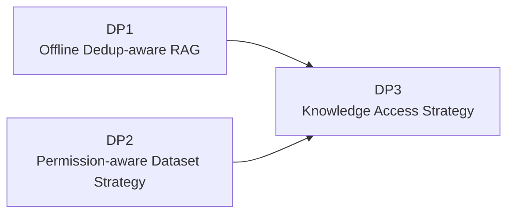
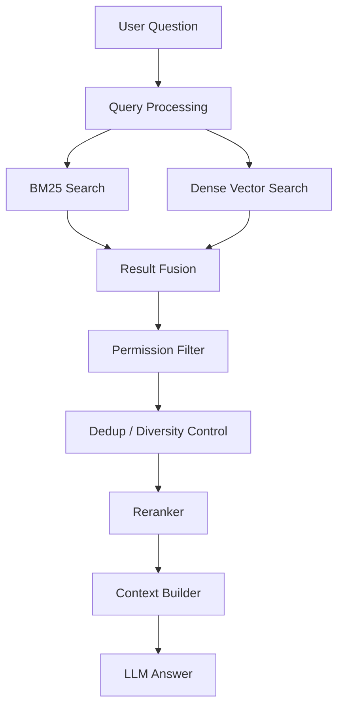
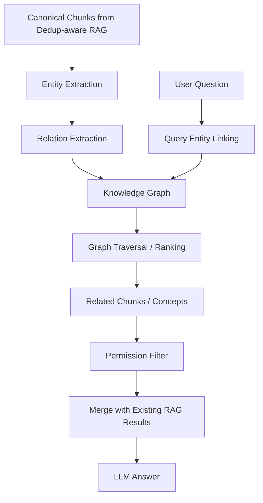
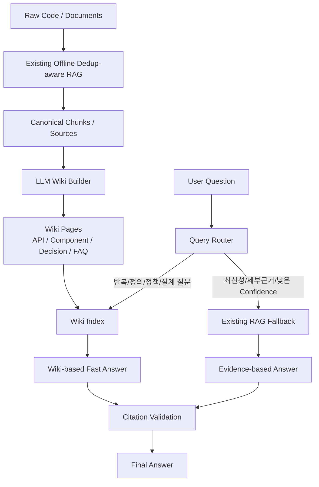

# 04. DP3 - Existing Dedup-aware RAG 기반 Knowledge Access Strategy 선정

## 1. Decision Point 개요

### 1.1 결정 주제

본 DP는 이미 Offline Dedup-aware RAG를 Baseline으로 채택한 상태에서, 중복이 많은 사내 코드/문서 데이터 환경의 QA 속도와 정확도를 추가 개선하기 위한 **Knowledge Access Strategy**를 선정한다.

### 1.2 본 DP의 위치

본 DP는 DP1과 DP2 이후의 후속 결정이다.



즉, 본 DP는 다음 전제를 가진다.

- 기존 RAG는 Offline 단계에서 중복제어를 수행한다.
- 검색 대상 Chunk에는 권한 Metadata가 연결된다.
- 질의 시 사용자의 권한 범위 내 데이터만 검색 또는 답변에 사용한다.
- 본 DP의 목적은 기존 RAG를 대체하는 것이 아니라, 기존 RAG 위에서 QA 속도와 정확도를 더 개선하는 것이다.

---

## 2. 이 DP가 필요한 이유

### 2.1 기존 Dedup-aware RAG가 해결하는 것

기존 RAG는 Offline 단계에서 다음 문제를 완화한다.

- 완전히 동일한 문서 제거
- 유사 Chunk Cluster 구성
- Canonical Chunk 선정
- Top-K 중복 편향 완화
- Deprecated 코드와 최신 코드 구분 기반 마련

이는 매우 중요한 기반이다.

### 2.2 그러나 여전히 남는 문제

Offline Dedup만으로는 다음 문제가 남는다.

| 남는 문제 | 설명 |
|---|---|
| 반복 질의 비용 | 같은 질문에도 매번 검색, Dedup, Rerank, Context 구성이 필요하다. |
| 답변 일관성 | Top-K 구성에 따라 동일 질문의 답변이 달라질 수 있다. |
| Context 비용 | 중복은 줄었지만 여전히 여러 Chunk를 LLM Context로 넣어야 한다. |
| 관계형 질문 | 요구사항, 설계 결정, 코드 구현 사이의 연결을 따라가야 할 수 있다. |
| Canonical Answer 부족 | “이 시스템에서 X는 무엇인가?” 같은 질문에 대해 미리 정리된 답변이 없다. |
| QA 속도 | 개발 도구 내 사용성을 위해 검색 및 Context 구성 비용을 더 줄일 필요가 있다. |

따라서 본 DP는 다음 질문에 답한다.

> 기존 Dedup-aware RAG 위에서, QA 속도와 중복 데이터 환경의 정확도를 높이기 위해 어떤 Knowledge Access 방식을 추가할 것인가?

---

## 3. 후보안

본 DP에서는 다음 세 가지 후보를 비교한다.

| 후보 | 설명 |
|---|---|
| Option A. Dense + BM25 Hybrid Retrieval 보강 | 기존 RAG의 검색 레이어에 Sparse/Dense Hybrid Search를 적용 |
| Option B. HippoRAG-style Graph Retrieval 확장 | Entity/Relation Graph를 구성하여 관계형 Multi-hop Retrieval 수행 |
| Option C. LLM Wiki Knowledge Cache | Dedup 결과를 기반으로 Canonical Wiki Page를 생성하고 QA에 우선 활용 |

---

## 4. Option A. Dense + BM25 Hybrid Retrieval 보강

### 4.1 개념

Dense + BM25는 RAG 자체가 아니라 RAG 내부 Retrieval 단계의 검색 전략이다.

- Dense Search: 의미 기반 검색
- BM25 Search: 키워드 기반 검색
- Hybrid Fusion: 두 결과를 결합하여 검색 Recall/Precision을 개선

### 4.2 구조



### 4.3 장점

- 기존 RAG에 비교적 쉽게 결합 가능하다.
- 정확한 API명, 함수명, 파일명, 에러 메시지 검색에 강하다.
- 사용자가 다른 표현으로 질문해도 의미 검색으로 보완할 수 있다.
- 기존 Dedup/Rerank와 함께 사용하면 안정적인 검색 품질을 기대할 수 있다.

### 4.4 단점

- 중복제어 자체가 목적은 아니다.
- BM25와 Dense가 각각 유사한 Chunk를 가져와 중복 후보가 다시 늘 수 있다.
- 기존 RAG가 이미 강한 검색 구조를 가지고 있다면 개선 폭이 제한적일 수 있다.
- 반복 질의에 대해 매번 검색과 Context 구성이 필요하다.

### 4.5 본 과제에서의 의미

Dense + BM25는 **검색 품질 보강책**으로 의미가 있다. 다만 본 DP의 핵심 목표인 “중복이 많은 데이터에서의 QA 속도와 Canonical Answer 일관성”에는 직접성이 상대적으로 낮다.

---

## 5. Option B. HippoRAG-style Graph Retrieval 확장

### 5.1 개념

HippoRAG-style 접근은 문서/코드에서 Entity와 Relation을 추출하여 Knowledge Graph를 만들고, 질문 시 Graph Traversal을 통해 관련 지식을 찾는 방식이다.

예를 들면 다음 관계를 만들 수 있다.

```text
Requirement A → implemented_by → Component B
Component B → uses → Internal API C
Decision D → affects → Module E
```

### 5.2 구조



### 5.3 장점

- 관계형 질문과 Multi-hop QA에 강하다.
- 요구사항, 설계 결정, 컴포넌트, API 사이의 연결을 표현할 수 있다.
- Impact Analysis, Traceability, Dependency QA로 확장 가능하다.
- 중복 데이터의 반복 내용을 Entity/Relation 단위로 압축할 가능성이 있다.

### 5.4 단점

- Entity/Relation 추출 품질에 크게 의존한다.
- Graph 구축, 갱신, Canonicalization 비용이 크다.
- 같은 개념이 여러 이름으로 등장하면 Graph 중복이 새로 생긴다.
- 속도 개선보다는 관계형 정확도 개선에 가까운 옵션이다.
- 본 과제 범위에서 초기 채택하기에는 구현 및 설명 복잡도가 높다.

### 5.5 본 과제에서의 의미

HippoRAG-style 접근은 장기적으로 매력적인 확장 후보이다. 하지만 본 DP의 우선 목표가 속도와 중복 데이터 환경의 일반 QA 정확도라면, 초기 선택보다는 **후속 확장안**으로 두는 것이 타당하다.

---

## 6. Option C. LLM Wiki Knowledge Cache

### 6.1 개념

LLM Wiki Knowledge Cache는 기존 Dedup-aware RAG의 결과를 기반으로, 반복적으로 참조되는 지식과 설계/정책/코드 설명을 Wiki Page 형태로 미리 정리하는 방식이다.

이 방식은 전통적인 Retrieval Algorithm이 아니라 **Knowledge Organization / Cache Layer**이다.

### 6.2 구조



### 6.3 장점

- 기존 Dedup 결과를 QA 친화적인 Canonical Knowledge로 승격시킨다.
- 반복 질문에 대해 검색/조합 비용을 줄일 수 있다.
- 답변 일관성을 높인다.
- LLM Context Token을 줄여 속도 개선에 직접 기여한다.
- 사람이 Wiki Page를 리뷰하고 수정할 수 있다.
- 기존 RAG를 원문 검증 및 Fallback 경로로 유지할 수 있다.

### 6.4 단점

- Wiki가 오래되면 Stale Answer가 발생할 수 있다.
- LLM이 Wiki를 잘못 생성하면 오류가 반복 재사용될 수 있다.
- Wiki Page와 원문 Chunk/Citation 연결을 반드시 유지해야 한다.
- 모든 질문에 적합하지 않으며, 최신 코드 확인이나 세부 근거 질문은 기존 RAG가 필요하다.

### 6.5 본 과제에서의 의미

기존 RAG가 이미 Offline Dedup을 수행하고 있기 때문에, LLM Wiki는 그 결과를 가장 효과적으로 활용할 수 있다.

```text
중복 문서 제거
 → 유사 Chunk Cluster 구성
 → Canonical Chunk 선정
 → LLM Wiki Page 생성
 → 빠르고 일관된 QA
```

즉, LLM Wiki는 본 DP의 목표인 **속도**와 **중복 데이터 환경에서의 정확도**에 가장 직접적으로 부합한다.

---

## 7. Trade-off 평가

평가 기준: ★★★ 매우 우수, ★★☆ 보통 이상, ★☆☆ 제한적

| QA 속성 | Dense + BM25 | HippoRAG-style | LLM Wiki Knowledge Cache |
|---|---:|---:|---:|
| QA 속도 개선 | ★★☆ | ★☆☆ | ★★★ |
| 중복 데이터 환경 정확도 | ★★☆ | ★★☆ | ★★★ |
| 답변 일관성 | ★★☆ | ★★☆ | ★★★ |
| 관계형 / Multi-hop QA | ★★☆ | ★★★ | ★★☆ |
| 기존 RAG 결합 용이성 | ★★★ | ★☆☆ | ★★☆ |
| 운영 복잡도 낮음 | ★★★ | ★☆☆ | ★★☆ |
| 원문 Citation 유지 | ★★★ | ★★☆ | ★★☆ |
| 개발 난이도 | ★★★ | ★☆☆ | ★★☆ |

---

## 8. Decision

본 DP에서는 **Option C. LLM Wiki Knowledge Cache**를 선택한다.

단, 기존 RAG를 대체하지 않는다. 기존 Dedup-aware RAG는 원문 검증, 최신성 확인, 상세 근거 검색을 위한 Fallback 경로로 유지한다.

```text
채택:
- LLM Wiki Knowledge Cache

유지:
- Existing Dedup-aware RAG

보조:
- Dense + BM25는 검색 품질 보강책으로 적용 가능

유보:
- HippoRAG-style Graph Retrieval은 관계형 Multi-hop QA 요구가 커질 때 후속 검토
```

---

## 9. 선택 이유

### 9.1 속도 목표에 직접 부합

LLM Wiki는 반복적이고 정형화된 질문에 대해 매번 Raw Chunk를 검색하지 않고, 이미 정리된 Wiki Page를 우선 사용한다.

따라서 다음 비용을 줄일 수 있다.

- 검색 후보 수
- Reranking 비용
- LLM Context Token
- 중복 근거 제거 비용
- 답변 구성 비용

### 9.2 중복 데이터 환경에 적합

기존 Dedup-aware RAG가 중복 Chunk를 정리하면, LLM Wiki는 그 결과를 Canonical Answer Page로 압축한다.

이는 단순히 검색 결과에서 중복을 제거하는 것보다 한 단계 더 나아간다.

```text
검색 시 중복 제거:
질문마다 Dedup 수행

LLM Wiki:
미리 정리된 Canonical Knowledge를 재사용
```

### 9.3 답변 일관성 향상

동일한 질문에 대해 매번 다른 Top-K 조합을 사용하는 대신, 같은 Wiki Page를 기반으로 답변할 수 있다.

### 9.4 기존 RAG를 활용할 수 있음

LLM Wiki는 기존 RAG의 대체재가 아니라 보완재이다.

- Wiki가 답변 가능한 경우: Wiki 기반 빠른 답변
- 최신성/세부 근거가 필요한 경우: 기존 RAG Fallback
- 근거 검증이 필요한 경우: 원문 Chunk Citation 확인

---

## 10. Consequences

### 10.1 긍정적 결과

- 반복 질의 응답 속도 개선
- 중복 데이터 환경에서 답변 일관성 향상
- QA Context 크기 감소
- 설계/정책/API 지식의 Canonical 관리 가능
- 사람이 검토 가능한 Knowledge Layer 확보
- 기존 RAG와 Citation 구조 유지 가능

### 10.2 부정적 결과 및 대응

| 리스크 | 설명 | 대응 |
|---|---|---|
| Wiki Staleness | 원문 코드/문서가 변경되었는데 Wiki가 갱신되지 않음 | Source 변경 감지, Wiki Invalidation, 주기적 재생성 |
| 요약 오류 | LLM이 Canonical Page를 잘못 생성 | Citation 유지, Human Review, Confidence Check |
| 근거 단절 | Wiki 답변과 원문 Chunk 연결이 사라짐 | Wiki Page에 Source ID, Chunk ID, Commit ID 포함 |
| 범위 과확장 | 모든 코드를 Wiki화하려다 비용 증가 | 반복 질의, 공통 API, 설계 결정부터 우선 적용 |
| 권한 문제 | Wiki가 여러 권한 범위의 지식을 섞을 수 있음 | Wiki Page에도 Permission Metadata 부여 |

---

## 11. 적용 범위

### 11.1 우선 Wiki화 대상

- 공통 API 사용법
- 주요 컴포넌트 역할
- 설계 결정사항
- Deprecated 코드와 권장 구현 차이
- 반복되는 개발자 FAQ
- 프로젝트 공통 규칙
- 코드 생성 시 주의사항
- 테스트 작성 가이드

### 11.2 기존 RAG Fallback 대상

- 특정 파일/함수의 최신 구현 확인
- 최근 변경된 코드 설명
- 권한 경계가 민감한 질문
- Wiki에 없는 상세 구현 질문
- Citation 검증이 필요한 질문
- Low Confidence 답변

---

## 12. 최종 결론

본 DP는 **LLM Wiki Knowledge Cache**를 채택한다.

이 결정은 기존 Offline Dedup-aware RAG가 이미 수행하는 중복제어를 부정하거나 대체하는 것이 아니다. 오히려 기존 Dedup 결과를 활용하여, 중복이 많은 코드 지식을 QA 친화적인 Canonical Knowledge로 승격시키는 설계이다.

최종 구조는 다음과 같다.

```text
Existing Dedup-aware RAG
 + Permission-aware Retrieval
 + LLM Wiki Knowledge Cache
 + Existing RAG Fallback
```

이를 통해 본 과제는 코드 어시스트 도메인에서 중요한 다음 품질속성을 함께 개선한다.

- QA 속도
- 중복 데이터 환경 정확도
- 답변 일관성
- 근거 추적성
- 유지보수성
