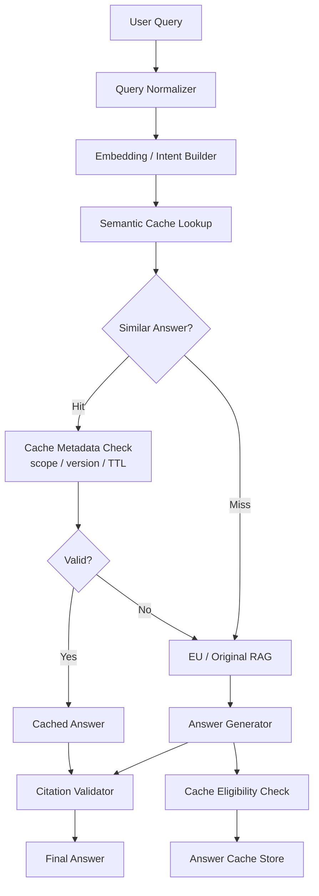
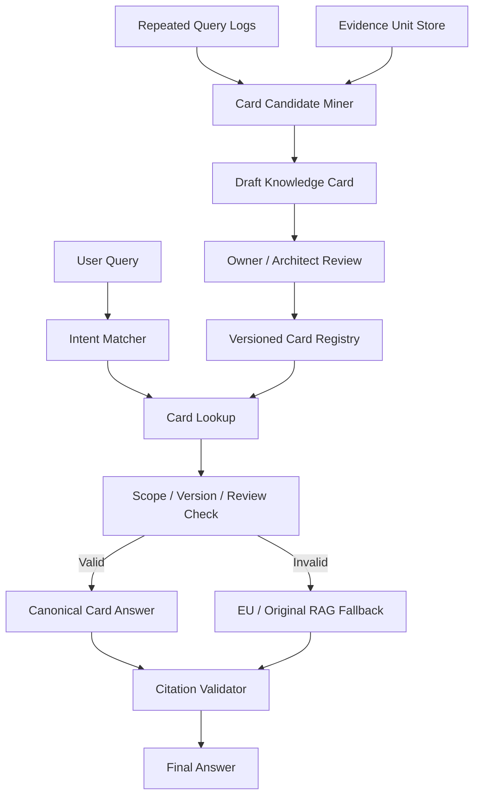
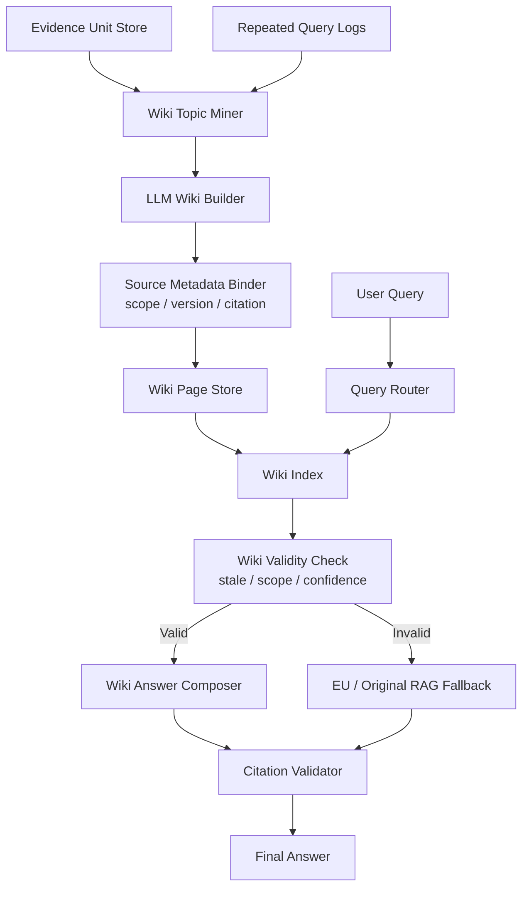

# 04. DP3 - Knowledge Access Strategy Trade-off

## 1. DP 주제

DP3의 주제는 **중복 제어 RAG 이후에도 반복적으로 발생하는 API/설계/정책 질문에 대해, 매번 Retrieval 결과를 새로 조합하지 않고 빠르고 일관된 표준 답변을 제공하기 위한 Knowledge Access Strategy를 선정하는 것**이다.

이 DP는 전체 코드베이스의 관계형 영향도 분석이나 Graph 기반 설계 지식 탐색을 1차 목표로 하지 않는다. 그런 문제는 장기적으로 Graph-based Knowledge Map 같은 확장 후보가 될 수 있지만, 본 DP의 핵심은 다음이다.

> 자주 반복되는 질문에 대해, 어떤 재사용 가능한 지식 계층을 두어 빠르고 일관된 답변을 제공할 것인가?

---

## 2. 배경

DP1의 Evidence Unit 기반 중복 제어 RAG는 중복 Segment를 줄이고 Source Mapping을 유지한다. DP2의 권한/버전 전략은 사용자가 볼 수 있는 Source Scope 안에서만 검색하도록 제한한다.

그럼에도 다음 문제는 남는다.

| 남는 문제 | 설명 |
|---|---|
| 반복 질의 비용 | 같은 API 사용법, 설계 규칙, Deprecated 대체 방향을 물을 때마다 Retrieval과 LLM 생성을 반복한다. |
| 답변 일관성 부족 | Query 표현과 Top-K 결과 조합에 따라 답변 표현과 권장 방향이 달라질 수 있다. |
| 표준 답변 부재 | 조직이 합의한 API 사용 기준과 설계 규칙을 Canonical Answer로 관리하기 어렵다. |
| 운영 지식 단위 부족 | Evidence Unit은 검색 근거 단위이지, Architect나 Tech Lead가 검토하기 좋은 지식 문서가 아니다. |
| Staleness 위험 | Cache나 Wiki를 사용하면 빨라지지만, 원문 변경과 권한 변경을 반영하지 못하면 잘못된 답변을 빠르게 제공한다. |
| Fallback 필요 | 표준 답변으로 처리하기 어려운 최신 코드, 세부 구현, 낮은 Confidence 질문은 DP1 EU 또는 원문 RAG로 돌아가야 한다. |

따라서 DP3의 trade-off는 단순히 “빠른가?”가 아니라 다음 기준으로 봐야 한다.

- 반복 질의 속도
- 답변 일관성
- 표준 지식 관리성
- 사람이 검토 가능한 지식 단위
- 권한/버전 안전성
- Staleness 대응
- PoC 구현 가능성

---

## 3. 후보 A: Semantic Answer Cache

### 3.1 상세 설명

Semantic Answer Cache는 사용자의 질문을 embedding 또는 normalized intent로 변환한 뒤, 과거에 처리한 유사 질문과 답변을 재사용하는 방식이다. GPTCache 같은 Semantic Cache 계열 기술과 연결할 수 있다.

이 후보는 반복 질의 속도 문제에 가장 단순하게 접근한다. 같은 질문이나 의미적으로 유사한 질문이 들어오면 기존 답변을 즉시 반환한다. 구현이 쉽고 PoC도 빠르게 만들 수 있다.

하지만 이 방식은 기본적으로 **이전 답변 재사용**이다. 조직이 합의한 표준 지식을 별도 Knowledge Product로 관리하는 구조는 아니다. 따라서 속도는 강하지만, 설계/정책/API 답변의 운영성과 검토 가능성은 약하다.

### 3.2 동작 원리

1. 사용자 질문을 정규화한다.
2. 질문 embedding 또는 intent representation을 생성한다.
3. Semantic Cache에서 유사 질문을 찾는다.
4. 유사도가 threshold 이상이면 cache hit로 판단한다.
5. Cache entry의 권한 Scope, Source Version, TTL, source timestamp를 검증한다.
6. 유효하면 cached answer와 citation을 반환한다.
7. 유효하지 않으면 DP1 EU Retrieval 또는 원문 RAG로 fallback한다.
8. 새 답변이 cacheable하면 cache에 저장한다.

### 3.3 설계 다이어그램



### 3.4 장점

| 장점 | 설명 |
|---|---|
| 구현이 쉽다 | Query embedding과 cache lookup만으로 최소 PoC를 만들 수 있다. |
| 응답 속도 개선이 직접적이다 | Cache hit이면 Retrieval과 LLM 생성을 줄일 수 있다. |
| 유사 질문 재사용 가능 | 질문 표현이 달라도 의미가 비슷하면 기존 답변을 사용할 수 있다. |
| 측정이 쉽다 | Cache hit rate, latency, token reduction을 바로 비교할 수 있다. |

### 3.5 단점

| 단점 | 설명 |
|---|---|
| 표준 지식 관리가 약하다 | 이전 답변을 재사용할 뿐, 승인된 Canonical Knowledge를 만들지는 않는다. |
| 잘못된 hit 위험 | 비슷해 보이지만 다른 질문에 기존 답변을 줄 수 있다. |
| 사람이 검토하기 어렵다 | Cache entry는 운영 지식 문서라기보다 시스템 내부 결과물이다. |
| 권한/버전 관리가 중요하다 | Scope와 Version을 cache key에 넣지 않으면 정보 유출 위험이 있다. |

### 3.6 PoC 관점

가장 쉽게 구현할 수 있는 후보이다. 하지만 발표에서 “Architecture Decision”으로 보이기보다는 성능 최적화 기법으로 보일 수 있다.

PoC 지표:

- Cache Hit Rate
- P95 Latency
- Token Usage Reduction
- Wrong Cache Hit Rate
- Scope/Version Validation Failure Count

---

## 4. 후보 B: Versioned Knowledge Card Registry

### 4.1 상세 설명

Versioned Knowledge Card Registry는 반복 질문과 표준 API/설계 규칙을 작은 Knowledge Card 단위로 관리하는 설계다.

각 Card는 하나의 intent 또는 topic에 대응한다. 예를 들어 다음과 같다.

- “이 API는 언제 사용해야 하는가?”
- “Deprecated API의 대체 구현은 무엇인가?”
- “이 컴포넌트의 표준 초기화 순서는 무엇인가?”
- “이 설계 규칙을 따라야 하는 이유는 무엇인가?”

Knowledge Card는 LLM Wiki보다 작고 엄격한 지식 단위다. 승인 상태, owner, source version, invalidation rule을 명확히 관리할 수 있다.

### 4.2 동작 원리

1. 반복 Query Log와 DP1 Evidence Unit에서 Card 후보를 추출한다.
2. API 사용법, Deprecated 대체 방향, 설계 규칙을 작은 Card로 정리한다.
3. Owner Team 또는 Architect가 Card를 검토하고 승인한다.
4. Query Router가 intent pattern 또는 embedding으로 관련 Card를 찾는다.
5. Card의 권한 Scope, Source Version, review status를 검증한다.
6. 조건이 유효하면 Card 기반 Canonical Answer를 반환한다.
7. 조건이 맞지 않으면 DP1 EU Retrieval 또는 원문 RAG로 fallback한다.

### 4.3 설계 다이어그램



### 4.4 장점

| 장점 | 설명 |
|---|---|
| 통제력이 강하다 | 승인된 Card만 표준 답변으로 사용할 수 있다. |
| 권한/버전 관리가 쉽다 | Card 단위로 allowed scope, branch/release range, owner를 붙일 수 있다. |
| Human Review에 적합하다 | Architect나 Owner Team이 작은 단위로 검토할 수 있다. |
| Audit 방어력이 좋다 | 어떤 Card가 어떤 Source에 근거해 승인되었는지 추적하기 쉽다. |

### 4.5 단점

| 단점 | 설명 |
|---|---|
| 초기 커버리지가 낮을 수 있다 | Card를 만들고 승인해야 하므로 초기에 답변 가능한 범위가 좁다. |
| 운영 Workflow가 필요하다 | Owner 지정, review, stale 처리 절차가 필요하다. |
| 긴 설명에는 약하다 | 넓은 설계 가이드나 복합 설명은 Wiki Page가 더 자연스럽다. |
| Fallback이 자주 필요할 수 있다 | Card 범위를 벗어난 질문은 RAG로 돌아가야 한다. |

### 4.6 PoC 관점

PoC 난이도는 중간이다. 5~10개의 Card를 직접 만들거나 LLM으로 초안 생성 후 수동 승인 상태를 부여하면 된다.

PoC 지표:

- Card Hit Rate
- Repeated Answer Consistency
- Approved Card Coverage
- Stale Card Detection
- Fallback Rate

---

## 5. 후보 C: LLM Wiki Knowledge Cache

### 5.1 상세 설명

LLM Wiki Knowledge Cache는 DP1의 Evidence Unit과 Source Mapping을 기반으로, 반복적으로 참조되는 API 사용법, 설계 규칙, 정책성 지식, Deprecated 대체 방향을 Wiki Page 형태로 정리하고 Query 시 우선 활용하는 구조다.

이 방식은 단순 Cache가 아니라 **사람이 검토 가능한 Canonical Knowledge Page**를 만드는 설계다. Knowledge Card보다 지식 단위가 넓고 설명력이 좋으며, 반복 질문에 대해 빠르고 일관된 답변을 제공하기 쉽다.

Wiki Page는 다음과 같은 정보를 포함해야 한다.

```text
WikiPage {
  page_id
  topic
  canonical_answer
  usage_guidelines
  examples
  deprecated_notes
  source_eu_ids
  source_segment_ids
  allowed_scope
  branch_release_range
  owner_team
  confidence
  last_verified_commit
  invalidation_rule
}
```

### 5.2 동작 원리

1. DP1 Evidence Unit과 반복 Query Log에서 Wiki Topic 후보를 찾는다.
2. LLM Wiki Builder가 API/Component/Decision/FAQ 단위의 Wiki Page 초안을 생성한다.
3. Source Mapping, Citation, 권한 Scope, Source Version을 Page metadata로 연결한다.
4. 필요하면 Architect 또는 Owner Team이 Wiki Page를 검토한다.
5. Query Router가 반복/정의/정책/설계 질문을 Wiki Index로 라우팅한다.
6. Wiki Page의 권한/버전/최신성/Confidence를 확인한다.
7. 조건이 유효하면 Wiki 기반 답변을 생성한다.
8. 조건이 맞지 않거나 상세 구현 확인이 필요하면 DP1 EU 또는 원문 RAG로 fallback한다.

### 5.3 설계 다이어그램



### 5.4 장점

| 장점 | 설명 |
|---|---|
| 반복 질문에 직접 대응한다 | API 사용법, 설계 규칙, 정책 질문에 빠르게 답할 수 있다. |
| 답변 일관성이 높다 | Canonical Page를 기반으로 답변하므로 권장 방향이 흔들릴 가능성이 줄어든다. |
| 사람이 검토하기 좋다 | Wiki Page는 Architect나 Tech Lead가 읽고 수정하기 쉬운 지식 단위다. |
| DP1 결과와 자연스럽게 연결된다 | Evidence Unit과 Source Mapping을 Wiki Page 근거로 사용할 수 있다. |
| 설명형 지식에 강하다 | Deprecated 이유, 사용 가이드, 설계 의도 같은 내용을 담기 좋다. |

### 5.5 단점

| 단점 | 설명 |
|---|---|
| Staleness 위험 | 원문 코드나 문서가 바뀌었는데 Wiki가 갱신되지 않으면 오래된 표준 답변을 제공한다. |
| 생성 오류 반복 위험 | LLM이 만든 Wiki 초안이 틀리면 오류가 반복 재사용될 수 있다. |
| 권한/버전 혼합 위험 | 여러 Source Scope나 Release를 섞어 Page를 만들면 DP2 정책을 침범할 수 있다. |
| 범위 관리 필요 | 모든 내용을 Wiki화하려 하면 생성/검토 비용이 커진다. |

### 5.6 PoC 관점

PoC 난이도는 중간이고, 데모 설득력은 높다. 5~10개의 Wiki Page만 만들어도 Wiki hit, fallback, citation validation을 보여줄 수 있다.

PoC 지표:

- Wiki Hit Rate
- P95 Latency
- Repeated Answer Consistency
- Stale Answer Rate
- Citation Trace Coverage
- Fallback Rate

---

## 6. Trade-off 비교

### 6.1 후보 요약

| 후보 | 핵심 단위 | 가장 강한 점 | 가장 큰 약점 |
|---|---|---|---|
| Semantic Answer Cache | Cached Answer | 구현이 쉽고 반복 질문 속도 개선이 직접적 | 표준 지식 운영성과 검토 가능성이 약함 |
| Versioned Knowledge Card Registry | Approved Knowledge Card | 승인/권한/버전 통제가 강함 | 초기 커버리지와 운영 Workflow 부담 |
| LLM Wiki Knowledge Cache | Wiki Page | 속도, 일관성, 설명력, 검토 가능성의 균형 | Staleness와 권한/버전 혼합 위험 |

### 6.2 품질속성 비교

| 평가 기준 | Semantic Answer Cache | Knowledge Card Registry | LLM Wiki Knowledge Cache |
|---|---:|---:|---:|
| 반복 질의 속도 | ★★★ | ★★★ | ★★★ |
| 답변 일관성 | ★★☆ | ★★★ | ★★★ |
| Canonical Knowledge 관리 | ★☆☆ | ★★★ | ★★★ |
| 사람이 검토 가능 | ★☆☆ | ★★★ | ★★★ |
| 권한/버전 안전성 | ★★☆ | ★★★ | ★★☆ |
| Staleness 대응 용이성 | ★★☆ | ★★★ | ★★☆ |
| 설명형 지식 표현력 | ★☆☆ | ★★☆ | ★★★ |
| PoC 난이도 낮음 | ★★★ | ★★☆ | ★★☆ |
| 발표 설득력 | ★★☆ | ★★★ | ★★★ |

### 6.3 PoC 기준 비교

| PoC 항목 | Semantic Answer Cache | Knowledge Card Registry | LLM Wiki Knowledge Cache |
|---|---|---|---|
| 최소 구현 | Query embedding + cache lookup | Card JSON + intent matcher + review status | Wiki page generation + router + validity check |
| 준비 데이터 | 반복 질문/답변 set | 승인된 Card 5~10개 | Wiki Page 5~10개 |
| 보여주기 좋은 장면 | Cache hit으로 빠르게 답변 | 승인된 표준 답변과 stale card fallback | Wiki hit, citation, stale fallback |
| 실패 위험 | wrong cache hit | coverage 부족 | stale wiki 또는 생성 오류 |
| 측정 지표 | hit rate, latency | consistency, coverage, fallback | hit rate, latency, consistency, stale rate |

---

## 7. 선택안 판단

본 과제의 DP3는 단순 성능 최적화보다 **반복되는 API/설계/정책 질문을 표준 지식으로 승격하고, 빠르고 일관되게 제공하는 것**이 핵심이다.

따라서 최종 선택안은 **LLM Wiki Knowledge Cache**가 가장 적합하다.

### 7.1 선택 이유

1. **DP3 문제에 가장 직접 대응한다.**  
   반복 질의 비용, 답변 일관성 부족, 표준 답변 부재를 한 번에 다룬다.

2. **Knowledge Card보다 표현력이 좋다.**  
   Card는 통제력은 강하지만 작은 단위다. Wiki는 API 사용 가이드, 설계 의도, Deprecated 이유 같은 설명형 지식을 담기 좋다.

3. **Semantic Answer Cache보다 Architecture Decision답다.**  
   Answer Cache는 성능 최적화에 가깝지만, LLM Wiki는 지식 계층을 설계하는 결정으로 보인다.

4. **DP1과 자연스럽게 연결된다.**  
   Evidence Unit과 Source Mapping을 Wiki Page의 근거로 연결할 수 있다.

5. **PoC에서 효과를 보여주기 좋다.**  
   Wiki hit 질의와 fallback 질의를 나눠 latency, consistency, citation trace를 비교할 수 있다.

### 7.2 선택안의 필수 보완 조건

| 조건 | 이유 |
|---|---|
| Source Mapping 유지 | Wiki 답변이 어떤 EU와 원본 Segment에 근거했는지 추적해야 한다. |
| Permission / Version Metadata | 권한 없는 Source나 다른 Release 기준 Wiki를 답변에 사용하면 안 된다. |
| Staleness Invalidation | 원문 코드/문서/권한이 바뀌면 Wiki를 stale 처리해야 한다. |
| Fallback Policy | 최신 구현, 상세 근거, 낮은 Confidence 질문은 EU/원문 RAG로 보내야 한다. |
| Human Review 옵션 | 핵심 API와 설계 규칙 Wiki는 Architect 또는 Owner Team 검토가 필요하다. |

---

## 8. 발표용 결론 문장

> Semantic Answer Cache는 가장 단순하고 빠른 재사용 전략이지만, 과거 답변을 재사용하는 성격이 강해 표준 지식 운영성이 약하다. Versioned Knowledge Card Registry는 승인된 작은 지식 단위로 통제력은 가장 강하지만, 초기 커버리지와 운영 Workflow 부담이 있다. LLM Wiki Knowledge Cache는 DP1의 Evidence Unit과 Source Mapping을 사람이 검토 가능한 Canonical Knowledge Page로 승격하고, 반복 질의에 빠르고 일관되게 답하며, 조건이 맞지 않을 때 원문 RAG로 fallback할 수 있어 본 과제 범위에서 가장 균형 잡힌 선택이다.

---

## 9. References / Evidence

| ID | 문서명 | 출처 | 활용 |
|---|---|---|---|
| REF-DP3-TR-01 | GPTCache: An Open-Source Semantic Cache for LLM Applications | https://aclanthology.org/2023.nlposs-1.24/ | Semantic Answer Cache 후보 근거 |
| REF-DP3-TR-02 | GPTCache Documentation | https://gptcache.readthedocs.io/ | Semantic cache 구조와 사용 방식 참고 |
| REF-DP3-TR-03 | RAGCache: Efficient Knowledge Caching for Retrieval-Augmented Generation | https://arxiv.org/abs/2404.12457 | RAG Context/Knowledge Cache를 Appendix 또는 성능 보강책으로 설명하는 근거 |
| REF-DP3-TR-04 | RAGAS: Automated Evaluation of Retrieval Augmented Generation | https://arxiv.org/abs/2309.15217 | Faithfulness, Context Precision/Recall 등 평가 기준 참고 |
