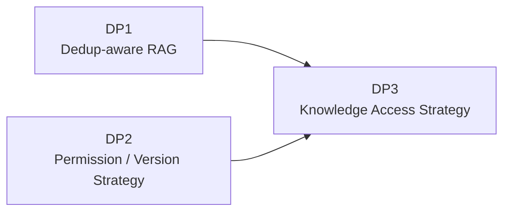
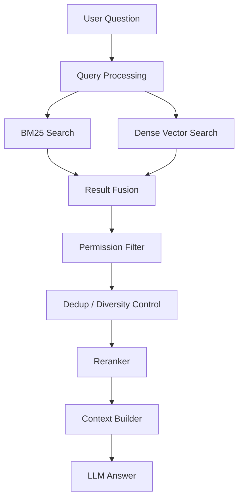
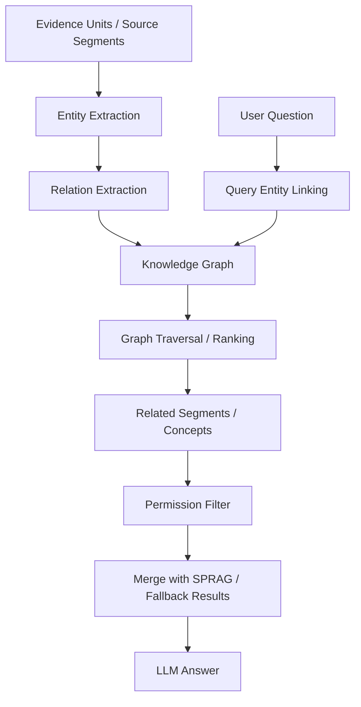
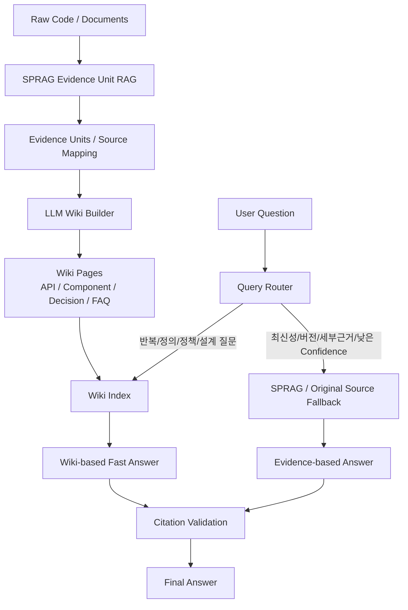

# 04. DP3 - 중복 제어 RAG 이후 Knowledge Access Strategy 선정

## 1. Decision Point 개요

### 1.1 결정 주제

본 DP는 이미 DP1에서 중복 제어 RAG 구조를 선정한 상태에서, 중복이 많은 사내 코드/문서 데이터 환경의 QA 속도, 답변 일관성, 반복 지식 재사용성을 추가 개선하기 위한 **Knowledge Access Strategy**를 선정한다.

### 1.2 본 DP의 위치

본 DP는 DP1과 DP2 이후의 후속 결정이다.



즉, 본 DP는 다음 전제를 가진다.

- 기존 RAG는 중복 제어 전략을 통해 Top-K 중복 편향과 Context 낭비를 줄이는 것을 전제로 한다.
- 검색 대상 Evidence Unit과 원본 Segment에는 권한 Metadata와 Source Version Metadata가 연결된다.
- 질의 시 사용자의 권한과 요청 Source Version 범위 내 데이터만 검색 또는 답변에 사용한다.
- 본 DP의 목적은 DP1의 중복 제어 RAG를 대체하는 것이 아니라, 그 위에서 반복 질의, 정책성 지식, 설계 지식의 접근 방식을 더 개선하는 것이다.

### 1.3 발표용 배경 태그

| 구분 | 관련 항목 |
|---|---|
| Stakeholder | 사내 개발자, Software Architect / Technical Lead, 플랫폼/인프라 운영팀, 사내 LLM 운영 조직 |
| FR | FR-02 코드 어시스트 질의 처리, FR-05 Citation 제공, FR-07 Knowledge Cache / Wiki 관리, FR-08 Source Version 기반 검색/답변 제어 |
| QA | QA-01 정확도, QA-02 응답 속도, QA-06 유지보수성, QA-07 최신성, QA-08 근거 추적성 |
| 핵심 문제 | 반복 질의 비용, 표준 답변 부재, Wiki Staleness, Fallback 판단, 권한/버전 혼합 |

### 1.4 배경 상황 설명

DP3가 필요한 이유는 중복 제어 RAG가 검색 근거를 효율화하더라도, **반복적으로 묻는 정책/설계/API 질문을 항상 같은 방식으로 빠르고 일관되게 답하는 문제는 별도로 남기 때문**이다.

예를 들어 “이 공통 API는 언제 써야 하는가?”, “Deprecated 구현 대신 무엇을 써야 하는가?”, “이 컴포넌트의 표준 초기화 순서는 무엇인가?” 같은 질문은 단순히 관련 Chunk 몇 개를 찾는 것만으로 충분하지 않다. 검토된 표준 답변, 최신 Source와의 연결, 사람이 수정 가능한 지식 단위, 낮은 Confidence일 때 원문으로 돌아가는 Fallback 정책이 필요하다.

중복 제어 RAG는 “좋은 근거를 더 효율적으로 찾는 문제”에 가깝다. 하지만 개발자들이 반복해서 묻는 질문은 검색 결과보다 “조직에서 합의한 표준 답변”이 더 중요할 때가 있다. 같은 질문에 대해 매번 다른 Chunk 조합이 선택되면 답변 표현과 권장 방향이 조금씩 달라질 수 있고, 이는 개발자 신뢰를 떨어뜨린다.

또한 운영 관점에서는 사람이 검토하고 고칠 수 있는 지식 단위가 필요하다. 검색 Index 안의 Chunk나 Evidence Unit은 기계가 검색하기 좋은 단위지만, Architect나 Tech Lead가 리뷰하기 좋은 문서 단위는 아니다. DP3는 반복 질문, 정책성 지식, 설계 지식을 어떤 Knowledge Layer로 제공하고, 언제 원문 RAG로 되돌아갈지 결정하는 지점이다.

따라서 DP3의 배경 페이지에서는 후보명을 먼저 말하기보다 다음 문제 흐름을 강조한다.

```text
중복 제어 RAG로 근거 검색 효율화
 → 반복/정책/설계 질문은 계속 발생
 → 매번 검색하면 비용과 답변 표현이 흔들림
 → 검토 가능한 Canonical Knowledge와 Fallback 정책 필요
```

### 1.5 예상 발표 스크립트

DP3는 DP1에서 중복 근거를 잘 제어했다는 전제 위에서 시작합니다. 중복 제어 RAG를 사용하면 검색 근거는 더 효율적으로 가져올 수 있지만, 개발자들이 반복적으로 묻는 질문에 항상 빠르고 일관되게 답하는 문제는 여전히 남습니다. 예를 들어 공통 API 사용 기준, Deprecated 구현의 대체 방식, 컴포넌트 초기화 순서 같은 질문은 단순히 관련 Source 몇 개를 찾는 것보다 조직에서 합의한 표준 답변이 중요합니다. 매번 검색 결과 조합이 달라지면 답변 표현과 권장 방향도 흔들릴 수 있습니다. 또한 운영자나 Architect가 직접 검토하고 수정할 수 있는 지식 단위가 필요합니다. 그래서 DP3는 검색 결과를 넘어, 반복 지식과 설계 지식을 어떤 방식으로 접근하고 언제 원문 RAG로 되돌아갈지 결정하는 지점입니다.

---

## 2. 이 DP가 필요한 이유

### 2.1 DP1의 SPRAG 기반 RAG가 해결하는 것

DP1의 SPRAG 기반 Evidence Unit RAG는 Offline 단계에서 다음 문제를 완화한다.

- 완전히 동일하거나 유사한 Segment의 중복 제어
- 의미적으로 유사한 Segment의 Evidence Unit 구성
- 엔트로피 기반 선택과 적응형 요약을 통한 핵심 정보 압축
- Top-K 중복 편향 완화
- Prompt 길이와 생성 지연 시간 감소
- Deprecated 코드와 최신 코드 구분 기반 마련

이는 매우 중요한 기반이다.

### 2.2 SPRAG 이후에도 여전히 남는 문제

SPRAG만으로도 중복 근거 압축과 Query-time 단순화 효과를 얻을 수 있다. 그러나 SPRAG는 본질적으로 **Evidence를 더 효율적으로 검색하기 위한 Retrieval 최적화**에 가깝다. 반복 질문에 대한 Canonical Answer 관리, 정책/설계 지식의 일관된 답변, 사람이 검토 가능한 Knowledge Layer, Wiki Cache Hit 판단, 기존 RAG Fallback 정책은 별도의 Knowledge Access Strategy가 필요하다.

| 남는 문제 | 설명 |
|---|---|
| 반복 질의 비용 | SPRAG가 단일 또는 소수 EU 검색으로 비용을 줄여도, 자주 반복되는 질문은 매번 Retrieval과 답변 구성을 수행하는 것보다 Wiki/Cache Hit가 더 효율적일 수 있다. |
| 답변 일관성 | Query 표현, 권한 범위, Source Version, Confidence에 따라 선택되는 EU가 달라질 수 있어 동일 질문의 답변 표현과 권장 방향이 흔들릴 수 있다. |
| Canonical Answer 부족 | “이 API는 언제 써야 하는가?”, “이 컴포넌트의 표준 사용법은 무엇인가?” 같은 질문에는 근거 EU뿐 아니라 검토된 표준 답변이 필요하다. |
| Knowledge Product 부족 | EU는 증거 단위이지만, 사람이 리뷰하고 수정할 수 있는 운영 지식 문서나 정책 문서 그 자체는 아니다. |
| Fallback 판단 필요 | Wiki로 답할지, SPRAG EU를 검색할지, 최신 원문 RAG로 Fallback할지 판단하는 Query Routing 정책이 필요하다. |
| Source Version 정합성 | Wiki Page가 특정 Branch/Release 기준으로 생성되었다면, 다른 버전 질문에는 그대로 재사용하면 안 된다. |
| 관계형 질문 | 요구사항, 설계 결정, 코드 구현 사이의 연결을 따라가는 Multi-hop 질문은 EU 압축만으로 충분하지 않을 수 있다. |

따라서 본 DP는 다음 질문에 답한다.

> 중복 제어 RAG 위에서, 반복 질의와 설계/정책 지식의 답변 일관성을 높이기 위해 어떤 Knowledge Access 방식을 추가할 것인가?

### 2.3 DP1과 DP3의 역할 구분

| 구분 | DP1: Dedup-aware RAG | DP3: Knowledge Access Strategy |
|---|---|---|
| 핵심 질문 | 중복 근거를 어떻게 압축하고 검색할 것인가? | 반복/정책/설계 지식을 어떻게 빠르고 일관되게 제공할 것인가? |
| 주요 단위 | Evidence Unit, Source Mapping, 원본 Segment | Wiki Page, Cache Entry, Query Router, Fallback Policy |
| 해결 위치 | Index-time + Retrieval-time | Query Routing + Answer-time + Knowledge Maintenance |
| 주요 효과 | Prompt 감소, 중복 근거 압축, 검색 단순화 | 반복 질의 속도 개선, Canonical Answer, 사람이 검토 가능한 Knowledge Layer |
| 남는 위험 | EU Staleness, Multi-hop 한계, 압축 오류 | Wiki Staleness, 권한/버전 혼합, 잘못된 Canonical Answer 재사용 |

---

## 3. 후보안

본 DP에서는 다음 세 가지 후보를 비교한다.

| 후보 | 설명 |
|---|---|
| Option A. Dense + BM25 Hybrid Retrieval 보강 | 기존 RAG의 검색 레이어에 Sparse/Dense Hybrid Search를 적용 |
| Option B. HippoRAG-style Graph Retrieval 확장 | Entity/Relation Graph를 구성하여 관계형 Multi-hop Retrieval 수행. 단, DP1의 EU 기반 Retrieval과 직접 결합 난이도가 높아 후속 확장 후보로 평가 |
| Option C. LLM Wiki Knowledge Cache | SPRAG의 Evidence Unit과 Source Mapping 결과를 기반으로 Canonical Wiki Page를 생성하고 QA에 우선 활용 |

---

## 4. Option A. Dense + BM25 Hybrid Retrieval 보강

### 4.1 개념

Dense + BM25는 RAG 자체가 아니라 RAG 내부 Retrieval 단계의 검색 전략이다.

- Dense Search: 의미 기반 검색
- BM25 Search: 키워드 기반 검색
- Hybrid Fusion: 두 결과를 결합하여 검색 Recall/Precision을 개선

### 4.2 구조



### 4.3 장점

- 기존 RAG에 비교적 쉽게 결합 가능하다.
- 정확한 API명, 함수명, 파일명, 에러 메시지 검색에 강하다.
- 사용자가 다른 표현으로 질문해도 의미 검색으로 보완할 수 있다.
- SPRAG의 EU 검색 및 Rerank와 함께 사용하면 안정적인 검색 품질을 기대할 수 있다.

### 4.4 단점

- 중복제어 자체가 목적은 아니다.
- BM25와 Dense가 각각 유사한 Chunk를 가져와 중복 후보가 다시 늘 수 있다.
- 기존 RAG가 이미 강한 검색 구조를 가지고 있다면 개선 폭이 제한적일 수 있다.
- 반복 질의에 대해 매번 검색과 Context 구성이 필요하다.

### 4.5 본 과제에서의 의미

Dense + BM25는 **검색 품질 보강책**으로 의미가 있다. 다만 본 DP의 핵심 목표인 “중복이 많은 데이터에서의 QA 속도와 Canonical Answer 일관성”에는 직접성이 상대적으로 낮다.

---

## 5. Option B. HippoRAG-style Graph Retrieval 확장

### 5.1 개념

HippoRAG-style 접근은 문서/코드에서 Entity와 Relation을 추출하여 Knowledge Graph를 만들고, 질문 시 Graph Traversal을 통해 관련 지식을 찾는 방식이다.

예를 들면 다음 관계를 만들 수 있다.

```text
Requirement A → implemented_by → Component B
Component B → uses → Internal API C
Decision D → affects → Module E
```

### 5.2 구조



### 5.3 장점

- 관계형 질문과 Multi-hop QA에 강하다.
- 요구사항, 설계 결정, 컴포넌트, API 사이의 연결을 표현할 수 있다.
- Impact Analysis, Traceability, Dependency QA로 확장 가능하다.
- 중복 데이터의 반복 내용을 Entity/Relation 단위로 압축할 가능성이 있다.

### 5.4 단점

- Entity/Relation 추출 품질에 크게 의존한다.
- Graph 구축, 갱신, Canonicalization 비용이 크다.
- 같은 개념이 여러 이름으로 등장하면 Graph 중복이 새로 생긴다.
- 속도 개선보다는 관계형 정확도 개선에 가까운 옵션이다.
- 본 과제 범위에서 초기 채택하기에는 구현 및 설명 복잡도가 높다.
- DP1에서 선택한 SPRAG Evidence Unit은 압축된 Evidence 단위이므로, Graph 구축에 필요한 세부 Entity/Relation을 어디까지 원본 Segment에서 다시 추출할지 추가 설계가 필요하다.
- 권한 Metadata와 Source Version Metadata가 EU, 원본 Segment, Graph Node/Edge에 동시에 전파되어야 하므로 DP2와의 결합 복잡도가 크다.

### 5.5 본 과제에서의 의미

HippoRAG-style 접근은 장기적으로 매력적인 확장 후보이다. 하지만 본 DP의 우선 목표가 SPRAG 이후의 반복 질의 속도, Canonical Answer 일관성, 운영 가능한 Knowledge Layer 확보라면 초기 선택보다는 **후속 확장안**으로 두는 것이 타당하다.

발표 Q&A에서는 다음처럼 정리할 수 있다.

> HippoRAG는 관계형 Multi-hop QA에는 강하지만, DP1에서 선택한 Evidence Unit 구조와 바로 결합하려면 EU와 원본 Segment, Graph Node/Edge, 권한 Metadata, Source Version Metadata를 모두 동기화해야 한다. 따라서 본 과제의 초기 Architecture에서는 선택하지 않고, 관계형 질의 요구가 커질 때 Appendix 또는 후속 과제로 확장한다.

---

## 6. Option C. LLM Wiki Knowledge Cache

### 6.1 개념

LLM Wiki Knowledge Cache는 SPRAG 기반 Evidence Unit과 Source Mapping 결과를 기반으로, 반복적으로 참조되는 지식과 설계/정책/코드 설명을 Wiki Page 형태로 미리 정리하는 방식이다.

이 방식은 전통적인 Retrieval Algorithm이 아니라 **Knowledge Organization / Cache Layer**이다.

### 6.2 구조



### 6.3 장점

- SPRAG의 Evidence Unit 결과를 QA 친화적인 Canonical Knowledge로 승격시킨다.
- 반복 질문에 대해 검색/조합 비용을 줄일 수 있다.
- 답변 일관성을 높인다.
- LLM Context Token을 줄여 속도 개선에 직접 기여한다.
- 사람이 Wiki Page를 리뷰하고 수정할 수 있다.
- 기존 RAG를 원문 검증 및 Fallback 경로로 유지할 수 있다.

### 6.4 단점

- Wiki가 오래되면 Stale Answer가 발생할 수 있다.
- LLM이 Wiki를 잘못 생성하면 오류가 반복 재사용될 수 있다.
- Wiki Page와 EU/원본 Segment/Source Version/Citation 연결을 반드시 유지해야 한다.
- 모든 질문에 적합하지 않으며, 최신 코드 확인이나 세부 근거 질문은 기존 RAG가 필요하다.

### 6.5 본 과제에서의 의미

기존 RAG가 이미 SPRAG 기반 Offline Dedup과 Evidence Unit 압축을 수행하고 있기 때문에, LLM Wiki는 그 결과를 가장 효과적으로 활용할 수 있다.

```text
중복 Segment 제어
 → Evidence Unit 구성
 → Source Mapping 유지
 → LLM Wiki Page 생성
 → 빠르고 일관된 QA
```

즉, LLM Wiki는 본 DP의 목표인 **속도**와 **중복 데이터 환경에서의 정확도**에 가장 직접적으로 부합한다.

---

## 7. Trade-off 평가

### 7.0 발표용 비교 기준

DP3 비교 페이지에서는 각 후보를 다음 QA 4개로 비교한다.

| QA | ★☆☆ 기준 | ★★☆ 기준 | ★★★ 기준 | 근거 / 측정 방식 |
|---|---|---|---|---|
| QA-02 응답 속도 | 매번 전체 Retrieval과 Context 구성이 필요 | 검색 보강으로 일부 개선 | 반복 질의가 Cache/Knowledge Layer에서 빠르게 처리 | P95 QA Latency, Cache Hit Rate |
| QA-01 정확도/일관성 | Query마다 답변 근거와 표현이 크게 흔들림 | 검색 Recall은 개선되나 표준 답변 관리 부족 | Canonical Answer와 검증된 Source Mapping 유지 | Repeated Answer Consistency, Faithfulness |
| QA-07 최신성 | 지식 계층 Staleness 관리가 어려움 | Fallback으로 일부 보완 | Source Version, Invalidation, Fallback 정책을 명시 | Stale Answer Rate, Citation Freshness |
| QA-06 유지보수성 | 별도 Graph/지식 구조 운영 부담 큼 | 기존 검색 레이어와 결합 쉬움 | 사람이 검토 가능한 Knowledge Product로 운영 가능 | Human Reviewability, Maintenance Complexity |

평가 기준: ★★★ 매우 우수, ★★☆ 보통 이상, ★☆☆ 제한적

| QA 속성 | Dense + BM25 | HippoRAG-style | LLM Wiki Knowledge Cache |
|---|---:|---:|---:|
| QA 속도 개선 | ★★☆ | ★☆☆ | ★★★ |
| 중복 데이터 환경 정확도 | ★★☆ | ★★☆ | ★★★ |
| 답변 일관성 | ★★☆ | ★★☆ | ★★★ |
| 관계형 / Multi-hop QA | ★★☆ | ★★★ | ★★☆ |
| SPRAG 기반 RAG 결합 용이성 | ★★★ | ★☆☆ | ★★★ |
| 운영 복잡도 낮음 | ★★★ | ★☆☆ | ★★☆ |
| 원문 Citation 유지 | ★★★ | ★★☆ | ★★☆ |
| 개발 난이도 | ★★★ | ★☆☆ | ★★☆ |

### 7.1 KPI 기반 Trade-off 평가

아래 값은 현재 내부 PoC 측정값이 아니라 설계 비교를 위한 `[Expected]` 기준이다. 실제 구현 후에는 반복 질의, 신규 질의, 관계형 질의, 최신 코드 질의를 분리해 측정해야 한다.

| KPI | 측정 의미 | Option A. Dense + BM25 | Option B. HippoRAG-style Graph Retrieval | Option C. LLM Wiki Knowledge Cache |
|---|---|---:|---:|---:|
| Wiki / Cache Hit Rate | 기존 RAG 전체 경로를 타지 않고 우선 답변 가능한 질의 비율 | [Expected] 0% | [Expected] 0~10% | [Expected] 30~60% |
| P95 QA Latency | End-to-end QA 응답 P95 지연 | [Expected] 중간 | [Expected] 높음 | [Expected] 낮음~중간 |
| Context Token Reduction | 기존 RAG 대비 평균 Context Token 감소율 | [Expected] 5~15% | [Expected] 10~25% | [Expected] 30~60% |
| Repeated Answer Consistency | 반복/정의/정책 질문에서 동일 근거 기반 답변을 제공하는 비율 | [Expected] 중간 | [Expected] 중간 | [Expected] 높음 |
| Multi-hop Question Success Rate | 요구사항-컴포넌트-API 등 관계형 질문 성공률 | [Expected] 중간 | [Expected] 높음 | [Expected] 중간 |
| Stale Answer Rate | 원문 변경 후 오래된 답변이 제공되는 비율 | [Expected] 낮음 | [Expected] 중간 | [Expected] 중간~높음 |
| Human Reviewability | 사람이 지식 단위를 검토하고 수정하기 쉬운 정도 | [Expected] 낮음 | [Expected] 중간 | [Expected] 높음 |
| Build / Maintenance Complexity | 구축 및 유지보수 복잡도 | [Expected] 낮음 | [Expected] 높음 | [Expected] 중간 |
| SPRAG Integration Risk | SPRAG EU / Source Mapping / 권한/버전 Metadata와의 결합 위험 | [Expected] 낮음 | [Expected] 높음 | [Expected] 중간 |

### 7.2 KPI 평가 해석

- Dense + BM25는 검색 Recall 보강에는 유리하지만, 반복 질의 비용과 답변 일관성을 직접 해결하지는 않는다.
- HippoRAG-style Graph Retrieval은 Multi-hop 질문에는 강하지만, Graph 구축과 Entity/Relation 품질 관리가 필요하고 SPRAG EU와 원본 Segment 간 동기화 설계가 추가로 필요해 초기 과제 범위에서는 부담이 크다.
- LLM Wiki Knowledge Cache는 SPRAG가 만든 Evidence Unit과 Source Mapping을 활용해 반복 질의와 정책/설계/API 설명을 Canonical Answer로 승격할 수 있으므로 속도와 일관성 개선 효과가 가장 직접적이다. 단, Stale Answer 방지를 위해 Source 변경 감지와 기존 RAG Fallback이 필수이다.

---

## 8. Decision

본 DP에서는 **Option C. LLM Wiki Knowledge Cache**를 선택한다.

단, 기존 RAG를 대체하지 않는다. SPRAG 기반 Evidence Unit RAG는 원문 검증, 최신성 확인, 상세 근거 검색을 위한 Fallback 경로로 유지한다.

```text
채택:
- LLM Wiki Knowledge Cache

유지:
- SPRAG Evidence Unit RAG

보조:
- Dense + BM25는 검색 품질 보강책으로 적용 가능

유보:
- HippoRAG-style Graph Retrieval은 관계형 Multi-hop QA 요구가 커질 때 후속 검토
```

---

## 9. 선택 이유

### 9.1 속도 목표에 직접 부합

LLM Wiki는 반복적이고 정형화된 질문에 대해 매번 Raw Chunk를 검색하지 않고, 이미 정리된 Wiki Page를 우선 사용한다.

따라서 다음 비용을 줄일 수 있다.

- 검색 후보 수
- Reranking 비용
- LLM Context Token
- 중복 근거 제거 비용
- 답변 구성 비용
### 9.2 중복 데이터 환경에 적합


SPRAG 기반 RAG가 중복 Segment를 Evidence Unit으로 압축하면, LLM Wiki는 그 결과를 사람이 검토 가능한 Canonical Answer Page로 승격한다.

이는 단순히 검색 결과에서 중복을 제거하는 것보다 한 단계 더 나아간다.

```text
검색 시 중복 제거:
질문마다 EU 검색과 답변 구성 수행

LLM Wiki:
미리 정리된 Canonical Knowledge를 재사용
```

### 9.3 답변 일관성 향상

동일한 질문에 대해 매번 다른 Top-K 조합을 사용하는 대신, 같은 Wiki Page를 기반으로 답변할 수 있다.

### 9.4 기존 RAG를 활용할 수 있음

LLM Wiki는 SPRAG 기반 RAG의 대체재가 아니라 보완재이다.

- Wiki가 답변 가능한 경우: Wiki 기반 빠른 답변
- 최신성/세부 근거가 필요한 경우: SPRAG 또는 원문 RAG Fallback
- 근거 검증이 필요한 경우: EU Source Mapping과 원본 Segment Citation 확인

---

## 10. Consequences

### 10.1 긍정적 결과

- 반복 질의 응답 속도 개선
- 중복 데이터 환경에서 답변 일관성 향상
- QA Context 크기 감소
- 설계/정책/API 지식의 Canonical 관리 가능
- 사람이 검토 가능한 Knowledge Layer 확보
- SPRAG EU, 원본 Segment, Citation 구조 유지 가능

### 10.2 부정적 결과 및 대응

| 리스크 | 설명 | 대응 |
|---|---|---|
| Wiki Staleness | 원문 코드/문서가 변경되었는데 Wiki가 갱신되지 않음 | Source 변경 감지, Wiki Invalidation, 주기적 재생성 |
| 요약 오류 | LLM이 Canonical Page를 잘못 생성 | Citation 유지, Human Review, Confidence Check |
| 근거 단절 | Wiki 답변과 EU/원본 Segment 연결이 사라짐 | Wiki Page에 Source ID, EU ID, Segment ID, Commit ID 포함 |
| 범위 과확장 | 모든 코드를 Wiki화하려다 비용 증가 | 반복 질의, 공통 API, 설계 결정부터 우선 적용 |
| 권한/버전 문제 | Wiki가 여러 권한 범위나 Source Version 범위의 지식을 섞을 수 있음 | Wiki Page에도 Permission Metadata와 Source Version Metadata 부여 |

---

## 11. 적용 범위

### 11.1 우선 Wiki화 대상

- 공통 API 사용법
- 주요 컴포넌트 역할
- 설계 결정사항
- Deprecated 코드와 권장 구현 차이
- 반복되는 개발자 FAQ
- 프로젝트 공통 규칙
- 코드 생성 시 주의사항
- 테스트 작성 가이드

### 11.2 기존 RAG Fallback 대상

- 특정 파일/함수의 최신 구현 확인
- 최근 변경된 코드 설명
- 권한 또는 Source Version 경계가 민감한 질문
- Wiki에 없는 상세 구현 질문
- Citation 검증이 필요한 질문
- Low Confidence 답변

---

## 12. 최종 결론

본 DP는 **LLM Wiki Knowledge Cache**를 채택한다.

이 결정은 DP1의 SPRAG 기반 Evidence Unit RAG가 이미 수행하는 중복제어를 부정하거나 대체하는 것이 아니다. 오히려 SPRAG의 EU와 Source Mapping 결과를 활용하여, 중복이 많은 코드 지식을 QA 친화적인 Canonical Knowledge로 승격시키는 설계이다.

최종 구조는 다음과 같다.

```text
SPRAG Evidence Unit RAG
 + Permission / Version-aware Retrieval
 + LLM Wiki Knowledge Cache
 + SPRAG / Original Source Fallback
```

이를 통해 본 과제는 코드 어시스트 도메인에서 중요한 다음 품질속성을 함께 개선한다.

- QA 속도
- 중복 데이터 환경 정확도
- 답변 일관성
- 근거 추적성
- 유지보수성

---

## 13. References / Evidence

| ID | 문서명 | 출처 | 본 DP에서의 활용 |
|---|---|---|---|
| REF-DP3-01 | The Probabilistic Relevance Framework: BM25 and Beyond | Robertson and Zaragoza, Foundations and Trends in Information Retrieval, 2009, https://doi.org/10.1561/1500000019 | BM25 기반 Sparse Retrieval 후보의 근거 |
| REF-DP3-02 | HippoRAG: Neurobiologically Inspired Long-Term Memory for Large Language Models | Gutiérrez et al., arXiv, https://arxiv.org/abs/2405.14831 | Graph 기반 Multi-hop Retrieval 후보의 근거 |
| REF-DP3-03 | RAGCache: Efficient Knowledge Caching for Retrieval-Augmented Generation | Jin et al., arXiv, https://arxiv.org/abs/2404.12457 | RAG에서 Knowledge/Context Cache가 latency와 throughput 개선에 기여할 수 있다는 근거 |
| REF-DP3-04 | GPTCache: An Open-Source Semantic Cache for LLM Applications | Bang, 2023, ACL Anthology, https://aclanthology.org/2023.nlposs-1.24/ | Semantic Cache가 LLM 질의 비용과 응답 시간을 줄일 수 있다는 근거 |
| REF-DP3-05 | RAGAS: Automated Evaluation of Retrieval Augmented Generation | Es et al., arXiv, https://arxiv.org/abs/2309.15217 | Faithfulness, Context Precision/Recall 등 DP3 평가 KPI 후보 근거 |

---

## 14. PPT 필수 포함 포인트

| 우선순위 | PPT에 반드시 들어갈 메시지 | 이유 |
|---|---|---|
| Must | DP3는 DP1의 SPRAG를 대체하지 않고, SPRAG 이후 남는 반복 질의/일관성/Knowledge 운영 문제를 해결한다. | “DP1과 DP3가 중복 결정 아닌가?”라는 질문을 방어하는 핵심 메시지이다. |
| Must | HippoRAG는 Multi-hop QA에는 강하지만 SPRAG EU, 원본 Segment, 권한/버전 Metadata와의 동기화 비용 때문에 초기 선택에서 제외하고 후속 확장으로 둔다. | 후보 제외 또는 유보 사유가 명확해야 Trade-off가 설득된다. |
| Must | 최종 선택은 LLM Wiki Knowledge Cache이며, SPRAG EU와 Source Mapping을 Canonical Answer로 승격시키는 구조이다. | DP3의 결정과 DP1/DP2 연결을 한 장에서 설명할 수 있다. |
