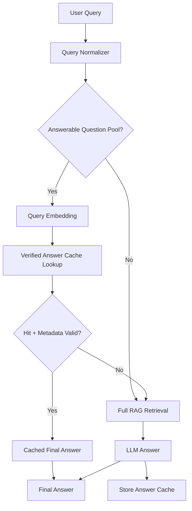
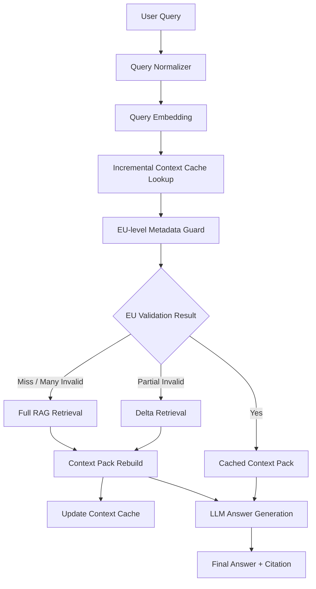

# 04. DP3 - RAG Cache Strategy: 검증형 답변 캐시 vs 증분 가능한 Context Cache

## 1. DP3 주제

DP3의 주제는 **사내 데이터의 특수성을 고려하여 반복적이고 유사한 질문에 대해 어떤 RAG 산출물을 캐시하고 재사용할 것인지 결정하는 것**이다.

구체적으로는 응답속도, 기능 적합성, 분석/테스트 용이성의 trade-off를 기준으로 다음 두 전략을 비교한다.

```text
Verified Answer Cache(검증형 답변 캐시)
  = 검증된 최종 답변을 제한된 질문 범위에서 재사용한다.

Incremental Context Cache(증분 가능한 Context Cache)
  = 검증된 Evidence Context를 재사용하고, invalid 부분만 증분 보강한다.
```

일반적인 RAG 흐름은 질문마다 필요한 Evidence Unit을 검색하고 LLM Context로 조합해 답변을 생성한다. 그러나 사내 사용자 풀은 유사한 역할과 업무 맥락을 공유하고, 접근하는 코드/문서도 유사하기 때문에 반복 질문이 필연적으로 발생한다. 반복적인 사용법 질문이나 설계 규칙 질문은 여전히 매번 여러 EU를 검색하고, rerank하고, LLM Context로 조합해야 한다.

또한 사내 데이터는 LLM이 사전 학습으로 충분히 알고 있는 공개 코드와 다르다. 권한과 보안 문제로 LLM이 직접 학습할 수 없는 정보가 많으므로, 답변 품질은 RAG가 제공하는 청크 또는 Evidence Unit에 크게 의존한다. 따라서 RAG 결과가 조금만 달라져도 답변이 민감하게 흔들릴 수 있으며, 반복 질문에서는 **정확한 정보를 안정적으로 재사용하는 전략**이 필요하다.

따라서 DP3의 핵심 질문은 다음이다.

> 반복 질문에 대해 검증된 최종 답변을 제한적으로 재사용할 것인가, 아니면 검증된 Evidence Context를 재사용하고 invalid 부분만 증분 보강할 것인가?

이 문서에서는 두 후보를 비교한다.

| 후보 | 핵심 아이디어 |
|---|---|
| Option A. Verified Answer Cache<br/>(검증형 답변 캐시) | FAQ, API 사용법처럼 답변이 명확한 질문 풀에 한해 과거 최종 답변을 검증 후 재사용한다. |
| Option B. Incremental Context Cache<br/>(증분 가능한 Context Cache) | RAG가 반환한 Evidence Unit / Context Pack을 EU 단위로 검증하고, invalid 부분만 delta retrieval로 보강한 뒤 LLM에 전달한다. |

이 DP는 의도 분류기나 복잡한 Query Router를 전제로 하지 않는다. PoC에서는 다음처럼 구현 가능한 기계적 조건만 사용한다.

```text
1. Answer Cache는 미리 정의된 answerable question pool을 먼저 통과한 질문에만 적용한다.
2. Context Cache는 질문 풀 필터링 없이 embedding similarity로 cache 후보를 찾는다.
3. cache lookup 이후 permission / version / freshness metadata guard로 재사용 가능성을 검증한다.
4. Context Cache에서 일부 EU만 invalid하면 delta retrieval로 invalid 부분만 보강한다.
5. cache miss 또는 invalid EU가 너무 많으면 Full RAG로 fallback한다.
```

즉 DP3의 비교 대상은 “cache를 쓸 것인가 말 것인가”가 아니라, **최종 답변 단위 재사용과 RAG Context 단위 재사용 중 어떤 단위가 사내 RAG의 효율성과 신뢰성을 더 잘 만족하는가**이다.

---

## 2. 배경

### 2.1 반복 질의에서의 남는 문제

Evidence Unit은 원본 Source에 가까운 근거 단위다. 중복은 줄였지만, 하나의 질문에 답하려면 여러 EU를 조합해야 할 수 있다.

예를 들어 `AuthClient` 사용법 질문에 답하려면 다음 근거들이 필요할 수 있다.

```text
EU-1: AuthClient init() signature
EU-2: AuthClient token validation behavior
EU-3: Deprecated AuthClientV1 replacement
EU-4: release/2.x migration note
EU-5: sample usage
```

일반적인 RAG 처리에서는 질문이 반복될 때마다 관련 EU를 검색하고, 권한/버전 필터링을 적용하고, Top-K를 rerank하고, LLM 입력 Context를 다시 구성한다. 이 과정에서 다음 문제가 생긴다.

| 문제 | 설명 |
|---|---|
| 반복 질의 비용 | 같은 주제 질문마다 EU 검색, filtering, rerank, context 구성, LLM 생성을 반복한다. |
| 응답 지연 누적 | 단순 vector search는 빠를 수 있지만, 코드 어시스트에서는 권한/버전 검증, dedup, rerank, context build가 함께 붙는다. |
| 결과 안정성 부족 | 매번 선택되는 EU 조합이 달라지면 같은 질문군에서도 답변의 근거와 표현이 흔들릴 수 있다. |
| 근거 재사용 부재 | 이미 검증한 근거 묶음이 있어도 다음 질문에서 다시 찾고 다시 조합한다. |

### 2.2 DP3가 해결해야 하는 것

DP3는 RAG 검색 자체의 품질보다, 반복 질문에서 이미 만들어진 산출물을 어떤 단위로 안전하게 재사용할 것인지 결정한다.

```text
기본 RAG 경로 = 질문마다 검색, 권한/버전 검증, rerank, context build, LLM 생성을 반복한다.
DP3 Cache 경로 = 반복 질문에서 검증된 답변 또는 검증된 Context Pack을 재사용해 비용을 줄인다.
```

따라서 DP3의 핵심은 **최종 답변 단위 재사용**과 **Context/EU 단위 재사용** 중 무엇이 사내 RAG의 반복 질문에 더 적합한지 판단하는 것이다.

| 구분 | DP3에서 확인할 내용 |
|---|---|
| 재사용 단위 | 최종 답변을 재사용할지, RAG Context Pack을 재사용할지 |
| 검증 조건 | 권한, 버전, 최신성, source fingerprint를 cache hit 시점에 확인할 수 있는지 |
| fallback 조건 | cache miss, invalid, 부분 invalid 상황에서 RAG로 안전하게 돌아갈 수 있는지 |
| 최적화 대상 | 평균 응답속도 절감, 기능 적합성, 분석/테스트 용이성 |
| 실패 위험 | wrong answer reuse, stale context reuse, 권한/버전 불일치 |

DP3의 좋은 후보는 다음 조건을 만족해야 한다.

- 반복 질문에서 응답 지연을 줄인다.
- 반복 질문에서 결과 변동성을 줄인다.
- 코드 어시스트에 필요한 Citation과 source 추적성을 유지한다.
- 권한/버전/최신성 문제가 생기면 cache entry를 거부하거나 RAG로 fallback할 수 있다.
- PoC에서 측정 가능한 trade-off를 제공한다.

### 2.3 PoC 친화적 설계 원칙

본 DP는 구현과 측정이 가능한 형태를 우선한다. 따라서 다음 원칙을 둔다.

| 원칙 | 설명 |
|---|---|
| 질문 풀 필터링 제한 | Answer Cache는 FAQ/API 사용법처럼 답변이 명확한 질문 풀에만 적용하고, Context Cache는 질문 풀 필터링 없이 적용한다. 1차 PoC에서는 embedding similarity 기반으로 제한하고, BM25 lexical matching은 near-miss 오탐을 줄이기 위한 2차 보강으로 둔다. |
| LLM 판정 최소화 | Cache hit 여부를 LLM에게 매번 판단시키지 않는다. PoC에서는 embedding과 metadata로 판정한다. |
| 측정 가능한 실패 정의 | wrong answer reuse, invalid cache acceptance, wrong version citation처럼 실패를 수치화한다. |
| 안전한 miss 허용 | 애매한 후보는 cache hit로 밀어붙이지 않고 delta retrieval 또는 Full RAG로 fallback한다. |

PoC 비교 대상은 다음 두 가지다.

```text
A. Verified Answer Cache
B. Incremental Context Cache
```

---

## 3. Option A. Verified Answer Cache - 검증형 답변 캐시

### 3.1 상세 설명

Verified Answer Cache는 과거에 처리한 질문과 최종 답변을 저장해두고, 새 질문이 들어오면 답변 가능한 질문 풀과 cache validation을 통과한 경우에만 기존 답변을 재사용하는 방식이다.

이 방식은 GPTCache나 LangChain의 cache option처럼 LLM 사용 비용과 지연을 줄이기 위한 일반적인 answer cache 전략에 가깝다. 다만 사내 코드 어시스트의 모든 질문에 적용하지 않고, **FAQ, API 사용법, 정형화된 정책 안내처럼 답변이 명확한 질문**에 한정한다.

핵심은 다음이다.

```text
"이 질문은 미리 정의한 답변 가능 범위에 있고, 과거 검증 답변을 지금 그대로 반환해도 되는가?"
```

즉 Verified Answer Cache는 **validated answer reuse** 전략이다.

### 3.2 동작 원리

1. 사용자 질문을 정규화한다.
2. 미리 구성된 answerable question pool을 기준으로 답변 캐시 적용 가능 여부를 필터링한다. 1차 PoC에서는 embedding similarity threshold를 넘을 때만 통과시킨다.
3. 필터링을 통과한 질문만 embedding을 생성한다.
4. Answer Cache에서 유사한 과거 질문과 최종 답변을 검색한다.
5. 유사도 threshold를 넘으면 cache 후보로 판단한다.
6. Cache entry의 권한 Scope, Source Version, TTL, Source timestamp를 검증한다.
7. 유효하면 cached answer와 citation metadata를 사용자에게 바로 반환한다.
8. 필터링 실패, cache miss, validation invalid이면 RAG/LLM을 수행한다.
9. 새 답변이 cacheable하면 Answer Cache를 업데이트한다.

### 3.3 설계 다이어그램



### 3.4 캐시 Entry 예시

```json
{
  "cache_type": "verified_answer",
  "query_text": "AuthClient 초기화 순서 알려줘",
  "query_embedding_id": "emb-q-1001",
  "answer_text": "AuthClient는 ... 순서로 초기화합니다.",
  "source_eu_ids": ["EU-101", "EU-205", "EU-330"],
  "citation_metadata": [
    {
      "file_path": "auth/AuthClient.cpp",
      "symbol": "AuthClient::init",
      "commit_sha": "abc123",
      "release": "2.1"
    }
  ],
  "validity_metadata": {
    "allowed_scopes": ["project-a-dev"],
    "release_range": "release/2.x",
    "last_verified_commit": "abc123",
    "ttl_seconds": 604800
  }
}
```

### 3.5 적용 범위

Verified Answer Cache는 다음 질문에 우선 적용한다.

| 적용 가능한 질문 | 이유 |
|---|---|
| FAQ | 질문과 답변의 의미가 비교적 고정되어 있다. |
| API 기본 사용법 | 사용 순서, 필수 파라미터, 기본 예제처럼 답변 구조가 명확하다. |
| 정형 정책 안내 | 권한/버전 validation을 통과하면 같은 답변을 재사용하기 쉽다. |

반대로 복합 설계 질문, 여러 조건이 섞인 장애 분석 질문, 미묘한 의도 차이가 중요한 질문은 answerable question pool에서 제외한다.

### 3.6 장점

| 장점 | 설명 |
|---|---|
| 응답속도가 가장 빠르다 | Cache hit 시 RAG와 LLM 생성을 모두 생략할 수 있다. |
| 구현과 운영이 단순하다 | 최종 답변과 metadata만 검증하는 구조이므로 개발 난이도와 유지보수 부담이 낮다. |
| 제한된 반복 질문에 직접 대응한다 | FAQ/API 사용법처럼 동일하거나 거의 같은 질문이 반복되면 효과가 크다. |
| 지표가 명확하다 | Cache Hit Rate, P95 Latency, Wrong Hit Rate를 쉽게 측정할 수 있다. |

### 3.7 단점

| 단점 | 설명 |
|---|---|
| Wrong cache hit 위험 | 비슷해 보이지만 다른 질문에 기존 답변을 재사용할 수 있다. |
| 최종 답변에 묶인다 | 과거 답변을 재사용하므로 새 질문의 세부 조건이나 뉘앙스를 반영하기 어렵다. |
| 사용처가 제한적이다 | 답변 가능한 질문 풀을 먼저 통과해야 하므로 복잡한 질문에는 적용하기 어렵다. |
| 부분 만료에 취약하다 | 최종 답변 단위 cache이므로 일부 근거만 만료되어도 cache item 전체를 재생성해야 한다. |

---

## 4. Option B. Incremental Context Cache - 증분 가능한 Context Cache

### 4.1 상세 설명

Incremental Context Cache는 최종 답변을 캐싱하지 않는다. 대신 RAG 과정에서 반환된 Evidence Unit 묶음과 LLM 입력 직전의 Context Pack을 캐싱한다.

이 후보는 cache hit 이후에도 LLM을 반드시 통과한다. 따라서 답변 가능한 질문 풀을 미리 필터링하지 않으며, FAQ뿐 아니라 복합 API 질문, 설계 규칙 질문, deprecated/migration 설명처럼 뉘앙스가 중요한 질문에도 적용할 수 있다.

핵심은 다음이다.

```text
"전에 이 질문과 유사한 질문에 대해 어떤 Context Pack을 사용했고, 그중 지금도 valid한 EU는 무엇인가?"
```

즉 Incremental Context Cache는 **EU-level validated context reuse + delta retrieval** 전략이다.

Verified Answer Cache가 `질문 → 최종 답변`을 재사용한다면, Incremental Context Cache는 `질문 → Context Pack`을 재사용하되, Context Pack 안의 EU를 개별 검증하고 답변은 현재 질문에 맞게 다시 생성한다.

### 4.2 Context Pack의 의미

여기서 Context Pack은 RAG가 검색 결과를 모아 LLM에 넣기 직전의 데이터다. 단순한 문자열이 아니라 다음 정보를 포함한다.

| 구성 요소 | 설명 |
|---|---|
| `context_text` | LLM Prompt에 넣을 근거 텍스트 |
| `source_eu_ids` | 이 context가 어떤 Evidence Unit에서 왔는지 |
| `citation_metadata` | 파일 경로, symbol, commit, release 등 Citation 정보 |
| `validity_metadata` | allowed_scope, release_range, last_verified_commit, TTL |
| `context_embedding` | Context Pack 검색을 위한 embedding |

### 4.3 동작 원리

1. 사용자 질문을 정규화한다.
2. 질문 embedding을 생성한다.
3. Context Cache에서 embedding similarity로 Context Pack 후보를 검색한다.
4. 후보 Context Pack에 포함된 각 EU의 권한 Scope, Source Version, TTL, Source timestamp를 EU 단위로 검증한다.
5. 모든 EU가 valid하면 cached context_text와 source_eu_ids를 LLM Context로 사용한다.
6. 일부 EU만 invalid하면 invalid EU에 대해서만 delta retrieval을 수행한다.
7. 기존 valid EU와 새로 검색된 EU를 합쳐 Context Pack을 rebuild한다.
8. rebuild된 Context Pack으로 cache를 업데이트하고 LLM에 전달한다.
9. Cache miss 또는 invalid EU가 너무 많으면 Full RAG를 수행하고 cache를 업데이트한다.
10. LLM은 현재 질문에 맞게 답변을 새로 생성한다.

### 4.4 설계 다이어그램



### 4.5 Cache Entry 예시

```json
{
  "cache_type": "incremental_context",
  "context_pack_id": "ctx-authclient-usage-2x",
  "context_embedding_id": "emb-ctx-2001",
  "anchor_queries": [
    "AuthClient 사용법 알려줘",
    "AuthClient 초기화 순서 알려줘",
    "AuthClient 예제 보여줘"
  ],
  "source_eu_ids": ["EU-101", "EU-205", "EU-330", "EU-412"],
  "context_text": "[EU-101] AuthClient::init ...\n[EU-205] Token validation ...\n[EU-330] AuthClientV1 is deprecated ...",
  "citation_metadata": [
    {
      "eu_id": "EU-101",
      "file_path": "auth/AuthClient.cpp",
      "symbol": "AuthClient::init",
      "commit_sha": "abc123",
      "release": "2.1"
    }
  ],
  "validity_metadata": {
    "allowed_scopes": ["project-a-dev"],
    "release_range": "release/2.x",
    "last_verified_commit": "abc123",
    "source_fingerprint": "sha256:...",
    "ttl_seconds": 604800
  }
}
```

### 4.6 요청과 Context Pack 매칭 방식

룰 기반 intent 분류를 전제로 하지 않는다. PoC에서는 다음 조합으로 구현한다.

```text
1. Query embedding과 Context Pack embedding의 cosine similarity로 후보 검색
2. Context Pack 내부 EU별 권한/버전/최신성 metadata guard 확인
3. 일부 EU만 invalid하면 delta retrieval 수행
```

즉 embedding은 유사한 Context Pack 후보를 찾기 위한 수단이고, metadata validation은 cache lookup 이후 해당 후보를 재사용해도 되는지 판단하는 단계다.

```text
Cache lookup 후보 선정:
- cosine_similarity(query_embedding, context_embedding) >= threshold

Hit 후 validation:
- 각 EU의 user_scope ∈ eu.allowed_scopes
- 각 EU의 requested_version ∈ eu.release_range
- 각 EU의 source_fingerprint 또는 last_verified_commit이 유효

Validation 결과 처리:
- 모든 EU가 valid하면 cached Context Pack을 LLM에 전달한다.
- 일부 EU만 invalid하면 delta retrieval로 보강한다.
- cache miss 또는 invalid EU가 너무 많으면 Full RAG로 fallback한다.
```

예를 들어 다음 두 질문은 embedding similarity가 높을 수 있다.

```text
Q1. AuthClient는 언제 써야 해?
Q2. AuthClient를 쓰면 안 되는 경우는?
```

두 질문 모두 `AuthClient`를 다루므로 같은 Context Pack 후보를 볼 수는 있다. 그러나 Incremental Context Cache는 최종 답변을 재사용하지 않는다. 같은 근거 묶음을 LLM에 제공하되, 현재 질문의 방향에 맞게 “사용 조건” 또는 “사용 금지 조건”을 새로 생성하게 한다. 이 점이 Verified Answer Cache와의 핵심 차이다.

### 4.7 Delta Retrieval 정책

Incremental Context Cache의 핵심은 전체 cache item을 바로 폐기하지 않고, valid한 EU는 유지하면서 invalid한 EU만 증분적으로 보강하는 것이다.

| Validation 결과 | 처리 방식 |
|---|---|
| 모든 EU가 valid | 기존 Context Pack을 그대로 LLM에 전달한다. |
| 일부 EU만 invalid | invalid EU와 같은 역할의 근거를 delta retrieval로 다시 검색한다. |
| invalid EU가 너무 많음 | Context Pack 신뢰도가 낮다고 보고 Full RAG로 fallback한다. |
| Cache miss | Full RAG를 수행한 뒤 새 Context Pack을 저장한다. |

delta retrieval 결과로 얻은 새 EU와 기존 valid EU는 다시 Context Pack으로 rebuild된다. rebuild된 Context Pack은 cache update에 사용되고, 같은 요청의 LLM 입력으로도 전달된다.

### 4.8 Context Pack 품질 제한

Incremental Context Cache는 Context Pack이 너무 넓어지는 것을 막아야 한다. 너무 넓은 Context Pack은 cache hit rate는 높일 수 있지만, 질문과 무관한 근거를 LLM에 넣어 답변 품질을 떨어뜨릴 수 있다.

PoC에서는 다음 제한을 둔다.

| 제한 항목 | 권장 기준 |
|---|---|
| `max_context_tokens` | Context Pack당 고정 상한을 둔다. 예: 1,500~2,500 tokens |
| `evidence_type` | api_signature, sample_usage, deprecated_note, migration_note 등으로 구분한다. |
| `required_key_points` | 이 Context Pack이 반드시 포함해야 하는 핵심 근거를 명시한다. |
| `source_eu_ids` | 모든 근거는 EU까지 추적 가능해야 한다. |
| `release_range` | 요청 version과 호환되지 않으면 miss 처리한다. |

즉 Context Cache hit는 단순히 embedding 점수가 높은 경우가 아니라, “EU 단위 권한/버전이 맞고, invalid 비율이 정책 기준 안에 있는 검증 가능한 근거 묶음”일 때만 인정한다.

### 4.9 장점

| 장점 | 설명 |
|---|---|
| 사용처 제약이 작다 | LLM을 반드시 통과하므로 FAQ뿐 아니라 복합 질문에도 적용할 수 있다. |
| Answer Cache보다 안전하다 | 최종 답변을 재사용하지 않고 근거 Context만 재사용하므로 질문 뉘앙스에 맞게 답변을 새로 생성할 수 있다. |
| 최신성 유지 비용을 줄인다 | invalid한 EU에 대해서만 delta retrieval을 수행해 증분적으로 보강할 수 있다. |

### 4.10 단점

| 단점 | 설명 |
|---|---|
| Answer Cache보다 느리다 | LLM 답변 생성은 여전히 수행하므로 latency 절감에는 한계가 있다. |
| 정책과 구조가 복잡하다 | EU 단위 validation, delta retrieval, context rebuild, full fallback 기준이 필요하다. |

---

## 5. 검증형 답변 캐시 vs 증분 가능한 Context Cache 비교

### 5.1 QA 기반 Trade-off

| 평가 QA | Verified Answer Cache | Incremental Context Cache | 점수 근거 |
|---|---|---|---|
| 성능 / 응답속도 | 3 | 2 | A안은 cache hit 시 RAG와 LLM을 모두 생략하므로 단일 hit의 latency 절감 효과가 가장 크다. B안은 cache hit이어도 LLM을 통과하므로 절감량은 제한적이다. |
| 기능 적합성 / 답변 정확성 | 2 | 3 | A안은 필터링으로 유용한 답변을 기대할 수 있지만, “사용법”과 “특징”처럼 유사 질문의 미묘한 뉘앙스 차이에 취약하다. B안은 LLM이 현재 질문에 맞게 답변을 생성하므로 뉘앙스 반영이 가능하다. |
| 분석 / 테스트 용이성 | 2 | 3 | A안은 답변 단위 metadata만 있어 세부 원인 분석이 제한될 수 있고, LLM 변경에 민감하다. B안은 LLM 출력과 독립적인 EU 단위 metadata를 저장하므로 문제 상황 분석에 더 유리하다. |
| 합계 | **7** | **8** | 성능 단일 지표는 A안이 우세하지만, 전체 질문 범위와 분석 가능성까지 고려하면 B안이 더 높다. |

점수 해석은 다음과 같다.

- 1점: 해당 QA를 만족하려면 추가 보완이 많이 필요하다.
- 2점: 기본 구조로 대응 가능하지만 적용 범위나 운영 정책의 제약이 있다.
- 3점: 후보의 구조적 강점이 해당 QA에 직접 연결된다.

### 5.2 Trade-off 해석

Verified Answer Cache는 반복 질문이 충분히 쌓이고 질문이 answerable question pool에 들어온 경우 가장 빠른 후보이다. Cache hit 시 RAG와 LLM을 모두 생략할 수 있으므로 응답속도 관점에서는 강력하다. 그러나 최종 답변을 재사용하므로 비슷하지만 다른 질문, 다른 Source Version, 다른 권한 Scope에서 wrong answer hit가 발생할 수 있다.

Incremental Context Cache는 Verified Answer Cache보다 느리다. LLM 답변 생성은 여전히 수행하기 때문이다. 대신 최종 답변이 아니라 검증된 Evidence Context를 재사용하므로 현재 질문의 뉘앙스를 반영할 수 있고, EU 단위 metadata를 통해 invalid 부분만 delta retrieval로 보강할 수 있다. 따라서 본 DP가 단순 최고 속도가 아니라 **평균 응답 효율, 기능 적합성, 분석 가능성의 균형**을 목표로 한다면 Incremental Context Cache가 더 적합하다.

PoC에서 Incremental Context Cache가 이겨야 하는 지표는 “최단 latency” 하나가 아니다. 다음 결과를 얻는 것이 목표다.

| 기대 결과 | 의미 |
|---|---|
| RAG 중간 처리 비용 감소 | 반복 질문에서 EU 검색/filtering/rerank/context build를 줄인다. |
| Verified Answer Cache 대비 Wrong Answer Reuse 감소 | 최종 답변을 재사용하지 않아 비슷하지만 다른 질문에 더 안전하다. |
| Delta Retrieval로 최신성 보강 비용 감소 | invalid EU만 보강해 전체 RAG 재수행 빈도를 줄인다. |

---

## 6. 최종 선택

### 6.1 선택 후보

본 DP에서는 **Option B. Incremental Context Cache**를 선택한다.

### 6.2 선택 이유

선택 이유는 다음과 같다.

1. Verified Answer Cache가 응답속도에서는 가장 강하지만, 적용 범위가 FAQ/API 기본 사용법 등으로 제한된다.
2. Incremental Context Cache는 LLM을 반드시 통과하므로 질문 대상에 대한 제약이 작고, 현재 질문의 뉘앙스를 반영할 수 있다.
3. 일부 EU가 invalid한 경우에도 valid EU는 유지하고 invalid EU만 delta retrieval로 보강할 수 있어 최신성 유지 비용이 낮다.
4. 분석/테스트 관점에서 EU 단위 metadata가 남기 때문에 문제 상황의 원인 분석과 재현이 Answer Cache보다 쉽다.

이 선택은 “가장 빠른 cache”를 고르는 결정이 아니다. 가장 빠른 후보는 Verified Answer Cache다. 본 선택은 **사내 데이터 기반 RAG에서 반복 질문의 평균 효율, 기능 적합성, 분석 가능성 사이의 균형이 가장 좋은 cache 산출물**을 고르는 결정이다.

### 6.3 발표용 결론 문장

> Verified Answer Cache는 cache hit 시 RAG와 LLM을 모두 생략할 수 있어 가장 빠른 후보입니다. 하지만 FAQ나 API 기본 사용법처럼 답변이 명확한 질문에 제한적으로 적용하는 편이 안전합니다. Incremental Context Cache는 최종 답변을 재사용하지 않고, cache hit 이후에도 LLM이 현재 질문에 맞게 답변을 생성합니다. 또한 일부 EU가 invalid한 경우에는 전체를 버리지 않고 delta retrieval로 보강할 수 있습니다. 따라서 평균적인 반복 질문 대응, 질문 뉘앙스 반영, 분석/테스트 용이성을 함께 고려하면 Incremental Context Cache가 더 균형 잡힌 선택입니다.

---

## 7. Appendix DP3 - PoC 설계와 방어 논리

### 7.1 PoC 목적

PoC의 목적은 Incremental Context Cache가 Verified Answer Cache보다 항상 빠르다는 것을 보이는 것이 아니다.

목표는 다음 trade-off를 확인하는 것이다.

```text
Verified Answer Cache:
  cache hit 이후 가장 빠르지만 wrong answer reuse 위험이 있다.

Incremental Context Cache:
  LLM 생성 비용은 남지만 RAG 중간 비용을 줄이고,
  일부 invalid EU는 delta retrieval로 보강하며,
  질문 뉘앙스 반영과 문제 원인 분석에 유리하다.
```

따라서 PoC의 성공 조건은 다음과 같다.

| 성공 조건 | 기대 방향 |
|---|---|
| Verified Answer Cache | 완전 반복 질문에서 latency와 LLM call count를 가장 크게 줄인다. |
| Incremental Context Cache | 반복 질문에서 RAG 중간 처리 비용을 줄인다. |
| Incremental Context Cache | Verified Answer Cache 대비 wrong answer reuse를 줄인다. |
| Incremental Context Cache | invalid EU만 delta retrieval로 보강해 Full RAG 수행 빈도를 줄인다. |
| Incremental Context Cache | EU 단위 metadata로 validation invalid 원인을 분석할 수 있다. |

### 7.2 PoC 데이터 구성

작은 샘플 도메인을 정한다.

예시 Topic:

- AuthClient 사용법
- Deprecated AuthClientV1 대체
- Token validation 주의사항
- Release 2.x migration note
- Error handling guideline

준비 데이터:

```text
EU Set:
- EU-1: AuthClient init() signature
- EU-2: AuthClient token validation behavior
- EU-3: AuthClientV1 deprecated note
- EU-4: release/2.x migration guide
- EU-5: sample usage
- EU-6: error handling rule
```

### 7.3 비교 대상 구현

#### A. Verified Answer Cache

```text
Query
-> Answerable Question Pool Filter
-> Query Embedding
-> Verified Answer Cache Lookup
-> Metadata Validation
-> Hit: Cached Answer Return
-> Miss: Full RAG + LLM
-> Store Answer Cache
```

#### B. Incremental Context Cache

```text
Query
-> Query Embedding
-> Incremental Context Cache Lookup
-> EU-level Metadata Validation
-> Hit: Cached Context Pack + LLM
-> Partial Invalid: Delta Retrieval + Context Rebuild + LLM
-> Miss / Many Invalid: Full RAG + Context Build + LLM
-> Update Context Pack
```

### 7.4 비교 테스트 시나리오

#### 시나리오 1. 완전 반복 질문

목적: Verified Answer Cache의 최고 속도 장점을 확인한다.

질문:

```text
Q1. AuthClient 초기화 순서 알려줘.
Q2. AuthClient 초기화 순서 알려줘.
Q3. AuthClient 초기화 순서 알려줘.
```

측정:

- Cache Hit Rate
- P50/P95 Latency
- LLM Call Count

#### 시나리오 2. 비슷하지만 뉘앙스가 다른 질문

목적: 비슷한 질문이라도 최종 답변을 재사용하지 않는 Context Cache가 질문 뉘앙스를 반영하고, Answer Cache의 wrong answer reuse 위험을 줄이는지 확인한다.

질문:

```text
Q1. AuthClient 사용법 알려줘.
Q2. AuthClient의 주요 특징 알려줘.
Q3. AuthClient를 쓰면 안 되는 경우는?
Q4. Release 2.x에서 AuthClient 초기화 시 주의사항은?
```

측정:

- Context Cache Hit Rate
- Intent-sensitive Answer Accuracy
- Required Key Point Coverage
- Wrong Answer Reuse Rate
- Wrong Cache Hit Rate
- Contradiction Rate
- Fallback Rate

기대 관찰:

- Verified Answer Cache는 threshold를 낮추면 hit rate가 올라가지만 wrong answer reuse 위험도 함께 증가한다.
- Incremental Context Cache는 같은 근거 묶음을 사용할 수 있지만 최종 답변은 새로 생성하므로 “사용 조건”과 “사용 금지 조건”을 분리할 가능성이 높다.

#### 시나리오 3. Source 변경 / Version 변경

목적: Cache entry의 invalidation과 metadata guard가 동작하는지 확인한다.

변경:

```text
- EU-101의 commit_sha 변경
- release_range를 release/3.x로 변경
- user_scope를 project-b-dev로 변경
```

측정:

- Invalid Cache Rejection Rate
- Wrong Version Citation Rate
- Unauthorized Source Exposure Count

#### 시나리오 4. 일부 EU invalid와 Delta Retrieval

목적: Incremental Context Cache가 valid EU를 유지하면서 invalid EU만 증분 보강하는지 확인한다.

변경:

```text
- Context Pack 내 EU-101, EU-205는 valid 유지
- EU-330만 source_fingerprint 변경으로 invalid 처리
```

측정:

- Delta Retrieval Count
- Full RAG Fallback Rate
- Context Rebuild Success Rate
- Required Key Point Coverage

### 7.5 측정 지표 정의

| 지표 | 의미 | 기대되는 관찰 |
|---|---|---|
| P50/P95 Latency | End-to-end 응답 시간 | Answer Cache hit이 가장 빠르고, Context Cache는 LLM 호출은 유지하되 중간 처리 시간을 줄인다. |
| Cache Hit Rate | 전체 질문 중 cache hit 비율 | 반복 질문에서 두 후보 모두 상승 |
| LLM Call Count | LLM 호출 횟수 | Answer Cache는 hit 시 감소, Context Cache는 유지 |
| Wrong Cache Hit Rate | 잘못된 cache entry를 hit로 판단한 비율 | Answer Cache 리스크가 더 큼 |
| Wrong Answer Reuse Rate | 잘못된 최종 답변을 재사용한 비율 | Answer Cache에서 핵심 위험 |
| Intent-sensitive Answer Accuracy | 유사 질문의 의도 차이를 답변에 반영한 비율 | Context Cache가 상대적으로 유리 |
| Delta Retrieval Count | invalid EU만 증분 보강한 횟수 | Context Cache의 최신성 유지 비용 절감 확인 |
| Full RAG Fallback Rate | cache miss 또는 대량 invalid로 Full RAG를 수행한 비율 | invalid 기준이 너무 공격적인지 확인 |
| Required Key Point Coverage | 필수 근거 포인트 포함 비율 | Context Pack 품질 검증 |
| Invalid Cache Rejection Rate | stale/권한/버전 불일치 cache를 거부한 비율 | 두 후보 모두 safety guard 검증 |

---

## 8. References / Evidence

| ID | 문서명 | 출처 | 활용 |
|---|---|---|---|
| REF-DP3-TR-01 | GPTCache: An Open-Source Semantic Cache for LLM Applications | https://aclanthology.org/2023.nlposs-1.24/ | Verified Answer Cache 후보 근거 |
| REF-DP3-TR-02 | GPTCache Documentation | https://gptcache.readthedocs.io/ | Semantic cache 구조와 사용 방식 참고 |
| REF-DP3-TR-03 | RAGCache: Efficient Knowledge Caching for Retrieval-Augmented Generation | https://arxiv.org/abs/2404.12457 | RAG 중간 산출물/context cache 계열 비교 근거 |
