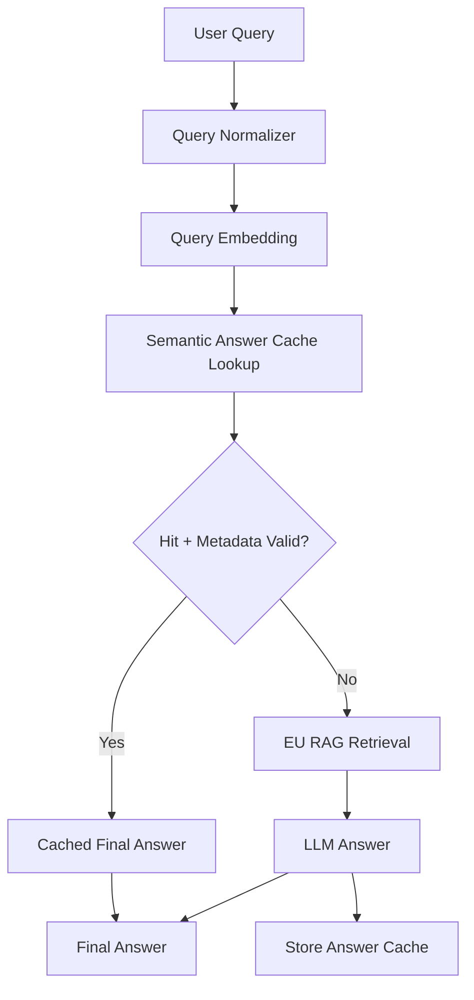
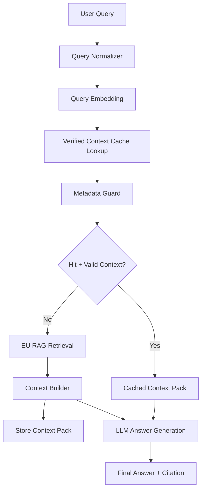

# 05. DP4 - RAG Cache Strategy: Answer Reuse vs Context Reuse

## 1. DP4 주제

DP4의 주제는 **중복 제어 RAG 이후에도 반복적으로 발생하는 API/설계/정책 질문에 대해, 어떤 RAG 산출물을 캐시하고 재사용할 것인지 결정하는 것**이다.

구체적으로는 응답속도를 개선하면서도 답변 일관성, 근거 신뢰성, 권한/버전 정합성을 유지하기 위해 다음 두 전략을 비교한다.

```text
Answer Reuse  = 최종 답변을 재사용한다.
Context Reuse = 검증된 Evidence Context를 재사용하고 답변은 다시 생성한다.
```

DP1의 SPRAG 기반 Evidence Unit RAG는 중복 Segment를 줄이고 원본 Source Mapping을 유지하는 Retrieval 근거 계층을 만든다. 그러나 반복적인 사용법 질문이나 설계 규칙 질문은 여전히 매번 여러 EU를 검색하고, rerank하고, LLM Context로 조합해야 한다.

따라서 DP4의 핵심 질문은 다음이다.

> 반복 질문에 대해 최종 답변을 재사용할 것인가, 아니면 검증된 Evidence Context를 재사용해 RAG 비용을 줄이되 답변은 현재 질문에 맞게 생성할 것인가?

이 문서에서는 두 후보를 비교한다.

| 후보 | 핵심 아이디어 |
|---|---|
| Option A. Semantic Answer Cache | 과거에 들어온 유사 질문과 최종 답변을 embedding similarity로 찾아 RAG와 LLM 생성을 생략하고 답변을 재사용한다. |
| Option B. Verified Context Cache | 과거 RAG 결과 중 권한/버전/최신성 검증을 통과한 Evidence Unit 묶음과 LLM 입력용 Context Pack을 재사용하고, LLM은 현재 질문에 맞게 다시 생성한다. |

이 DP는 의도 분류기나 복잡한 Query Router를 전제로 하지 않는다. PoC에서는 다음처럼 구현 가능한 기계적 조건만 사용한다.

```text
1. embedding similarity로 cache 후보를 찾는다.
2. permission / version / freshness metadata guard를 통과한 경우에만 hit로 인정한다.
3. guard를 통과하지 못하면 EU-only RAG baseline으로 fallback한다.
```

즉 DP4의 비교 대상은 “정책적으로 어떤 질문은 어디로 보낸다”가 아니라, **cache hit를 어떤 데이터와 어떤 검증 조건으로 안전하게 인정할 것인가**이다.

Symbol Matching은 두 후보 중 하나에만 속한 핵심 메커니즘이 아니라, 양쪽 모두에 붙일 수 있는 optional hardening으로 Appendix에서 별도로 다룬다.

---

## 2. 배경

### 2.1 EU-only RAG의 남는 문제

Evidence Unit은 원본 Source에 가까운 근거 단위다. 중복은 줄였지만, 하나의 질문에 답하려면 여러 EU를 조합해야 할 수 있다.

예를 들어 `AuthClient` 사용법 질문에 답하려면 다음 근거들이 필요할 수 있다.

```text
EU-1: AuthClient init() signature
EU-2: AuthClient token validation behavior
EU-3: Deprecated AuthClientV1 replacement
EU-4: release/2.x migration note
EU-5: sample usage
```

EU-only RAG에서는 질문이 반복될 때마다 관련 EU를 검색하고, 권한/버전 필터링을 적용하고, Top-K를 rerank하고, LLM 입력 Context를 다시 구성한다. 이 과정에서 다음 문제가 생긴다.

| 문제 | 설명 |
|---|---|
| 반복 질의 비용 | 같은 주제 질문마다 EU 검색, filtering, rerank, context 구성, LLM 생성을 반복한다. |
| 응답 지연 누적 | 단순 vector search는 빠를 수 있지만, 코드 어시스트에서는 권한/버전 검증, dedup, rerank, context build가 함께 붙는다. |
| 답변 일관성 부족 | 매번 선택되는 EU 조합이 달라지면 같은 API/Topic에 대한 권장 방향과 표현이 흔들릴 수 있다. |
| 근거 재사용 부재 | 이미 검증한 근거 묶음이 있어도 다음 질문에서 다시 찾고 다시 조합한다. |

### 2.2 DP4가 해결해야 하는 것

DP4는 “검색 품질을 높이는 것”보다 한 단계 위의 문제를 다룬다.

```text
DP1 = 정확하고 중복이 적은 근거 조각을 만든다.
DP2 = 사용자가 볼 수 있는 Source와 요청 Version 범위만 사용하게 한다.
DP4 = 반복 질문에서 어떤 산출물을 재사용해 빠르고 일관된 답변을 만들지 결정한다.
```

따라서 DP4는 DP1의 대체안이 아니라, DP1 산출물인 Evidence Unit을 소비하는 상위 Cache Layer의 선택이다.

| 구분 | DP1 SPRAG | DP4 Response Cache Strategy |
|---|---|---|
| 설계 질문 | 원본 코드/문서를 어떤 근거 단위로 쪼개고 중복을 줄일 것인가? | 반복 질문에서 최종 답변을 재사용할 것인가, 검증된 근거 Context를 재사용할 것인가? |
| 산출물 | Evidence Unit | Cached Answer 또는 Verified Context Pack |
| 최적화 대상 | Retrieval corpus 품질, 중복 강건성, Source Mapping | 반복 질의 응답속도, 답변 일관성, 안전한 재사용 |
| Online 역할 | EU Index의 검색 대상 제공 | Cache hit 시 RAG/LLM 일부 또는 전체 생략 |
| 실패 위험 | 중복 제거 실패, 잘못된 EU 구성, Source Mapping 손상 | Wrong answer reuse, stale context reuse, 권한/버전 불일치 |
| 평가 지표 | Top-K Duplicate Ratio, Context Diversity, Citation Mapping | P95 Latency, Cache Hit Rate, Wrong Hit Rate, Repeated Answer Consistency |

DP4의 좋은 후보는 다음 조건을 만족해야 한다.

- 반복 질문에서 응답 지연을 줄인다.
- 같은 Topic에 대해 답변 방향을 안정화한다.
- 코드 어시스트에 필요한 Citation과 Source Mapping을 유지한다.
- 권한/버전/최신성 문제가 생기면 cache entry를 거부하거나 RAG로 fallback할 수 있다.
- PoC에서 측정 가능한 trade-off를 제공한다.

### 2.3 PoC 친화적 설계 원칙

본 DP는 구현과 측정이 가능한 형태를 우선한다. 따라서 다음 원칙을 둔다.

| 원칙 | 설명 |
|---|---|
| Query Router 최소화 | “사용법 질문이면 A, 정책 질문이면 B” 같은 hard rule routing을 핵심 메커니즘으로 두지 않는다. |
| LLM 판정 최소화 | Cache hit 여부를 LLM에게 매번 판단시키지 않는다. PoC에서는 embedding, symbol, metadata로 판정한다. |
| Baseline 포함 | 두 cache 후보는 반드시 EU-only RAG baseline과 함께 비교한다. |
| 측정 가능한 실패 정의 | wrong answer reuse, invalid cache acceptance, wrong version citation처럼 실패를 수치화한다. |
| 안전한 miss 허용 | 애매한 후보는 cache hit로 밀어붙이지 않고 EU-only RAG로 fallback한다. |

PoC 비교 대상은 다음 세 가지다.

```text
A. EU-only RAG baseline
B. Semantic Answer Cache
C. Verified Context Cache
```

이렇게 해야 “cache 후보끼리 누가 나은가”뿐 아니라 “기존 RAG 대비 무엇이 개선되는가”를 함께 설명할 수 있다.

---

## 3. Option A. Semantic Answer Cache

### 3.1 상세 설명

Semantic Answer Cache는 과거에 처리한 질문과 최종 답변을 저장해두고, 새 질문이 들어오면 embedding similarity로 유사 질문을 찾아 기존 답변을 재사용하는 방식이다.

핵심은 다음이다.

```text
"전에 비슷한 질문에 뭐라고 답했지?"
```

즉 Semantic Answer Cache는 **answer reuse** 전략이다.

### 3.2 동작 원리

1. 사용자 질문을 정규화한다.
2. 질문 embedding을 생성한다.
3. Answer Cache에서 유사한 과거 질문을 검색한다.
4. 유사도 threshold를 넘으면 cache 후보로 판단한다.
5. Cache entry의 권한 Scope, Source Version, TTL, Source timestamp를 검증한다.
6. 유효하면 cached answer와 citation metadata를 반환한다.
7. Miss 또는 invalid이면 EU RAG를 수행한다.
8. 새 답변이 cacheable하면 Answer Cache에 저장한다.

### 3.3 설계 다이어그램



### 3.4 캐시 Entry 예시

```json
{
  "cache_type": "semantic_answer",
  "query_text": "AuthClient 초기화 순서 알려줘",
  "query_embedding_id": "emb-q-1001",
  "answer_text": "AuthClient는 ... 순서로 초기화합니다.",
  "source_eu_ids": ["EU-101", "EU-205", "EU-330"],
  "citation_metadata": [
    {
      "file_path": "auth/AuthClient.cpp",
      "symbol": "AuthClient::init",
      "commit_sha": "abc123",
      "release": "2.1"
    }
  ],
  "validity_metadata": {
    "allowed_scopes": ["project-a-dev"],
    "release_range": "release/2.x",
    "last_verified_commit": "abc123",
    "ttl_seconds": 604800
  }
}
```

### 3.5 장점

| 장점 | 설명 |
|---|---|
| 응답속도가 가장 빠르다 | Cache hit 시 RAG와 LLM 생성을 모두 생략할 수 있다. |
| 구현이 쉽다 | Query embedding, vector search, threshold, TTL 정도로 최소 PoC를 만들 수 있다. |
| 반복 질문에 직접 대응한다 | 동일하거나 거의 같은 질문이 반복되면 효과가 크다. |
| 지표가 명확하다 | Cache Hit Rate, P95 Latency, Wrong Hit Rate를 쉽게 측정할 수 있다. |

### 3.6 단점

| 단점 | 설명 |
|---|---|
| Wrong cache hit 위험 | 비슷해 보이지만 다른 질문에 기존 답변을 재사용할 수 있다. |
| 최종 답변에 묶인다 | 과거 답변을 재사용하므로 새 질문의 세부 조건이나 뉘앙스를 반영하기 어렵다. |
| 권한/버전 위험 | 과거 답변의 Source Scope와 Version이 현재 사용자/요청에 맞는지 반드시 재검증해야 한다. |
| 최신성 문제 | 원본 코드가 바뀌었는데 예전 답변을 그대로 줄 수 있다. |
| Citation 유지가 별도 과제 | 답변과 함께 source_eu_ids, commit, release metadata를 보존하지 않으면 신뢰성이 낮다. |

### 3.7 Coding Assist에서의 위험 예

다음 질문들은 embedding similarity가 높을 수 있지만 답변 방향은 달라야 한다.

```text
Q1. AuthClient는 언제 써야 해?
Q2. AuthClient를 쓰면 안 되는 경우는?
Q3. Release 2.x에서 AuthClient를 써도 돼?
Q4. AuthClientV1에서 AuthClientV2로 바꿀 때 주의점은?
```

Semantic Answer Cache가 Q1의 답변을 Q2나 Q4에 재사용하면 잘못된 구현 가이드가 될 수 있다. 코드 어시스트에서는 이런 wrong cache hit가 빌드 오류, 런타임 오류, 보안 취약점으로 이어질 수 있다.

---

## 4. Option B. Verified Context Cache

### 4.1 상세 설명

Verified Context Cache는 최종 답변을 캐싱하지 않는다. 대신 RAG 과정에서 이미 검증된 Evidence Unit 묶음과 LLM 입력 직전의 Context Pack을 캐싱한다.

핵심은 다음이다.

```text
"전에 이 질문과 유사한 질문에 대해 어떤 검증된 근거 묶음을 사용했지?"
```

즉 Verified Context Cache는 **evidence/context reuse** 전략이다.

Semantic Answer Cache가 `질문 → 최종 답변`을 재사용한다면, Verified Context Cache는 `질문 → 검증된 Context Pack`을 재사용하고 답변은 현재 질문에 맞게 다시 생성한다.

### 4.2 Context Pack의 의미

여기서 Context Pack은 RAG가 검색 결과를 모아 LLM에 넣기 직전의 데이터다. 단순한 문자열이 아니라 다음 정보를 포함한다.

| 구성 요소 | 설명 |
|---|---|
| `context_text` | LLM Prompt에 넣을 근거 텍스트 |
| `source_eu_ids` | 이 context가 어떤 Evidence Unit에서 왔는지 |
| `citation_metadata` | 파일 경로, symbol, commit, release 등 Citation 정보 |
| `validity_metadata` | allowed_scope, release_range, last_verified_commit, TTL |
| `context_embedding` | Context Pack 검색을 위한 embedding |
| `source_symbol_set` | Optional Symbol Matching guard 또는 Citation 보강에 사용할 수 있는 주요 API/Symbol 목록 |

### 4.3 동작 원리

1. 사용자 질문을 정규화한다.
2. 질문 embedding을 생성한다.
3. Context Cache에서 embedding similarity로 Context Pack 후보를 검색한다.
4. 후보의 권한 Scope, Source Version, TTL, Source timestamp를 검증한다.
5. 유효하면 cached context_text와 source_eu_ids를 LLM Context로 사용한다.
6. LLM은 현재 질문에 맞게 답변을 새로 생성한다.
7. Miss 또는 invalid이면 EU RAG를 수행한다.
8. RAG 결과가 cacheable하면 Context Pack으로 저장한다.

### 4.4 설계 다이어그램



### 4.5 Cache Entry 예시

```json
{
  "cache_type": "verified_context",
  "context_pack_id": "ctx-authclient-usage-2x",
  "context_embedding_id": "emb-ctx-2001",
  "anchor_queries": [
    "AuthClient 사용법 알려줘",
    "AuthClient 초기화 순서 알려줘",
    "AuthClient 예제 보여줘"
  ],
  "source_symbol_set": [
    "AuthClient",
    "AuthClient::init",
    "AuthClientV1"
  ],
  "source_eu_ids": ["EU-101", "EU-205", "EU-330", "EU-412"],
  "context_text": "[EU-101] AuthClient::init ...\n[EU-205] Token validation ...\n[EU-330] AuthClientV1 is deprecated ...",
  "citation_metadata": [
    {
      "eu_id": "EU-101",
      "file_path": "auth/AuthClient.cpp",
      "symbol": "AuthClient::init",
      "commit_sha": "abc123",
      "release": "2.1"
    }
  ],
  "validity_metadata": {
    "allowed_scopes": ["project-a-dev"],
    "release_range": "release/2.x",
    "last_verified_commit": "abc123",
    "source_fingerprint": "sha256:...",
    "ttl_seconds": 604800
  }
}
```

### 4.6 요청과 Context Pack 매칭 방식

룰 기반 intent 분류를 전제로 하지 않는다. PoC에서는 다음 조합으로 구현한다.

```text
1. Query embedding과 Context Pack embedding의 cosine similarity로 후보 검색
2. 권한/버전/최신성 metadata guard 확인
```

즉 embedding은 유사한 Context Pack 후보를 찾기 위한 수단이고, Metadata는 권한/버전/최신성 불일치 reuse를 막는 기본 안전장치다.

```text
Cache hit 조건 예시:
- cosine_similarity(query_embedding, context_embedding) >= threshold
- user_scope ∈ context.allowed_scopes
- requested_version ∈ context.release_range
- source_fingerprint 또는 last_verified_commit이 유효
```

예를 들어 다음 두 질문은 embedding similarity가 높을 수 있다.

```text
Q1. AuthClient는 언제 써야 해?
Q2. AuthClient를 쓰면 안 되는 경우는?
```

두 질문 모두 `AuthClient`를 다루므로 같은 Context Pack 후보를 볼 수는 있다. 그러나 Verified Context Cache는 최종 답변을 재사용하지 않는다. 같은 근거 묶음을 LLM에 제공하되, 현재 질문의 방향에 맞게 “사용 조건” 또는 “사용 금지 조건”을 새로 생성하게 한다. 이 점이 Semantic Answer Cache와의 핵심 차이다.

### 4.7 Context Pack 품질 제한

Verified Context Cache는 Context Pack이 너무 넓어지는 것을 막아야 한다. 너무 넓은 Context Pack은 cache hit rate는 높일 수 있지만, 질문과 무관한 근거를 LLM에 넣어 답변 품질을 떨어뜨릴 수 있다.

PoC에서는 다음 제한을 둔다.

| 제한 항목 | 권장 기준 |
|---|---|
| `max_context_tokens` | Context Pack당 고정 상한을 둔다. 예: 1,500~2,500 tokens |
| `source_symbol_set` | Optional Symbol Matching guard를 사용할 경우 주요 API/Symbol 목록을 포함한다. |
| `evidence_type` | api_signature, sample_usage, deprecated_note, migration_note 등으로 구분한다. |
| `required_key_points` | 이 Context Pack이 반드시 포함해야 하는 핵심 근거를 명시한다. |
| `source_eu_ids` | 모든 근거는 EU까지 추적 가능해야 한다. |
| `release_range` | 요청 version과 호환되지 않으면 miss 처리한다. |

즉 Context Cache hit는 단순히 embedding 점수가 높은 경우가 아니라, 권한/버전이 맞고 너무 넓지 않은 검증된 근거 묶음일 때만 인정한다.

### 4.8 장점

| 장점 | 설명 |
|---|---|
| Semantic Cache보다 안전하다 | 최종 답변을 재사용하지 않고 근거 Context만 재사용하므로 질문 뉘앙스에 맞게 답변을 새로 생성할 수 있다. |
| EU-only RAG보다 빠르다 | Cache hit 시 EU 검색, filtering, rerank, context build를 생략하거나 크게 줄인다. |
| 답변 일관성이 높다 | 같은 API/Topic 질문이 같은 근거 묶음을 중심으로 답변되어 권장 방향이 안정된다. |
| Citation 유지가 쉽다 | Context Pack이 source_eu_ids와 citation metadata를 보존한다. |
| DP1/DP2와 자연스럽게 연결된다 | DP1의 EU를 재사용하고, DP2의 권한/버전 metadata로 cache validity를 검증한다. |
| PoC가 LLM Wiki보다 쉽다 | 별도 Wiki Page 생성 품질을 증명하지 않아도 된다. |

### 4.9 단점

| 단점 | 설명 |
|---|---|
| Semantic Cache보다 느리다 | LLM 답변 생성은 여전히 수행한다. |
| Context stale 관리 필요 | Source가 변경되면 Context Pack을 invalidate해야 한다. |
| Context hit 품질 관리 필요 | 너무 넓은 Context Pack을 재사용하면 질문과 맞지 않는 근거가 들어갈 수 있다. |
| Context metadata 품질 의존 | 권한/버전/최신성 metadata 품질이 낮으면 잘못된 Context 후보가 선택될 수 있다. |
| Cache 저장 비용 | context_text, source_eu_ids, metadata, embedding을 별도 저장해야 한다. |

---

## 5. Semantic Answer Cache vs Verified Context Cache 비교

### 5.1 핵심 차이

| 구분 | Semantic Answer Cache | Verified Context Cache |
|---|---|---|
| 재사용 대상 | 과거 최종 답변 | 검증된 EU 묶음 + LLM 입력 Context Pack |
| 핵심 전략 | Answer reuse | Evidence / context reuse |
| Cache hit 시 생략 | RAG 전체 + LLM 생성 | EU 검색, filtering, rerank, context build |
| Cache hit 시 수행 | 거의 없음. 답변 반환 | LLM 답변 생성 |
| 속도 | 가장 빠름 | 빠름. 단 LLM 생성 비용은 남음 |
| 질문 뉘앙스 반영 | 낮음 | 높음. 현재 질문에 맞게 답변 생성 |
| Wrong reuse 위험 | 높음 | 낮음~중간 |
| 답변 일관성 | 동일 답변 재사용으로 높지만 위험 | 동일 근거 묶음 재사용으로 안정적 |
| 권한/버전 검증 | Cached answer metadata 검증 필요 | Context Pack metadata 검증 필요 |
| Citation | 답변에 source_eu_ids를 별도 저장해야 함 | Context Pack에 source_eu_ids가 기본 포함 |
| 주된 위험 | wrong answer hit, stale answer | stale context, broad context hit |
| Architecture 성격 | Application-level answer cache | RAG intermediate result cache |

### 5.2 기술적 비교

| 비교 기준 | Semantic Answer Cache | Verified Context Cache | 판단 |
|---|---|---|---|
| 구현 난이도 | 낮음 | 중간 | Answer Cache가 PoC는 쉽다. |
| 반복 질문 속도 | 매우 높음 | 높음 | Answer Cache는 LLM까지 생략한다. |
| 정확도 안전성 | 낮음~중간 | 중간~높음 | Context Cache는 답변을 새로 생성하므로 wrong answer reuse 위험이 낮다. |
| 권한/버전 정합성 | 중간 | 높음 | 두 후보 모두 metadata guard가 필요하지만, Context Pack은 source_eu_ids 기반 검증이 자연스럽다. |
| 답변 일관성 | 높지만 경직됨 | 높고 유연함 | Context Pack 재사용은 근거 방향을 안정화하면서 표현은 질문별로 조정할 수 있다. |
| 최신성 대응 | TTL/Source 검증 필수 | TTL/Source 검증 필수 | Source fingerprint 또는 last_verified_commit으로 invalidate해야 한다. |
| Citation 추적 | 저장 누락 시 취약 | 구조적으로 유리 | Context Pack은 citation metadata를 포함한다. |
| Coding Assist 적합성 | 완전 반복 FAQ에 적합 | API 사용법, 설계 규칙, Deprecated 설명에 적합 | 본 과제에는 Verified Context Cache가 더 균형적이다. |

### 5.3 QA 기반 Trade-off

| QA | Semantic Answer Cache | Verified Context Cache | 별점 기준 KPI / 근거 |
|---|---|---|---|
| 성능: 응답속도 | ★★★ | ★★☆ | Answer Cache는 cache hit 시 RAG/LLM을 모두 생략한다. Context Cache는 RAG 비용은 줄이지만 LLM 생성은 수행한다. |
| 보안성: 권한 | ★★☆ | ★★★ | 두 후보 모두 metadata validation이 필요하다. Context Cache는 source_eu_ids와 source metadata를 기준으로 검증하기 쉽다. |
| 신뢰성: 팀 맥락 근거 Citation 100% | ★★☆ | ★★★ | Answer Cache도 citation metadata를 저장할 수 있지만, Context Cache는 구조적으로 EU/source mapping이 중심이다. |
| 신뢰성: Cache Freshness | ★★☆ | ★★★ | Answer Cache는 답변 전체가 stale해질 수 있다. Context Cache는 source_eu_ids, source_fingerprint, last_verified_commit 단위로 invalidation하기 쉽다. |

별점 해석은 다음과 같다.

- ★☆☆: 해당 QA를 만족하려면 추가 보완이 많이 필요하다.
- ★★☆: 기본 구조로 대응 가능하지만 운영 metadata와 검증 정책이 중요하다.
- ★★★: 후보의 구조적 강점이 해당 QA에 직접 연결된다.

### 5.4 Trade-off 해석

Semantic Answer Cache는 반복 질문이 충분히 쌓인 뒤 가장 빠른 후보이다. Cache hit 시 RAG와 LLM을 모두 생략할 수 있으므로 응답속도 관점에서는 강력하다. 그러나 최종 답변을 재사용하므로 비슷하지만 다른 질문, 다른 Source Version, 다른 권한 Scope에서 wrong answer hit가 발생할 수 있다.

Verified Context Cache는 Semantic Answer Cache보다 느리다. LLM 답변 생성은 여전히 수행하기 때문이다. 대신 최종 답변이 아니라 검증된 Evidence Context를 재사용하므로 현재 질문의 뉘앙스를 반영할 수 있고, source_eu_ids와 citation metadata를 유지하기 쉽다. 따라서 본 DP가 단순 최고 속도가 아니라 **저지연·일관성·근거 신뢰성의 균형**을 목표로 한다면 Verified Context Cache가 더 적합하다.

PoC에서 Verified Context Cache가 이겨야 하는 지표는 “최단 latency” 하나가 아니다. 다음 결과를 얻는 것이 목표다.

| 기대 결과 | 의미 |
|---|---|
| EU-only RAG 대비 RAG Call Count 감소 | 반복 질문에서 EU 검색/filtering/rerank/context build를 줄인다. |
| Semantic Answer Cache 대비 Wrong Answer Reuse 감소 | 최종 답변을 재사용하지 않아 비슷하지만 다른 질문에 더 안전하다. |
| Citation Trace Coverage 유지 | Context Pack이 source_eu_ids와 citation metadata를 유지한다. |
| Wrong Version Citation 0% 유지 | metadata guard가 stale 또는 version mismatch cache를 거부한다. |
| Repeated Answer Consistency 개선 | 같은 API/Topic 질문이 같은 근거 묶음을 중심으로 답변된다. |

---

## 6. 최종 선택

### 6.1 선택 후보

본 DP에서는 **Option B. Verified Context Cache**를 선택한다.

### 6.2 선택 이유

선택 이유는 다음과 같다.

1. Semantic Answer Cache가 응답속도에서는 가장 강하지만, 코드 어시스트에서는 wrong answer hit의 실패 비용이 크다.
2. Verified Context Cache는 RAG의 검색, filtering, rerank, context build 비용을 줄이면서도 LLM이 현재 질문에 맞게 답변을 생성할 수 있다.
3. Context Pack이 source_eu_ids, citation metadata, validity metadata를 포함하므로 DP1의 Source Mapping과 DP2의 권한/버전 검증을 유지하기 쉽다.
4. 같은 API/Topic 질문이 동일한 근거 묶음을 중심으로 답변되므로 반복 질문의 답변 일관성이 높아진다.
5. LLM Wiki처럼 별도 Topic 문서 생성 품질을 증명하지 않아도 되므로 PoC 난이도가 상대적으로 낮다.

이 선택은 “가장 빠른 cache”를 고르는 결정이 아니다. 가장 빠른 후보는 Semantic Answer Cache다. 본 선택은 **PoC로 구현 가능한 범위에서 응답속도 개선과 답변 안전성 사이의 균형이 가장 좋은 cache 산출물**을 고르는 결정이다.

### 6.3 발표용 결론 문장

> Semantic Answer Cache는 cache hit 시 RAG와 LLM을 모두 생략할 수 있어 가장 빠른 후보입니다. 하지만 코드 어시스트에서는 비슷하지만 다른 질문에 과거 답변을 재사용하는 wrong cache hit 위험이 큽니다. Verified Context Cache는 최종 답변이 아니라 검증된 Evidence Unit 묶음과 Context Pack을 재사용합니다. 따라서 EU 검색, rerank, context build 비용을 줄이면서도 LLM은 현재 질문에 맞게 답변을 새로 생성할 수 있습니다. 본 과제의 DP4 목표가 단순 최고 속도가 아니라 저지연, 답변 일관성, 근거 신뢰성을 함께 만족하는 것이라면 Verified Context Cache가 더 균형 잡힌 선택입니다.

---

## 7. Appendix DP4 - PoC 설계와 방어 논리

### 7.1 PoC 목적

PoC의 목적은 Verified Context Cache가 Semantic Answer Cache보다 항상 빠르다는 것을 보이는 것이 아니다. 또한 cache 후보끼리만 비교하지 않는다.

목표는 다음 trade-off를 확인하는 것이다.

```text
EU-only RAG baseline:
  가장 단순하지만 반복 질문마다 검색, filtering, rerank, context build를 반복한다.

Semantic Answer Cache:
  cache hit 이후 가장 빠르지만 wrong answer reuse 위험이 있다.

Verified Context Cache:
  LLM 생성 비용은 남지만 RAG 중간 비용을 줄이고,
  답변 일관성, citation, 권한/버전 검증 가능성을 유지한다.
```

따라서 PoC의 성공 조건은 다음과 같다.

| 성공 조건 | 기대 방향 |
|---|---|
| Semantic Answer Cache | 완전 반복 질문에서 latency와 LLM call count를 가장 크게 줄인다. |
| Verified Context Cache | EU-only RAG 대비 RAG call/context build 비용을 줄인다. |
| Verified Context Cache | Semantic Answer Cache 대비 wrong answer reuse를 줄인다. |
| Verified Context Cache | Citation Trace Coverage와 Wrong Version Citation 0%를 유지한다. |
| Verified Context Cache | 같은 Topic 질문에서 Required Key Point Coverage와 Answer Consistency를 유지한다. |

### 7.2 PoC 데이터 구성

작은 샘플 도메인을 정한다.

예시 Topic:

- AuthClient 사용법
- Deprecated AuthClientV1 대체
- Token validation 주의사항
- Release 2.x migration note
- Error handling guideline

준비 데이터:

```text
EU Set:
- EU-1: AuthClient init() signature
- EU-2: AuthClient token validation behavior
- EU-3: AuthClientV1 deprecated note
- EU-4: release/2.x migration guide
- EU-5: sample usage
- EU-6: error handling rule
```

### 7.3 비교 대상 구현

#### Baseline. EU-only RAG

```text
Query
-> Query Embedding
-> EU Index Search
-> Permission / Version Filter
-> Dedup / Rerank
-> Context Build
-> LLM Answer
-> Citation Attach
```

#### A. Semantic Answer Cache

```text
Query
-> Query Embedding
-> Semantic Answer Cache Lookup
-> Metadata Validation
-> Hit: Cached Answer Return
-> Miss: EU-only RAG + LLM
-> New Answer
-> Store Answer Cache
```

#### B. Verified Context Cache

```text
Query
-> Query Embedding
-> Verified Context Cache Lookup
-> Metadata Validation
-> Hit: Cached Context Pack
-> Miss: EU-only RAG + Context Build
-> LLM Answer Generation
-> Store Context Pack
```

### 7.4 Metadata Guard

Metadata Guard는 Semantic Answer Cache와 Verified Context Cache 모두에 필요하다. 차이는 검증 대상이다.

```text
Semantic Answer Cache:
이 cached final answer를 지금 그대로 반환해도 되는가?

Verified Context Cache:
이 cached context pack을 지금 LLM 근거로 넣어도 되는가?
```

| Metadata | Semantic Answer Cache에서의 의미 | Verified Context Cache에서의 의미 |
|---|---|---|
| `permission` / `allowed_scope` | cached answer의 근거 source를 현재 사용자가 볼 수 있는지 확인 | context pack의 `source_eu_ids`가 현재 사용자 scope 안에 있는지 확인 |
| `source_version` / `branch` / `release_range` | 답변 생성 당시 source version이 현재 요청 version과 맞는지 확인 | context pack의 `release_range`가 현재 요청 version과 맞는지 확인 |
| `source_fingerprint` / `last_verified_commit` | 답변 생성 이후 원본 source가 변경됐는지 확인 | context pack 구성 이후 근거 EU가 변경됐는지 확인 |
| `ttl` / `expire_at` | 오래된 답변을 자동 invalid 처리 | 오래된 context pack을 자동 invalid 처리 |
| `tenant` / `project` / `repo_scope` | 다른 팀/프로젝트의 cached answer가 섞이지 않도록 제한 | 다른 팀/프로젝트의 context pack이 섞이지 않도록 제한 |
| `citation_metadata` / `source_eu_ids` | cached answer의 근거를 추적 가능하게 유지 | cached context가 어떤 EU/source에서 왔는지 LLM 답변까지 연결 |

따라서 Metadata Guard는 두 후보의 차이를 만드는 장치라기보다, cache reuse 자체를 안전하게 만들기 위한 공통 안전장치다. A/B의 핵심 차이는 guard 통과 이후 재사용하는 산출물이 `Final Answer`인지 `Context Pack`인지에 있다.

DP2의 권한 제어와 DP4의 Metadata Guard는 같은 metadata를 사용할 수 있지만, 설계 지점은 다르다.

| 구분 | 역할 |
|---|---|
| DP2 Permission / Version Control | 질의 시점에 어떤 Repository, Branch, Release, Project Scope를 검색 대상으로 삼을지 결정한다. Retrieval 전에 source 접근 범위를 제한한다. |
| DP4 Metadata Guard | 이미 저장된 cached answer/context가 현재 사용자 권한, 요청 version, 최신 source 상태에서도 재사용 가능한지 검증한다. Cache reuse 직전의 validity check다. |
| 관계 | DP4는 DP2를 대체하지 않는다. DP2의 권한/버전 metadata를 cache entry에 저장하고, 재사용 시점에 다시 확인한다. |

### 7.5 Optional Guard: Symbol Matching

Symbol Matching은 A/B 어느 한 후보의 핵심 차이가 아니라, 둘 모두에 붙일 수 있는 보강 방법이다. Query embedding으로 cache 후보를 찾은 뒤, API/Class/Function symbol overlap을 추가 검증하면 embedding false positive를 줄일 수 있다.

```text
Optional Symbol Dictionary:
- AuthClient
- AuthClient::init
- AuthClientV1
- TokenValidator
- LoginManager
```

적용 방식:

```text
Semantic Answer Cache:
Query Embedding -> Answer Cache Lookup -> Metadata Validation -> Optional Symbol Guard

Verified Context Cache:
Query Embedding -> Context Cache Lookup -> Metadata Validation -> Optional Symbol Guard
```

여기서 Symbol Matching은 “질문 의도를 분류하는 룰 엔진”이 아니라, cache 후보가 현재 질문과 같은 코드 영역을 다루는지 확인하는 deterministic guard다. 따라서 본 DP의 핵심 비교는 Symbol Matching 유무가 아니라, **최종 답변을 재사용할 것인가**, **검증된 Context Pack을 재사용할 것인가**에 둔다.

### 7.6 비교 테스트 시나리오

#### 시나리오 1. 완전 반복 질문

목적: Semantic Answer Cache의 최고 속도 장점을 확인한다.

질문:

```text
Q1. AuthClient 초기화 순서 알려줘.
Q2. AuthClient 초기화 순서 알려줘.
Q3. AuthClient 초기화 순서 알려줘.
```

측정:

- Cache Hit Rate
- P50/P95 Latency
- LLM Call Count
- RAG Call Count

#### 시나리오 2. 같은 Topic의 표현 변형

목적: 같은 API/Topic 질문이 표현만 바뀔 때 Context Cache가 답변 방향을 안정화하는지 확인한다.

질문:

```text
Q1. AuthClient 초기화 순서 알려줘.
Q2. AuthClient는 어떤 순서로 init 해야 해?
Q3. 인증 클라이언트 초기 설정 방법 알려줘.
Q4. AuthClient 사용 예제 보여줘.
```

측정:

- Context Cache Hit Rate
- Repeated Answer Consistency
- Required Key Point Coverage
- Citation Trace Coverage

#### 시나리오 3. 비슷하지만 다른 질문

목적: Semantic Answer Cache가 비슷하지만 다른 질문에 기존 답변을 잘못 재사용하는지 확인한다.

질문:

```text
Q1. AuthClient는 언제 써야 해?
Q2. AuthClient를 쓰면 안 되는 경우는?
Q3. AuthClientV1을 계속 써도 되는 경우는?
Q4. Release 2.x에서 AuthClient 초기화 시 주의사항은?
```

측정:

- Wrong Answer Reuse Rate
- Wrong Cache Hit Rate
- Contradiction Rate
- Fallback Rate

기대 관찰:

- Semantic Answer Cache는 threshold를 낮추면 hit rate가 올라가지만 wrong answer reuse 위험도 함께 증가한다.
- Verified Context Cache는 같은 근거 묶음을 사용할 수 있지만 최종 답변은 새로 생성하므로 “사용 조건”과 “사용 금지 조건”을 분리할 가능성이 높다.

#### 시나리오 4. Source 변경 / Version 변경

목적: Cache entry의 invalidation과 metadata guard가 동작하는지 확인한다.

변경:

```text
- EU-101의 commit_sha 변경
- release_range를 release/3.x로 변경
- user_scope를 project-b-dev로 변경
```

측정:

- Invalid Cache Rejection Rate
- Wrong Version Citation Rate
- Unauthorized Source Exposure Count

### 7.7 측정 지표 정의

| 지표 | 의미 | 기대되는 관찰 |
|---|---|---|
| P50/P95 Latency | End-to-end 응답 시간 | Answer Cache hit이 가장 빠르고, Context Cache는 EU-only 대비 감소 |
| Cache Hit Rate | 전체 질문 중 cache hit 비율 | 반복 질문에서 두 후보 모두 상승 |
| LLM Call Count | LLM 호출 횟수 | Answer Cache는 hit 시 감소, Context Cache는 유지 |
| RAG Call Count | EU RAG 수행 횟수 | 두 후보 모두 hit 시 감소 가능 |
| Wrong Cache Hit Rate | 잘못된 cache entry를 hit로 판단한 비율 | Answer Cache 리스크가 더 큼 |
| Wrong Answer Reuse Rate | 잘못된 최종 답변을 재사용한 비율 | Answer Cache에서 핵심 위험 |
| Repeated Answer Consistency | 같은 Topic 질문의 핵심 권장사항 일관성 | Context Cache가 안정적일 수 있음 |
| Required Key Point Coverage | 필수 근거 포인트 포함 비율 | Context Pack 품질 검증 |
| Citation Trace Coverage | 답변 근거가 EU/source까지 연결되는 비율 | Context Cache가 구조적으로 유리 |
| Invalid Cache Rejection Rate | stale/권한/버전 불일치 cache를 거부한 비율 | 두 후보 모두 safety guard 검증 |

---

## 8. References / Evidence

| ID | 문서명 | 출처 | 활용 |
|---|---|---|---|
| REF-DP4-TR-01 | GPTCache: An Open-Source Semantic Cache for LLM Applications | https://aclanthology.org/2023.nlposs-1.24/ | Semantic Answer Cache 후보 근거 |
| REF-DP4-TR-02 | GPTCache Documentation | https://gptcache.readthedocs.io/ | Semantic cache 구조와 사용 방식 참고 |
| REF-DP4-TR-03 | RAGCache: Efficient Knowledge Caching for Retrieval-Augmented Generation | https://arxiv.org/abs/2404.12457 | RAG 중간 산출물/context cache 계열 비교 근거 |
