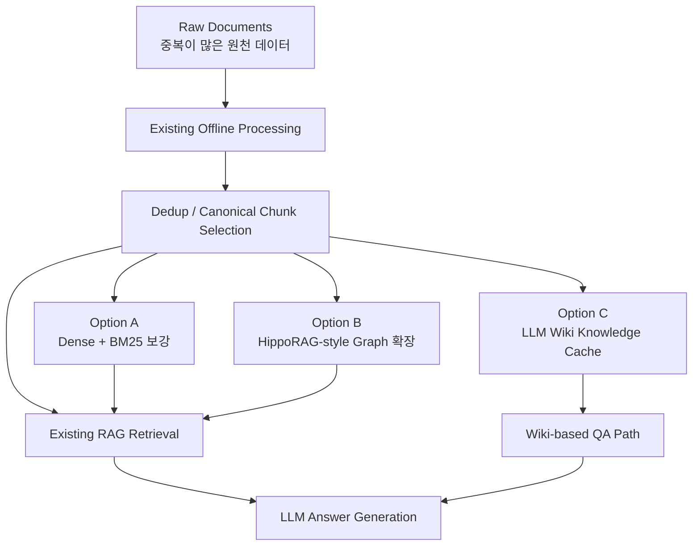
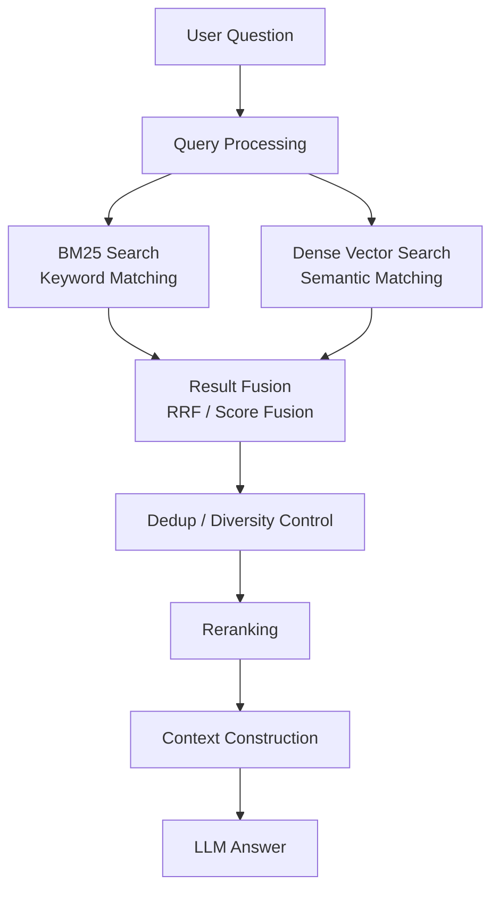
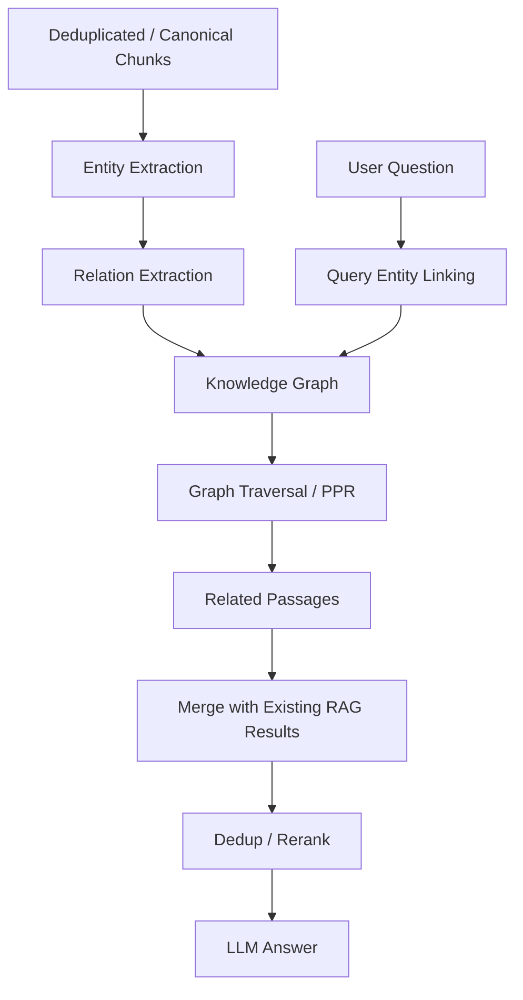
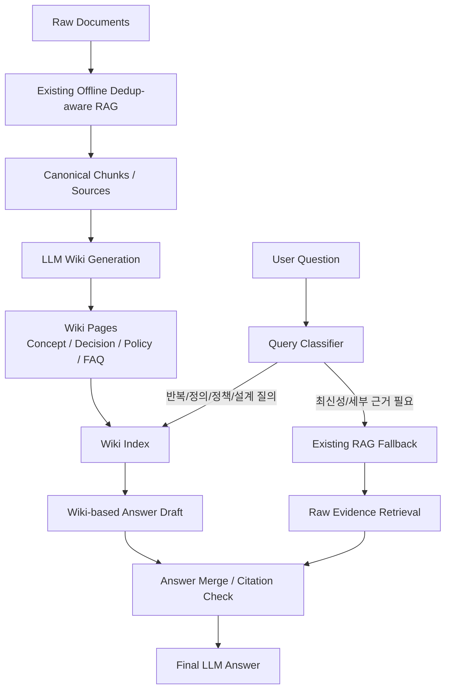
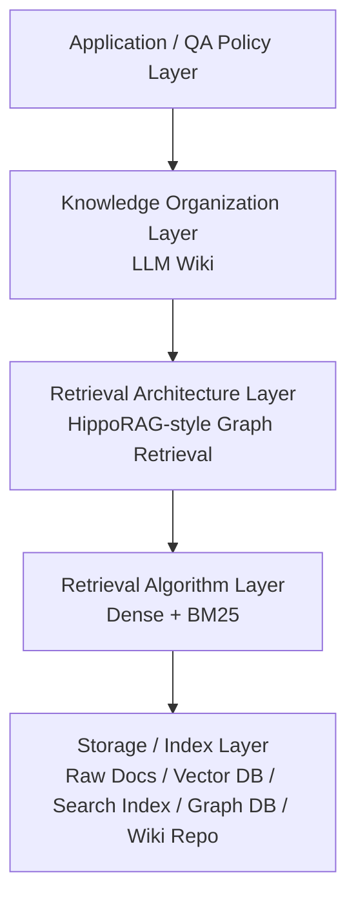
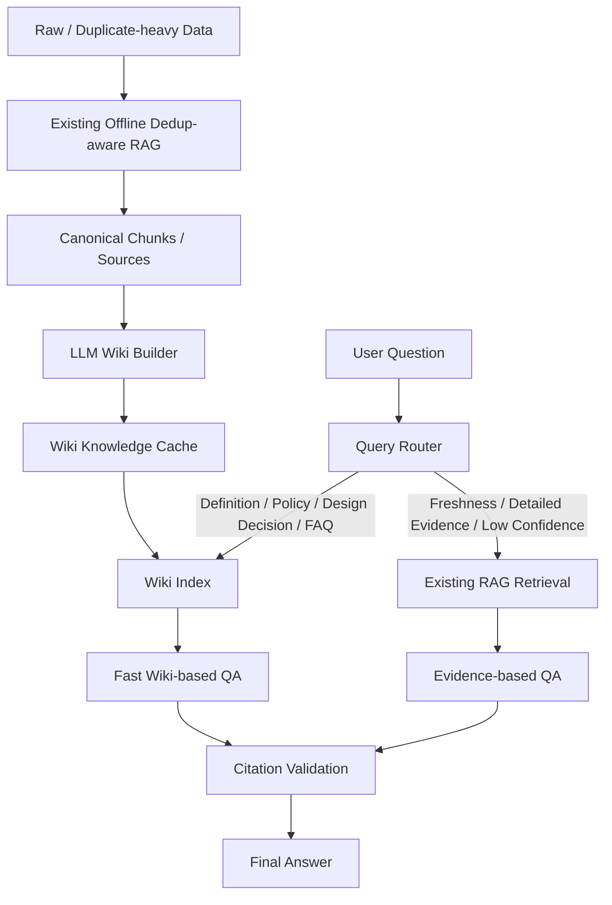

# DP-XX. Existing Dedup-aware RAG 기반 Knowledge Access 보강 방식 선정

## 1. Decision Point 개요

### 1.1 결정 주제

본 DP는 **이미 Offline 중복제어를 수행하는 기존 RAG 시스템**을 유지한다는 전제하에,  
중복이 많은 데이터 환경에서 **QA 속도와 답변 정확도**를 추가로 개선하기 위한 Knowledge Access 보강 방식을 선정한다.

비교 대상은 다음 세 가지이다.

1. **Dense + BM25 Hybrid Retrieval**
2. **HippoRAG-style Graph Retrieval**
3. **LLM Wiki Knowledge Cache**

본 DP의 핵심은 “기존 RAG를 대체할 것인가?”가 아니다.  
이미 보유한 RAG 시스템을 유지하면서, 그 위/안/옆에 어떤 기술을 추가하거나 확장할지 판단하는 것이다.

---

## 2. 이 DP가 필요한 이유

### 2.1 기존 시스템 전제

현재 시스템은 이미 다음과 같은 특성을 가진다고 가정한다.

- RAG 기반 QA 구조를 사용한다.
- Offline 단계에서 문서/Chunk 중복제어를 수행한다.
- 중복이 많은 데이터에서도 동일하거나 유사한 문서가 검색 결과를 과도하게 점유하지 않도록 일부 제어한다.
- QA 답변 생성을 위해 검색된 지식을 LLM Context로 제공한다.

즉, 기존 시스템은 단순한 Naive RAG가 아니라, 일정 수준의 전처리와 중복제어를 수행하는 **Dedup-aware RAG**이다.

### 2.2 그럼에도 추가 DP가 필요한 이유

Offline 중복제어는 중요한 기반이지만, 다음 문제를 완전히 해결하지는 않는다.

| 남는 문제 | 설명 |
|---|---|
| 질문-문서 매칭 문제 | 사용자가 다른 표현으로 질문할 때 적절한 문서를 찾는 문제 |
| 관계형 질의 문제 | 여러 문서/개념/결정사항 사이의 연결을 따라가야 하는 문제 |
| 반복 질의 문제 | 자주 묻는 질문에 대해 매번 원문 Chunk를 다시 검색·조합하는 비효율 |
| 답변 일관성 문제 | 같은 질문에 대해 검색 결과 구성에 따라 답변이 흔들리는 문제 |
| Context 비용 문제 | 중복이 완화되었더라도 QA 시점에 여러 Chunk를 읽어야 하는 비용 |
| 최신성 및 근거 추적 문제 | 정리된 답변과 원문 근거를 동시에 유지해야 하는 문제 |

따라서 본 DP는 **중복 제거 자체**가 아니라,  
**중복제어된 데이터를 QA 시점에 어떻게 접근하고 재사용할 것인가**를 결정하는 것이다.

### 2.3 핵심 관점

> Offline Deduplication은 세 옵션의 대체재가 아니라 전제 조건이다.  
> 세 옵션은 Dedup 이후의 지식 접근 방식을 다르게 설계한다.

---

## 3. 기존 RAG와 세 옵션의 관계

### 3.1 전체 레이어 관점



### 3.2 기술적 종속성 및 교체가능성

| 옵션 | RAG를 포함하는가? | 기존 RAG와의 관계 | 기존 RAG 교체 필요성 | 적용 위치 |
|---|---|---|---|---|
| Dense + BM25 | 아니오 | 기존 RAG의 Retrieval 방식을 보강 | 낮음 | Retrieval / Index Layer |
| HippoRAG-style Graph Retrieval | RAG 계열 확장 | 기존 RAG 옆에 Graph Retrieval Path 추가 | 중간~높음 | Retrieval Architecture Layer |
| LLM Wiki Knowledge Cache | 전통적 RAG는 아님 | 기존 RAG 결과를 기반으로 Knowledge Cache 생성 | 낮음 | Offline Knowledge Layer / QA Cache |

---

## 4. Option A. Dense + BM25 Hybrid Retrieval

### 4.1 개념

Dense + BM25는 RAG 자체가 아니라, RAG 내부의 **Retrieval 단계에서 사용하는 Hybrid Search 전략**이다.

- **BM25**: 키워드 기반 검색
- **Dense Retrieval**: Embedding 기반 의미 검색
- **Hybrid Retrieval**: 두 검색 결과를 병합하여 Recall과 Precision의 균형을 맞춤

### 4.2 기존 RAG와의 관계

기존 RAG의 검색 레이어가 다음과 같다면:

```text
Question → Existing Retriever → Chunks → LLM
```

Dense + BM25를 적용한 구조는 다음과 같다.

```text
Question
 → BM25 Search
 → Dense Vector Search
 → Result Fusion
 → Existing Dedup / Rerank
 → LLM
```

즉, 기존 RAG 전체를 바꾸는 것이 아니라 **검색 방식을 보강**하는 형태이다.

### 4.3 구조 다이어그램



### 4.4 장점

- 기존 RAG에 가장 쉽게 결합 가능하다.
- 정확한 용어, 코드명, 문서명, 정책명 검색에 강하다.
- 사용자가 다른 표현으로 질문해도 Dense Search가 의미 기반 매칭을 보완한다.
- 성숙한 검색 엔진과 Vector DB를 활용할 수 있어 구현 리스크가 낮다.
- 기존 Dedup 로직과 결합하면 검색 결과 품질을 안정적으로 개선할 수 있다.

### 4.5 단점

- 자체적으로 중복을 해결하는 기술은 아니다.
- BM25와 Dense가 각각 유사한 Chunk를 가져와 중복 후보가 늘 수 있다.
- 기존 RAG가 이미 Hybrid Search 계열을 사용하고 있다면 추가 차별성이 제한적이다.
- 여러 문서 사이의 관계를 명시적으로 추론하지는 못한다.
- 반복 질의에 대해 매번 검색과 조합을 수행해야 한다.

### 4.6 본 상황에서의 의미

기존 RAG가 이미 Offline Dedup을 수행하고 있다면 Dense + BM25는 **중복제어 개선용**이라기보다,  
**질문-문서 매칭 품질을 개선하는 안정적 보강책**으로 보는 것이 적절하다.

---

## 5. Option B. HippoRAG-style Graph Retrieval

### 5.1 개념

HippoRAG-style 접근은 문서에서 Entity와 Relation을 추출하여 Knowledge Graph를 만들고,  
질문이 들어왔을 때 Graph Traversal 또는 Personalized PageRank류 탐색을 통해 관련 지식을 찾는 Graph-based RAG 확장 방식이다.

Dense + BM25가 “관련 Chunk를 잘 찾는 검색 방식”이라면,  
HippoRAG-style 접근은 “문서와 개념 사이의 관계를 따라가며 찾는 검색 구조”에 가깝다.

### 5.2 기존 RAG와의 관계

기존 RAG를 완전히 교체하지 않고도 다음과 같이 병렬 Retrieval Path로 추가할 수 있다.

```text
Question
 → Existing RAG Search
 → Graph Retrieval
 → Result Merge
 → Dedup / Rerank
 → LLM
```

다만 Entity Extraction, Relation Extraction, Graph Construction, Entity Canonicalization이 추가로 필요하므로 기존 RAG의 Retrieval Architecture를 상당히 확장해야 한다.

### 5.3 구조 다이어그램



### 5.4 장점

- 여러 문서에 흩어진 관계형 정보를 찾는 데 강하다.
- 요구사항, 설계 결정, 컴포넌트, 정책 간의 연결을 표현할 수 있다.
- 단순 Chunk 검색으로 누락되는 Multi-hop QA에 유리하다.
- 중복 문서의 반복 내용을 Entity/Relation 단위로 압축할 가능성이 있다.
- 향후 Traceability, Impact Analysis, Dependency Analysis로 확장하기 좋다.

### 5.5 단점

- 구현 및 운영 복잡도가 높다.
- Entity Alias, Relation 중복, Graph Noise 문제가 새로 발생할 수 있다.
- Graph 구축 및 갱신 비용이 크다.
- 질의 시 Graph 탐색과 기존 검색 결과 병합이 필요해 속도 목표와 직접적으로 맞지 않을 수 있다.
- Graph 품질이 낮으면 오히려 부정확한 관계를 근거로 답변할 위험이 있다.

### 5.6 본 상황에서의 의미

HippoRAG-style 방식은 중복제어가 이미 있는 상황에서도 의미가 있다.  
다만 그 의미는 “중복제어 추가”가 아니라 **관계형 QA 정확도 향상**에 있다.

따라서 본 DP의 주 목표가 “속도”와 “중복 데이터 환경에서의 일반 QA 정확도”라면 초기 채택보다는 후속 확장 후보로 두는 것이 타당하다.

---

## 6. Option C. LLM Wiki Knowledge Cache

### 6.1 개념

LLM Wiki는 기존 RAG가 Dedup한 원천 지식을 기반으로 LLM이 Wiki Page를 생성하고,  
자주 쓰이는 개념/정책/결정사항/비교 내용을 Canonical Knowledge로 정리해두는 방식이다.

이는 전통적 RAG의 Retrieval Algorithm이라기보다는 **Knowledge Organization / Knowledge Cache Layer**에 가깝다.

### 6.2 기존 RAG와의 관계

기존 RAG의 Offline Dedup 결과를 입력으로 사용한다.

```text
Raw Documents
 → Existing Offline Dedup-aware RAG
 → Canonical Chunks
 → LLM Wiki Generation
 → Wiki-based QA
```

이후 질문 시에는 Wiki를 우선 검색하고, 부족하거나 최신성이 필요한 경우 기존 RAG로 Fallback한다.

### 6.3 구조 다이어그램



### 6.4 장점

- 중복제어된 지식을 QA 친화적인 Canonical Page로 압축할 수 있다.
- 중복이 많은 데이터에서 매번 많은 Chunk를 검색·조합하는 비용을 줄일 수 있다.
- 반복 질문에 대해 빠르고 일관된 답변을 제공할 수 있다.
- 설계 결정, 요구사항, 정책, 비교표, FAQ처럼 구조화된 지식에 강하다.
- 사람이 Wiki Page를 직접 검토하고 수정할 수 있다.
- 기존 RAG를 원문 검증 및 Fallback 경로로 유지할 수 있다.

### 6.5 단점

- Wiki가 잘못 생성되면 오류가 반복 재사용될 수 있다.
- 원문이 바뀌었는데 Wiki가 갱신되지 않으면 Stale Answer가 발생한다.
- Wiki Page와 원문 Source 간 Citation/Traceability를 반드시 유지해야 한다.
- Wiki 생성 및 갱신 정책이 필요하다.
- 모든 질의에 적합하지 않으며, 최신 원문 확인이나 세부 근거 질의는 기존 RAG Fallback이 필요하다.

### 6.6 본 상황에서의 의미

기존 RAG가 Offline Dedup을 이미 수행하고 있기 때문에 LLM Wiki는 오히려 더 효과적으로 동작할 수 있다.

기존 RAG가 Canonical Chunk를 선별하고, LLM Wiki가 이를 Canonical Answer Page로 승격시키는 구조가 가능하기 때문이다.

```text
중복 문서 제거
 → 유사 Chunk 정리
 → Canonical Source 선택
 → Canonical Wiki Page 생성
 → QA 시 빠르고 일관된 답변
```

따라서 LLM Wiki는 본 DP의 목표인 **속도**와 **중복 데이터 환경에서의 정확도**에 가장 직접적으로 부합한다.

---

## 7. 세 옵션 비교 요약

### 7.1 레이어 비교



| 구분 | Dense + BM25 | HippoRAG-style | LLM Wiki |
|---|---|---|---|
| 주 레이어 | Retrieval Algorithm | Retrieval Architecture / Graph Layer | Knowledge Organization / Cache |
| 기존 RAG 교체 필요 | 낮음 | 중간~높음 | 낮음 |
| 기존 Dedup 결과 활용 | 가능 | 가능하나 Graph 정규화 필요 | 매우 적합 |
| 핵심 개선점 | 질문-문서 매칭 | 관계형/Multi-hop 검색 | 속도, 일관성, 지식 압축 |
| 주요 리스크 | 중복 후보 재발생 | Graph 품질/복잡도 | Staleness / 요약 오류 |

---

## 8. QA 속성 Trade-off 평가

평가 기준은 ★ 1~3개로 표시한다.

- ★★★: 매우 우수
- ★★☆: 보통 이상 / 조건부 우수
- ★☆☆: 제한적

### 8.1 Trade-off 표

| QA 속성 | Dense + BM25 | HippoRAG-style | LLM Wiki |
|---|---:|---:|---:|
| QA 속도 개선 | ★★☆ | ★☆☆ | ★★★ |
| 중복 데이터 환경 정확도 | ★★☆ | ★★☆ | ★★★ |
| 질문-문서 매칭 품질 | ★★★ | ★★☆ | ★★☆ |
| 관계형 / Multi-hop QA | ★★☆ | ★★★ | ★★☆ |
| 답변 일관성 | ★★☆ | ★★☆ | ★★★ |
| 기존 RAG 결합 용이성 | ★★★ | ★☆☆ | ★★☆ |
| 운영 복잡도 낮음 | ★★★ | ★☆☆ | ★★☆ |
| 원문 Citation 유지 | ★★★ | ★★☆ | ★★☆ |

### 8.2 평가 해석

#### Dense + BM25

Dense + BM25는 기존 RAG에 가장 쉽게 결합할 수 있고, 질문-문서 매칭 품질을 안정적으로 개선한다.  
다만 기존 RAG가 이미 Offline Dedup을 수행하는 상황에서는 중복제어 자체에 대한 추가 차별성은 제한적이다.  
따라서 본 DP에서는 **기본 검색 품질 보강책**으로 볼 수 있다.

#### HippoRAG-style

HippoRAG-style 방식은 관계형 질의와 Multi-hop QA에 강점이 있다.  
하지만 Graph 구축과 Entity/Relation 정규화 비용이 크고, 속도 개선 목표와 직접적으로 일치하지 않을 수 있다.  
따라서 본 DP에서는 **고급 관계형 QA 요구가 커질 경우의 확장 후보**로 보는 것이 적절하다.

#### LLM Wiki

LLM Wiki는 기존 Dedup-aware RAG의 결과를 Canonical Knowledge Page로 압축하여 QA 시점의 검색·조합 비용을 줄인다.  
반복 질의, 설계 결정, 정책, 요구사항, FAQ성 질문에서 속도와 답변 일관성을 동시에 개선할 수 있다.  
단, Wiki의 최신성 관리와 원문 Citation 연결은 필수이다.

---

## 9. 권장 선택

### 9.1 Decision

본 DP에서는 **LLM Wiki Knowledge Cache**를 우선 채택한다.

단, 기존 RAG를 대체하지 않고 다음 구조로 사용한다.

```text
기존 Dedup-aware RAG 유지
+ LLM Wiki Knowledge Cache 추가
+ 기존 RAG를 원문 검증 및 Fallback 경로로 유지
```

### 9.2 권장 아키텍처



### 9.3 선택 이유

LLM Wiki를 선택하는 이유는 다음과 같다.

1. **기존 Offline Dedup 결과를 가장 잘 활용한다.**  
   기존 RAG가 중복 문서와 유사 Chunk를 정리한 결과를 기반으로 Wiki Page를 생성할 수 있다.

2. **중복 많은 데이터 환경에서 QA Context를 줄인다.**  
   매 질의마다 여러 중복 후보를 검색·조합하는 대신, 미리 정리된 Canonical Page를 우선 사용할 수 있다.

3. **속도 목표에 직접적으로 부합한다.**  
   Wiki Page는 QA 친화적인 요약 지식이므로 LLM 입력 토큰과 검색 비용을 줄일 수 있다.

4. **답변 일관성을 높인다.**  
   반복 질문에 대해 매번 다른 Chunk 조합을 사용하는 대신, 동일한 Canonical Knowledge를 기반으로 답변할 수 있다.

5. **기존 RAG를 버리지 않는다.**  
   Wiki가 부족하거나 최신성이 중요한 경우 기존 RAG로 Fallback하여 원문 기반 답변을 유지할 수 있다.

---

## 10. Consequences

### 10.1 긍정적 결과

- 반복 질의의 응답 속도 개선
- 중복 많은 데이터에서 답변 일관성 향상
- QA Context 크기 감소
- 설계 결정/정책/요구사항 등 Canonical Knowledge 관리 가능
- 사람이 검토 가능한 Knowledge Layer 확보
- 기존 RAG를 원문 근거 검증 경로로 유지 가능

### 10.2 부정적 결과 및 리스크

| 리스크 | 설명 | 대응 |
|---|---|---|
| Wiki Staleness | 원문 변경 후 Wiki가 갱신되지 않을 수 있음 | Source 변경 감지, Wiki Invalidation, 재생성 정책 |
| 요약 오류 | LLM이 원문을 잘못 요약할 수 있음 | 원문 Citation 유지, Human Review, Confidence Check |
| 근거 단절 | Wiki 답변이 원문 근거와 분리될 수 있음 | Wiki Page에 Source ID / Chunk ID 연결 |
| 범위 과확장 | 모든 원문을 Wiki화하려다 비용 증가 | 반복 질의/핵심 설계 지식부터 적용 |
| Fallback 부재 | Wiki만 보고 답하면 최신/세부 질문에 취약 | 기존 RAG Fallback 필수 유지 |

---

## 11. 적용 범위

### 11.1 우선 적용 대상

LLM Wiki는 다음 유형의 지식에 우선 적용한다.

- 설계 결정사항
- 요구사항 요약
- 정책 및 제약사항
- 용어 정의
- 컴포넌트 역할
- 후보 기술 비교
- 반복적으로 질문되는 FAQ
- 변경 이력과 Deprecated 정보

### 11.2 기존 RAG Fallback 대상

다음 질문은 기존 RAG를 우선 또는 병행 사용한다.

- 최신 원문 확인이 필요한 질문
- 특정 문서/문구/근거를 직접 확인해야 하는 질문
- Wiki에 없는 세부 구현 질문
- Confidence가 낮은 질문
- Source Citation이 반드시 필요한 감사/검증성 질문

---

## 12. 최종 결론

기존 Offline Dedup-aware RAG가 존재하더라도, 본 DP는 여전히 필요하다.

기존 중복제어는 **원천 데이터의 중복을 줄이는 전처리**이고,  
본 DP의 세 옵션은 **정리된 지식을 QA 시점에 어떻게 접근하고 재사용할지**를 결정하는 후속 설계이기 때문이다.

최종적으로 본 DP는 다음 결론을 제안한다.

> 기존 Dedup-aware RAG를 유지하되, QA 속도와 중복 데이터 환경에서의 답변 일관성 및 정확도 향상을 위해  
> **LLM Wiki Knowledge Cache**를 추가한다.  
> Dense + BM25는 검색 품질 보강책으로 유지 가능하며, HippoRAG-style Graph Retrieval은 관계형 Multi-hop QA 요구가 커질 경우 후속 확장 후보로 둔다.

---
